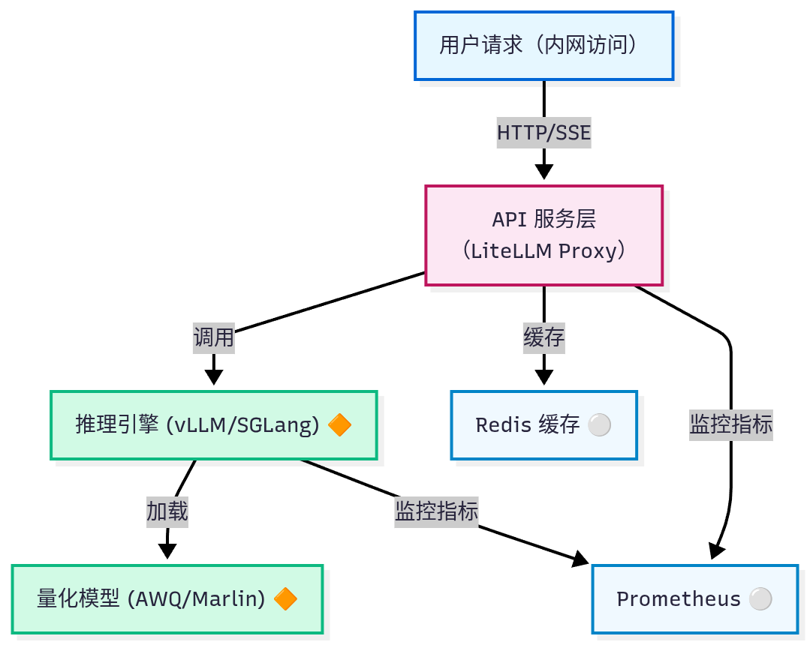

# LLM 部署实践


## 容器化环境配置

> 前提：已经正确安装GPU驱动。

首先，需要根据[这里](https://docs.nvidia.com/datacenter/cloud-native/container-toolkit/latest/install-guide.html)的建议，安装适用目标平台的NVIDIA Container Toolkit，目前最新的版本是1.18.0。以Ubuntu或Debian系统为例，根据“With apt: Ubuntu, Debian”一节的说明进行配置即可。

而后，配置Docker daemon，创建/etc/docker/daemon.json文件，确定配置文件中出现如下内容。

```bash
{
  "runtimes": {
    "nvidia": {
      "path": "nvidia-container-runtime",
      "runtimeArgs": []
    }
  },
  "default-runtime": "nvidia",
  "default-ulimits": {
    "memlock": {
      "Name": "memlock",
      "Hard": -1,
      "Soft": -1
    }
  }
}
```

配置完成后，重新加载Docker配置。

```bash
# 1. 重新加载Docker配置
sudo systemctl daemon-reload
sudo systemctl restart docker

# 2. 验证配置是否生效
# 2.1 检查NVIDIA runtime是否注册
docker info | grep -A 10 "Runtimes"

# 2.2 使用--runtime参数测试（更可靠的验证方式）
docker run --rm --runtime=nvidia --gpus all nvidia/cuda:12.9.1-base-ubuntu24.04 nvidia-smi
```


## 企业内部LLM最小化部署



### 准备步骤

1. 准备模型文件

   本示例依赖到的本地模型文件保存路径为/Models/Pretrained_Models/，如若需要其它路径，请注意修改相关的各项配置。

   ```bash
   # 宿主机模型目录
   mkdir -p /Models/Pretrained_Models/
   chown -R $USER:$USER /Models
   
   # 下载模型
   pip install modelscope
   modelscope download --model Qwen/Qwen3-8B --local_dir /Models/Pretrained_Models/Qwen3-8B
   ```


2. 目录结构创建

   ```bash
   # 创建所有必需的目录
   mkdir -p {data,logs}/{litellm,vllm,redis,prometheus}
   touch logs/litellm/litellm.log logs/vllm/vllm.log
   
   # 设置权限
   chmod -R 755 config data logs
   chown nobody data/prometheus
   
   # 创建空日志文件（避免挂载问题）
   touch logs/litellm/litellm.log
   touch logs/vllm/vllm.log
   ```

   

3. 拉取镜像（可选）

   vllm的镜像文件非常大，建议提前拉取镜像，而后再启动服务。

   ```bash
   docker-compose pull
   ```

### 启动服务

1. 启动服务

   ```bash
   # 启动所有服务
   docker compose up -d
   
   # 查看服务状态
   docker compose ps
   
   # 检查日志
   docker compose logs -f litellm-proxy
   docker compose logs -f inference-engine
   ```

   

2. 服务验证

   ```bash
   # 1. 验证 vLLM 服务
   curl http://localhost:8001/v1/models
   # 预期输出：包含 "qwen3-8b" 模型信息
   
   # 2. 验证 LiteLLM Proxy 健康检查
   curl http://localhost:4000/health
   # 预期输出：{"status":"healthy"}
   
   # 3. 验证 Redis 连接
   docker exec redis-cache redis-cli ping
   # 预期输出：PONG
   
   # 4. 完整链路测试
   curl -X POST http://localhost:4000/v1/chat/completions \
     -H "Content-Type: application/json" \
     -H "Authorization: Bearer dummy-key" \
     -d '{
       "model": "qwen3-8b",
       "messages": [{"role": "user", "content": "你好，介绍一下量子力学。"}],
       "max_tokens": 200
     }'
   ```

   

3. 监控面板访问

   ```bash
   # Prometheus 监控面板
   echo "访问 Prometheus: http://<server-ip>:9090"
   
   # 查看目标状态
   # - litellm-proxy:4001
   # - inference-engine:8001
   # 应显示为 UP 状态
   ```

   

### LiteLLM

LiteLLM Proxy 提供了灵活的命令行选项，主要可以通过两种模式来启动和管理代理服务：一种是适用于快速测试的直接命令行模式，另一种是更适合生产环境的配置文件模式。

- 直接命令行模式：litellm --model <provider/model_name> [选项]
  - --model: 必需，指定模型（如 ollama/llama3）
  - --api-base: 指定模型服务的地址
  - --port: 设置服务端口，默认常为4000
- 配置文件模式：litellm --config <配置文件路径> [选项]
  - --config: 指定YAML配置文件的路径，用于复杂设置
  - --host: 绑定主机地址，0.0.0.0表示允许所有IP访问
  - --num-workers: 设置工作进程数，提升并发能力

除了启动代理，LiteLLM还提供了一个专门的管理CLI工具 litellm-proxy，用于管理模型、API密钥等。

```bash
# 列出已配置的模型
litellm-proxy models list

# 生成一个新的API密钥
litellm-proxy keys generate --models gpt-4,claude-3 --spend 100 --duration 24h
```


对于生产环境，使用YAML配置文件可以定义更复杂的路由策略、回退机制和监控设置。下面是一个标准的配置示例：

```yaml
model_list:
  - model_name: qwen3-8b  # 对应用户调用的模型别名，通常要与后端模型推理引擎提供的model id一致
    litellm_params:
      model: openai/qwen3-8b  # 实际的后端模型
      api_key: os.environ/OPENAI_API_KEY  # 从环境变量读取密钥，EMPTY表示使用空密钥

litellm_settings:
  set_verbose: true  # 开启详细日志
  # 定义回退策略：如果qwen3-8b失败，依次尝试qwen3-8b-backup和deepseek-r1-0528-qwen3-8b
  fallbacks:
    - gpt-4-prod: [qwen3-8b-backup, deepseek-r1-0528-qwen3-8b]

router_settings:
  routing_strategy: simple-shuffle  # 路由策略
  num_retries: 3  # 重试次数

environment_variables:
  LITELLM_MASTER_KEY: "sk-your-master-key-here"  # 主密钥
```


LiteLLM Proxy 的配置文件（通常是 YAML 格式）是其核心，它定义了代理如何管理模型、处理请求以及提供各种高级功能。通常主要由4个配置模块构成：

- model_list：定义代理管理的所有模型及其连接参数；
- litellm_settings：配置 LiteLLM 核心库的全局行为，如重试、故障转移、缓存等
- router_settings：控制路由器的行为，如负载均衡策略、重试机制等
- general_settings：配置代理服务器级参数，如主密钥、数据库连接、全局速率限制等


其中的模型列表配置段是配置文件中最重要的部分，它相当于代理的“模型菜单”，列出了所有可被调用的模型。其基本结构如下：

```yaml
model_list:
  - model_name: qwen3-8b  # 面向用户的模型别名
    litellm_params:
      model: openai/qwen3-8b   # LiteLLM内部使用的模型标识符，格式为`provider/model-name`
      api_key: os.environ/OPENAI_API_KEY  # 推荐从环境变量读取密钥
      api_base: https://api.openai.com/v1  # 模型API的基础地址
    model_info:  # 模型元数据
      base_model: "qwen3-8b"
      max_tokens: 4096
```

关键字段说明：

- model_name: 客户端请求时使用的名称（如"model": "qwen3-8b-prod"），你可以为此名称配置多个后端以实现负载均衡
- litellm_params:
  - model: 实际的后端模型，格式为“提供商/模型名”，例如 azure/your-deployment-name、ollama/llama3、anthropic/claude-3-sonnet等
  - api_key, api_base: 连接模型所需的认证和地址信息


下表是LiteLLM 支持的主流提供商，对于 vLLM，使用 openai/ 前缀 + api_base 是标准方式。

| 提供商                  | model 格式                 | 示例                                                     |
| ----------------------- | -------------------------- | -------------------------------------------------------- |
| **OpenAI 兼容（vLLM）** | `openai/<model-name>`      | `openai/qwen3-8b` + `api_base: http://localhost:8001/v1` |
| **HuggingFace TGI**     | `huggingface/<model-path>` | `huggingface/Qwen/Qwen3-8B`                              |
| **本地 Ollama**         | `ollama/<model>`           | `ollama/llama2`                                          |


### 清理操作

若初始化失败，或者不需要再运行相关服务，需要彻底清理旧容器和卷时，可通过类似如下命令进行。

```bash
# 停止并移除所有容器
docker compose down --volumes --remove-orphans

# 清理卷
docker volume prune -f

# 清理网络
docker network prune -f
```


## 带过滤的系统


moderation 端点

LiteLLM Proxy 默认发送请求体 JSON：

```json
{
  "model": "moderation-model",
  "input": "用户输入文本"
}
```

返回必须是如下格式的内容，或者至少 flagged 字段存在。

```json
{
  "flagged": true,
  "label": "violence",
  "score": 0.98
}
```

如果直接用 vLLM 的 /v1/chat/completions，返回的是原始文本，需要在LiteLLM Proxy 做解析模板或使用 ModerationModel 类型的包装模型。


配置示例：

```yaml
litellm_settings:
  input_moderation: true
  output_moderation: true
  moderation_action: "block"
  # 指向 LiteLLM 内置 Moderation 封装
  # 如果是 vLLM moderation 模型，需要用特定模型映射
  custom_moderation_endpoint: "http://vllm-moderation:8001/v1/completions"
  moderation_model_name: "qwen2.5-moderation"
```

注意：

- moderation_model_name 必须指向 你在 model_list 中注册的 moderation 模型。
- custom_moderation_endpoint 必须与模型的 OpenAI API 接口匹配，最好使用 /v1/completions 而非 /v1/chat/completions，因为 LiteLLM Proxy 会自动封装成标准 input 字段。


