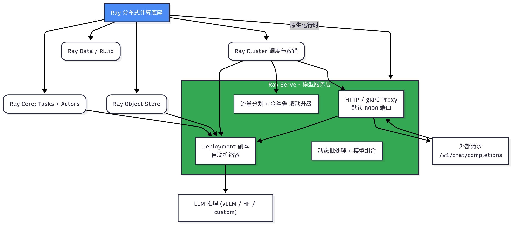
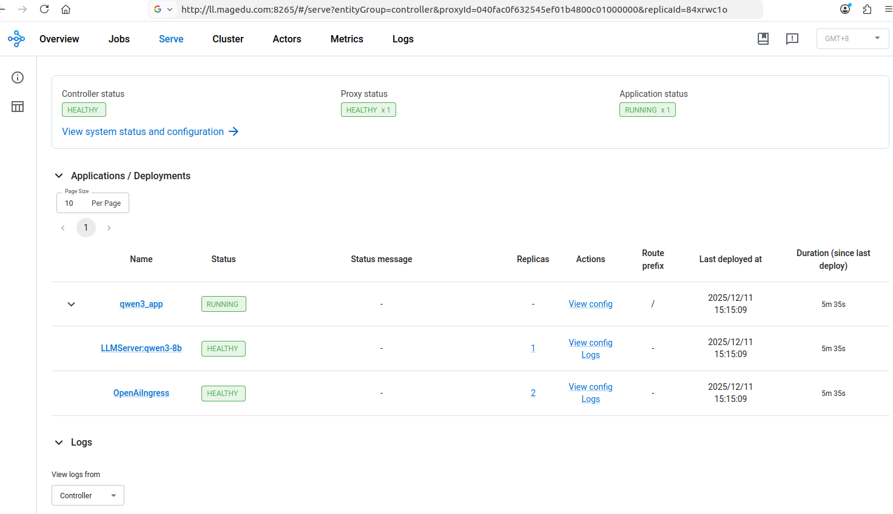
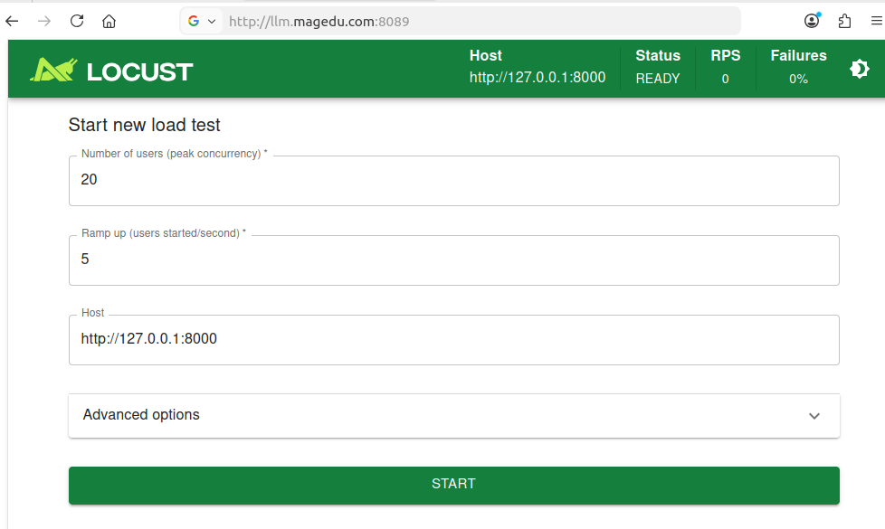
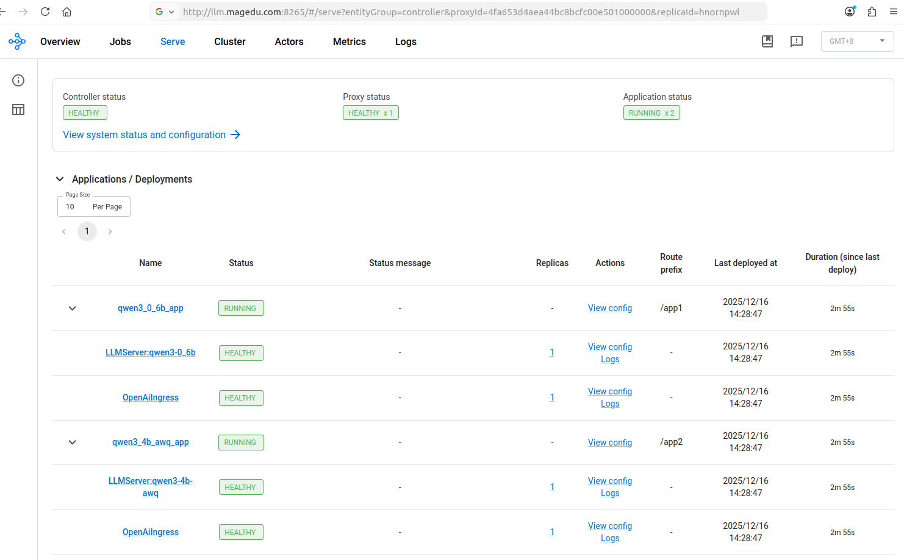

# Ray Serve 实践案例

**Ray** 是一个开源的分布式计算框架，专为大规模机器学习和 Python 应用设计，它的核心优势在于“让分布式计算像写单机代码一样简单”。Ray 提供了原生的任务并行（Ray Tasks）、演员模型（Ray Actor）、分布式数据处理（Ray Data）、强化学习（Ray RLlib）、超参搜索（Ray Tune）、模型服务（Ray Serve）等完整生态。最重要的是，Ray 把复杂的分布式调度、故障恢复、对象存储（Ray Object Store）、跨机器零拷贝传输全部封装成极简 Python API，几乎不需要修改原有单机代码就能轻松扩展到几十甚至上千台机器，因此成为当前 AI 工程领域最流行的分布式运行时之一。

**Ray Serve** 是 Ray 内置的模型服务（Model Serving）组件，专门解决把 AI 模型快速、可靠、高性能地暴露成在线服务的问题。它具有以下核心特性：

- 与 Ray 原生深度集成，可直接服务部署在 Ray 集群上，支持自动水平扩展、滚动升级、金丝雀发布；
- 支持任意 Python 函数、FastAPI、gRPC、任意 Python 类或对象（如 vLLM、Transformers、自定义推理代码；
- 内置支持动态批处理、模型组合（Model Composition）、多模型路由、条件路由等高级特性；
- 支持请求级别的 autoscaling、队列管理和多种部署模式（per-model、per-endpoint）；
- 提供 HTTP、gRPC 两种协议，默认兼容 OpenAI API 格式（vLLM、TGI、Transformers 等都可以无缝接入；
- 提供完整的可观测性（Prometheus 指标、仪表盘）和流量分割；
- 因此成为目前最流行的 LLM Serving 方案之一（如 Anyscale、vLLM + Ray Serve 组合）。简单一句话：Ray Serve 就是“Ray 生态里最适合把大模型做成高并发、低延迟在线服务的组件。

简单来说：Ray 是分布式计算的“底座”，Ray Serve 则是把 AI 模型快速变成可伸缩、可观测的在线服务的“顶层框架”，二者一起构成了从训练到推理的全链路分布式解决方案。




Ray Serve Application（即一个完整的 Serve Graph / DAG）的创建与启动方式，总共有 5 种主流方法，从开发调试到生产零停机部署，覆盖全部场景。下表从“最有代码”到“最零代码”、从“本地开发”到“生产集群”顺序列出，并说明了每种方法的命令、适用场景、优缺点、零停机能力。

| 方法名称                               | 是否需要代码   | 启动命令示例                                                 | 典型场景                       | 是否支持零停机更新 | 备注                                                         |
| -------------------------------------- | -------------- | ------------------------------------------------------------ | ------------------------------ | ------------------ | ------------------------------------------------------------ |
| 编程式 `serve.run()`（最原始）         | ★★★★★          | `python deploy.py`（里面写 `serve.run(app)`）                | 本地快速迭代、Jupyter Notebook | ×（重启进程）      | 开发阶段最常用                                               |
| `serve run` CLI + import_path          | ★★★★☆          | `serve run deploy_qwen:app --port 8080`                      | 本地测试、调试、临时共享       | ×（重启进程）      | 比方法1少写一行 `serve.run`，但本质一样                      |
| `serve build` + `serve run` YAML       | ★★☆☆☆          | 1. `serve build deploy_qwen:app -o config.yaml` 2. `serve run config.yaml` | 本地想体验 YAML 部署流程       | ✓（局部）          | 第一次生成 YAML，后续只改 YAML 可部分热更新                  |
| `serve deploy` + YAML（单机/远程集群） | ★☆☆☆☆          | `serve deploy config.yaml` 或 `serve deploy config.yaml -a http://<head>:8265` | 单机生产、远程 Ray 集群生产    | ✓ 完全零停机       | 生产环境最常用方式，支持 `serve config`、`serve status` 管理 |
| Kubernetes RayService + 内嵌 YAML      | ★☆☆☆☆（几乎0） | `kubectl apply -f rayservice-qwen.yaml`                      | K8s 生产环境（最推荐）         | ✓ 完全零停机       | 工业级最高级别部署方式，配合 KubeRay Operator                |


需要注意的是，无论是 serve run 还是 serve deploy，它们都要求底层有一个可用的 Ray 运行时环境（Ray Cluster 或 Ray 进程），二者的区别在于：

- serve run 在没有找到现有环境时，会自动创建一个本地的 Ray 进程
- serve deploy 则要求必须事先通过 **ray start** 或 Kubernetes Operator 等方式，手动启动或连接到一个持久化运行的 Ray Cluster
  - serve deploy 命令自身并不负责启动 Ray 进程，它只负责读取配置（如 YAML 文件），并将这个配置推送到正在运行的 Ray Serve Controller Actor
  - 如果 Controller 不存在（即 Ray Cluster 没有运行），命令将失败


## 前提条件

### 部署Ray和vLLM环境


1. 创建独立的Python环境

   ```bash
   conda create -n ray_serve python=3.10 -y
   conda activate ray_serve
   ```

   

2. 安装Ray（含Serve），Ray 版本 ≥ 2.43.0，同时安装 ray[serve,llm] 和 vllm

   ```bash
   pip install "ray[default,serve,llm]" vllm==0.10.2 transformers torch
   ```

​	  

3. 安装完成后，检查安装的版本。

   ```bash
   python -c "import vllm; print(vllm.__version__)"
   python -c "import ray; print(ray.__version__)"
   ```


​    **提示：** 注意ray和vllm的兼容性，目前的ray 2.52.1版本与vllm 0.10.2兼容，与后续版本的兼容性需要自行验证。


### 部署Ray Cluster

启动 Ray Cluster 常见的 4 种方式：

- Local Cluster（单机）：ray start --head
- Manual Multi-node（手工多机）：每台机器通过 CLI 启动
- Cluster Launcher（YAML 自动创建）：ray up cluster.yaml
- Kubernetes（Operator / Helm / RayService）


手动基于命令行选项的方式创建Ray Cluster的命令为ray start，它支持如下常用选项：

| 选项                    | 参数类型     | 默认值         | 描述                                                         | 常用示例                                      |
| ----------------------- | ------------ | -------------- | ------------------------------------------------------------ | --------------------------------------------- |
| `--head`                | 无参数标志   | 无             | 指定当前节点为 Head 节点（启动 GCS、Dashboard 等核心服务）   | `ray start --head`                            |
| `--port`                | 整数         | 6379           | 指定 GCS Server（Ray 内部通信端口），生产环境强烈建议改成 6380 以避开 Redis 冲突 | `ray start --head --port=6379`                |
| `--address`             | 字符串       | 无             | Worker 节点加入集群时指定 Head 节点的地址（格式：ip:port）   | `ray start --address='192.168.1.10:6380'`     |
| `--dashboard-host`      | 字符串       | 127.0.0.1      | Dashboard 监听地址，设为 0.0.0.0 允许远程访问                | `ray start --head --dashboard-host=0.0.0.0`   |
| `--dashboard-port`      | 整数         | 8265           | Dashboard Web UI 端口                                        | `ray start --head --dashboard-port=8265`      |
| `--num-cpus`            | 整数         | 自动检测       | 覆盖本节点报告的 CPU 核心数                                  | `ray start --head --num-cpus=16`              |
| `--num-gpus`            | 整数         | 自动检测       | 覆盖本节点报告的 GPU 数量                                    | `ray start --num-gpus=4`                      |
| `--memory`              | 整数（字节） | 自动检测       | 覆盖本节点报告的可用内存                                     | `ray start --memory=64000000000` (64GB)       |
| `--object-store-memory` | 整数（字节） | 自动检测的一半 | 指定对象存储（共享内存）大小，LLM 推理常用                   | `ray start --object-store-memory=30000000000` |
| `--resources`           | JSON 字符串  | 无             | 定义自定义资源（如 "CustomGPU": 1）                          | `--resources='{"CustomGPU": 2}'`              |
| `--node-ip-address`     | 字符串       | 自动检测       | 指定本节点对外暴露的 IP（多网卡机器必备）                    | `--node-ip-address=192.168.1.10`              |
| `--block`               | 无参数标志   | 无             | 启动后阻塞终端（常用于脚本）                                 | `ray start --head --block`                    |
| `--redis-password`      | 字符串       | 无             | 设置 GCS 的密码（生产环境推荐）                              | `--redis-password='your_secure_password'`     |
| `--include-dashboard`   | 布尔         | True           | 是否启动 Dashboard（设为 False 可禁用）                      | `--include-dashboard=False`                   |
| `--autoscaling-config`  | 文件路径     | 无             | 用于 autoscaler 的配置（集群自动扩缩容）                     | `--autoscaling-config=~/autoscaler.yaml`      |


#### 1. 本地/单机 Ray Cluster

运行如下命令，在节点上启动Head Node即可。

```bash
ray start --head --port=6379
```


若需要对外提供Dashboard的访问接口，则换用如下命令。

```bash
ray start --head --port=6379 --dashboard-host=0.0.0.0
```


若需要指定使用的CPU或GPU资源，可以使用--num-cpus或--num-gpus选项，例如如下命令就表示ray cluster在head上的可用GPU是2个。

```bash
ray start --head --port=6379 --dashboard-host=0.0.0.0 --num-gpus=2
```


#### 2. 多机Ray Cluster

head主机的配置，同单机Ray Cluster相同。首先，运行如下命令，运行head节点。

```bash
ray start --head --port=6379 --dashboard-host=0.0.0.0
```

该命令通常会返回类似如下提示。

```
Local node IP: 172.25.0.100

--------------------
Ray runtime started.
--------------------

Next steps
  To add another node to this Ray cluster, run
    ray start --address='172.25.0.100:6379'
  
  To connect to this Ray cluster:
    import ray
    ray.init()
  
  To submit a Ray job using the Ray Jobs CLI:
    RAY_API_SERVER_ADDRESS='http://172.25.0.100:8265' ray job submit --working-dir . -- python my_script.py
  
  See https://docs.ray.io/en/latest/cluster/running-applications/job-submission/index.html 
  for more information on submitting Ray jobs to the Ray cluster.
  
  To terminate the Ray runtime, run
    ray stop
  
  To view the status of the cluster, use
    ray status
  
  To monitor and debug Ray, view the dashboard at 
    172.25.0.100:8265
```


接着，直接根据提示，在各worker主机上，运行如下命令加入到集群中即可。

```bash
ray start --address='172.25.0.100:6379'
```

该命令会生成类似如下提示。

```bash
Local node IP: 172.25.0.200

--------------------
Ray runtime started.
--------------------

To terminate the Ray runtime, run
  ray stop
```


随后，运行如下命令，可打印集群的相关信息。

```bash
ray status
```

该命令的通常会返回类似如下结果：

```
======== Autoscaler status: 2025-12-12 16:34:38.974605 ========
Node status
---------------------------------------------------------------
Active:
 1 node_2cd2239a4e104091d881a45c5534f3784dbf25f222f0e2e83797cb4d
 1 node_01f282530f77796bd5a337a6a5e06c0da587425192ccaef3aa95a42b
Pending:
 (no pending nodes)
Recent failures:
 (no failures)

Resources
---------------------------------------------------------------
Total Usage:
 0.0/16.0 CPU
 ...
```


若需要进一步测试集群的健康状态，以及集群资源的可用状态，可通过scripts目录下的ray_cluster_healthcheck.py脚本进行。提交该脚本的方法有两种，一是直接使用python解释器运行。

```bash
python ray_cluster_healthcheck.py
```

二是以ray job作业的方式进行。

```bash
ray job submit --address http://127.0.0.1:8265  --working-dir ./  -- python ray_cluster_healthcheck.py
```

上面的命令运行时，通常会返回类似如下结果。

```txt
=== Ray Cluster Health Check ===
Alive nodes: 2
 - 172.25.0.100 | CPUs=15.0 | GPUs=1.0
 - 172.25.0.200 | CPUs=15.0 | GPUs=1.0

[CPU] Tasks ran on 1 unique hosts
{'type': 'cpu', 'hostname': 'autodl-container-b52c468700-26a4f634', 'pid': 29684, 'node_id': '237de269430a523803b32c7d60ba194ea7b3ac16e102c398de5b07e5'}
{'type': 'cpu', 'hostname': 'autodl-container-b52c468700-26a4f634', 'pid': 29681, 'node_id': '237de269430a523803b32c7d60ba194ea7b3ac16e102c398de5b07e5'}
{'type': 'cpu', 'hostname': 'autodl-container-b52c468700-26a4f634', 'pid': 29683, 'node_id': '237de269430a523803b32c7d60ba194ea7b3ac16e102c398de5b07e5'}
{'type': 'cpu', 'hostname': 'autodl-container-b52c468700-26a4f634', 'pid': 29684, 'node_id': '237de269430a523803b32c7d60ba194ea7b3ac16e102c398de5b07e5'}

[GPU] Total GPUs visible to Ray: 2
[GPU] Tasks ran on 2 unique hosts
{'type': 'gpu', 'hostname': 'autodl-container-b52c468700-26a4f634', 'pid': 29685, 'gpu_info': '0, NVIDIA GeForce RTX 3090'}
{'type': 'gpu', 'hostname': 'autodl-container-b52c468700-3263b82f', 'pid': 24823, 'gpu_info': '0, NVIDIA GeForce RTX 3090'}

[Object Store] Testing data sharing...
[Object Store] Data consumed on 1 unique hosts
{'hostname': 'autodl-container-b52c468700-26a4f634', 'sum': 4194304.0}
{'hostname': 'autodl-container-b52c468700-26a4f634', 'sum': 4194304.0}

=== Health Check Summary ===
CPU hosts: 1
GPU hosts: 2
Object Store hosts: 1

Ray Cluster health check completed successfully.

------------------------------------------
Job 'raysubmit_Yq8wce483XprTjtk' succeeded
------------------------------------------
```


#### 3. 基于Docker的Ray Cluster

**示例环境说明：**

- Ubuntu 2204 Server，有两个GPU（RTX 3090），设备编号为0和2
- 计划在该主机上创建两个Docker容器，一个作为Head Node，加载0号GPU，另一个作为Worker Node，加载2号GPU
- 使用的ray image为rayproject/ray:2.50.1-gpu，在没有GPU的环境中，建议使用以“-cpu”为后缀的image


**启动Head Node：**

```bash
# 设定可见的GPU编号，若所有GPU均打算可，可省略该步骤
export CUDA_VISIBLE_DEVICES=0,2

# 启动Head Node
docker run -d --name ray-head  --gpus '"device=0"' --network bridge -p 6379:6379 -p 8265:8265 -p 10001:10001 \
    --shm-size=2gb  rayproject/ray:2.50.1-gpu ray start --head --port=6379 --dashboard-host=0.0.0.0 --block
```


等Head Node容器正常运行之后，使用如下命令获取其IP地址，以便用于后续的Worker Node的加入。

```bash
RAY-HEAD-IP=$(docker container inspect ray-head | jq .[0].NetworkSettings.Networks.bridge.IPAddress)
```

> 提示：若worker node运行于其它主机上，则无须上面的命令，而是在添加Worker Node时，直接使用ray-head容器所在主机的IP地址。


**启动Worker Node：**

运行如下命令，即可创建一个Worker Node容器，并加入到前面Head Node所代表的Ray Cluster中去。但需要注意的是，若Worker Node容器运行在不同的主机上，下面命令的变量${RAY-HEAD-IP}要替换为ray-head容器所在主机的IP地址。

```bash
docker run -d --name ray-worker-1 --gpus '"device=2"' --network bridge --shm-size=2gb rayproject/ray:2.50.1-gpu \
    ray start --address=${RAY-HEAD-IP}:6379 --block
```

以类似上面命令的方式，可加入多个Worker Node至同一个Ray Cluster中。


**验证集群状态：**

- 通过WebUI进行：访问Head Node容器所在主机的8265端口即可；

- 通过命令行进行（在ray-head容器所在的宿主机上运行如下命令即可）：

  ```bash
  docker exec -it ray-head ray status
  ```

  

**尝试提交Job：**

运行如下命令，提交用于测试集群健康状态的的python脚本ray_cluster_healthcheck.py，即可进行测试。下面命令中如果有ray-head容器所在的主机上运行，直接使用相应的容器IP或HOST IP都可以。如果在该主机外部的其它主机上运行，则需要使用HOST IP。

```bash
ray job submit --address http://${RAY-HEAD-IP}:8265  --working-dir ./  -- python ray_cluster_healthcheck.py
```


**注意：**

- 上面的示例是在同一个具有两个可用GPU的主机上进行，如若使用的是不同的主机，且每个主机使用所有可用的GPU设备时，可省略相应的--gpus选项；
- 上面示例中使用的ray image并没有附带vLLM，因此，其无法基于vLLM推理引擎将模型服务启动为serve application；
- 若需要使用该功能，则应该手动构建Image，在前面使用的ray image的基础上安装vllm模块；或者，也可以以vllm image（例如vllm/vllm-openai:v0.10.2）为基础安装ray模块； 相对来说，后者需要的安装过程更快捷；


## serve run案例

serve run 是 Ray Serve 官方提供的最重要、最常用的“开发神器”命令。 它本质上是“编程式 serve.run() 的 CLI 包装”，几乎一行命令就可以把整个 Serve Application 启动起来。

### serve run的用法

serve run的常见用途：

| 需求场景                 | 典型命令示例                                      | 说明                   |
| ------------------------ | ------------------------------------------------- | ---------------------- |
| 本地快速启动一个模型服务 | `serve run deploy:app`                            | 最为常见的用法         |
| 调试 + 自动热重载        | `serve run deploy:app --reload`                   | 改代码后能自动重启     |
| 暴露到公网或局域网       | `serve run deploy:app --host 0.0.0.0 --port 8080` | 开放给主机外部环境访问 |
| 指定 GPU、运行时环境等   | `serve run config.yaml`                           | 混合使用               |


serve run命令支持两种不同的用法：

| 用法模式                   | 命令格式                          | 接受的输入               | 是否需要代码 | 典型用途               |
| -------------------------- | --------------------------------- | ------------------------ | ------------ | ---------------------- |
| import_path 模式（最常用） | `serve run module:app [options]`  | Python 模块路径 + 变量名 | 需要代码     | 开发、调试、临时演示   |
| YAML config 模式           | `serve run config.yaml [options]` | 完整的 Serve YAML 配置   | 可以零代码   | 本地体验 YAML 部署流程 |


**命令语法：**

serve run 的基本语法要求指定一个 Python 模块和该模块中定义的 Application 变量名。

```bash
serve run <module>:<app_variable> [options]
```

- \<module>: 包含 Application 定义的 Python 文件名（不带 .py 后缀）。
- \<app_variable>: 在该 Python 文件中，通过 serve.run() 或 build_openai_app() 等函数创建的 Application 对象变量名（通常是 app）。

常用的参数：

```text
--address TEXT                  Ray 集群地址，默认 auto（本地启动新集群）
--reload                        开发模式，文件改动自动重启（需要 watchfiles）
--working-dir PATH              项目根目录（用于相对路径 import）
--runtime-env PATH              runtime_env.yaml 文件路径
--runtime-env-json TEXT         直接内联 JSON 字符串
--name TEXT                     应用名称（默认 default）
--route-prefix TEXT             自定义路由前缀 
```


### 第一种用法：serve run \<import_path\>

本方法是适合开发本地测试部署的途径。

代码只需要构建出 Serve Application（DAG），但不需要调用 serve.run()。例如，下面的示例基于Ray Serve和vLLM运行了一个DeepSeek模型实例，具体的代码注释请参考原代码文件deepseek.py中的内容。

```python
from ray import serve
from ray.serve.llm import LLMConfig, build_openai_app

llm_config = LLMConfig(
    model_loading_config={
        "model_id": "deepseek",
        "model_source": "/Models/Pretrained_Models/DeepSeek-R1-0528-Qwen3-8B",
    },
    deployment_config={
        "autoscaling_config": {
            "min_replicas": 1,
            "max_replicas": 1,
        }
    },
    runtime_env={"env_vars": {"VLLM_USE_V1": "1"}},
    engine_kwargs={
        "tensor_parallel_size": 1,
        "gpu_memory_utilization": 0.92,
        "dtype": "auto",
        "max_num_seqs": 40,
        "max_model_len": 16384,
        "enable_chunked_prefill": True,
        "enable_prefix_caching": True,
    },
)

# Deploy the application
llm_app = build_openai_app({"llm_configs": [llm_config]})

# 请不要启动如下行，否则就需要使用python解释器来运行脚本
#serve.run(llm_app)
```


随后，就可以运行如下命令之一来启动Ray Serve Application实例。

```bash
# 最简命令格式（默认监听127.0.0.1:8000）
# 参数格式： <script_name>:<app_name>，<app_name>是脚本中定义的application的名称
serve run deepseek:llm_app

# 开发时自动热重载（改代码后自动重启）
serve run deepseek:llm_app --reload --host 0.0.0.0 --port 8080

# 指定运行时环境（比如要装最新 vllm）
serve run deepseek:llm_app \
  --working-dir ./serve_run_examples \
  --runtime-env-json '{"pip": ["vllm==0.11.1.post1", "torch==2.8.0"]}'

# 指定应用名称（多应用调试时有用）
serve run deepseek:llm_app --name llm-deepseek
```


随后，即可对模型deepseek发起请求测试。

```bash
 curl -X POST http://127.0.0.1:8000/v1/chat/completions   -H "Content-Type: application/json"   -d '{
    "model": "deepseek",
    "messages": [
      {"role": "user", "content": "你好，能介绍一下你自己吗？"}
    ]
  }'
```


### 第二种方法：serve run config.yaml

本方法是适合生产部署的途径。

首先，需要从代码生成一份完整的 YAML：

```bash
serve build deepseek:llm_app -o deepseek_config.yaml
```


随后，我们就可以完全抛弃 Python 代码，只用 YAML 来启动Serve Application了：

```bash
# 基于默认参数启动
serve run deepseek_config.yaml
```

这种方法的优点：

- 以后只改 YAML 就能调整副本数、GPU 数、user_config、autoscaling 等
- 也可以直接把这个 YAML 拿去由 serve deploy 进行生产部署


启动后，即可对模型deepseek发起请求测试。


## serve deploy 案例

serve deploy 命令是 Ray Serve 命令行工具（CLI）中的一个关键命令，用于将一个 **Application 配置（通常是 YAML 文件）**应用到一个正在运行的 Ray Cluster 上。

### serve deploy介绍

serve deploy 命令的主要作用是，根据用户提供的配置，以零停机的方式，将 Application 的期望状态推送到 Ray Serve Controller，并由 Controller 协调集群资源达到该状态。

| 特点       | 描述                                                         |
| ---------- | ------------------------------------------------------------ |
| 部署方式   | 声明式 (Declarative)， 它侧重于定义服务的最终状态（例如：模型 ID、副本数），而不是执行启动逻辑 |
| 适用场景   | 生产环境标准配置、远程 Ray Cluster 部署、CI/CD 自动化集成、版本控制 |
| 零停机更新 | serve deploy 最重要的特性，它能实现服务更新、扩缩容、配置更改时的零停机滚动更新 |
| 代码依赖   | 零代码 (0 行)，它依赖于配置文件，不执行用户编写的 Python 启动代码 |

serve deploy 是 Ray Serve 唯一官方推荐的生产部署命令，它和 serve run 的最大区别如下表：

| 项目               | serve run                     | serve deploy                                    |
| ------------------ | ----------------------------- | ----------------------------------------------- |
| 用途               | 开发、调试、临时演示          | 生产环境、长期运行、高可用、零停机更新          |
| 是否接管 Ray 集群  | 每次重新启动一个新 controller | 复用已有Ray集群的 Serve Controller（持久化）    |
| 是否支持零停机更新 | 不支持                        | 完全支持（官方保证rolling update）              |
| 是否支持多应用共存 | 一次只能运行一个应用          | 支持几十个应用同时运行                          |
| 管理命令           | 几乎没有                      | serve status / serve config / serve shutdown 等 |
| Kubernetes 兼容性  | 差                            | 与 RayService / KubeRay Operator 无缝集成       |


**基础设施要求 (硬性要求)**

与 serve run 不同，serve deploy 必须连接到一个事先启动且稳定运行的 Ray Cluster。

- Ray Head 启动： 集群必须通过 ray start --head 启动。
- Serve Controller 运行： 在 Ray Cluster 启动时，Ray Serve Controller Actor 会自动启动并运行，负责接收和管理 serve deploy 提交的配置。


ray cluster相关的常用命令如下表：

| 命令                            | 功能                                     | 生产常用写法示例                                        |
| ------------------------------- | ---------------------------------------- | ------------------------------------------------------- |
| `ray start --head`              | 启动 Head 节点                           | `ray start --head --port=6380 --dashboard-host=0.0.0.0` |
| `ray start --address='ip:port'` | Worker 节点加入集群                      | `ray start --address='10.0.0.5:6380'`                   |
| `ray stop -f`                   | 强制停止本机所有 Ray 进程                | `ray stop -f`                                           |
| `ray status`                    | 查看集群资源、节点、演员状态（最常用！） | `ray status -v`                                         |
| `ray dashboard`                 | 打开本地 Dashboard（浏览器）             | `ray dashboard`                                         |
| `ray memory`                    | 查看当前所有对象占用内存（排查泄漏神器） | `ray memory --sort-by=object_size`                      |
| `ray timeline`                  | 生成性能时间线（Chrome 打开）            | `ray timeline > timeline.json`                          |
| `ray list nodes`                | 列出所有节点信息                         | `ray list nodes --detail`                               |
| `ray exec cluster.yaml "cmd"`   | 在集群所有节点执行命令                   | `ray exec cluster.yaml "nvidia-smi"`                    |
| `ray attach cluster.yaml`       | SSH 登录到 Head 节点                     | `ray attach prod-cluster.yaml`                          |

常用的集群管理命令示例：

```bash
# 1. 单机快速启动（开发/测试）
ray stop -f && ray start --head --port=6379 --dashboard-host=0.0.0.0

# 2. 多节点集群一键启动（官方 ray up）
ray up cluster.yaml           # 启动整个集群
ray down cluster.yaml         # 彻底销毁
ray monitor cluster.yaml      # 后台监控日志
ray attach cluster.yaml       # SSH 进 Head
ray exec cluster.yaml "ray status"   # 查看全集群状态
```


### 示例1：极简化LLM配置，单节点

**部署流程：**

1. 提交配置： serve deploy 读取 YAML 文件，将配置发送给 Ray Serve Controller。
2. 状态对比： Controller 对比收到的期望状态（来自 YAML）和当前的实际状态。
3. 执行操作： Controller 根据差异（例如：模型版本更新、副本数量变化），指示 Ray Core 的 Scheduler 执行相应的操作（启动新的 Actor、停止旧的 Actor）。
4. 持续监控： Controller 持续监控 Application 的运行状态，直到实际状态与期望状态完全一致。


下面是一个以极简化配置基于serve deploy来创建并启动LLM实例的配置文件示例，它保存在文件qwen3_app_minimal.yaml文件中。

```yaml
applications:
  - name: qwen3_app
    route_prefix: /
    import_path: ray.serve.llm:build_openai_app
    args:
      llm_configs:
        - model_loading_config:
            model_id: qwen3
            model_source: /Models/Pretrained_Models/Qwen3-8B/
          deployment_config:
            max_ongoing_requests: 128  # 高并发推荐            
          engine_kwargs:
            # quantization: awq  # 若加载的是量化的模型，需要启用该参数并为其指定量化的方法名称
            tensor_parallel_size: 1  # 多卡时调整，例如 2/4/8
            gpu_memory_utilization: 0.9
            max_model_len: 32768
            trust_remote_code: true
```


**使用外部Dirver：**

创建单节点ray cluster，并启动serve application。

```bash
# 1. 创建并启动集群：假设计划使用机 1 块 GPU
ray stop # 确保没有旧的 Ray 进程
ray start --head --num-gpus 1 --dashboard-host 0.0.0.0

# 2. 将application配置应用到正在运行的 Ray Cluster
serve deploy qwen3_app_minimal.yaml

# 或者以指定ray cluster的方式启动
serve deploy qwen3_app_minimal.yaml --address http://127.0.0.1:8265
```


**使用Ray Job：**

创建单节点ray cluster，并以ray job命令提交作业。

```bash
# 1. 创建并启动集群：假设计划使用机 1 块 GPU
ray stop # 确保没有旧的 Ray 进程
ray start --head --num-gpus 1 --dashboard-host 0.0.0.0

# 2. 提交作业
ray job submit --address http://127.0.0.1:8265 --working-dir ./ -- serve deploy qwen3_app_minimal.yaml
```


随后，我们可以通过ray dashboard来了解serve和cluster等相关的状态。




确保application实例正常运行后，即可发起访问测试。

```
curl -X POST http://127.0.0.1:8000/v1/chat/completions   -H "Content-Type: application/json"   -d '{
    "model": "qwen3",
    "messages": [
      {"role": "user", "content": "你好，能介绍一下你自己吗？"}
    ]
}'
```


### serve app 常用管理命令

在使用 serve deploy 命令于 Ray Cluster 上创建和更新 Serve Application 之后，Ray Serve CLI 提供了许多常用的管理命令，用于监控、检查、配置和删除服务。

| 命令                                  | 功能描述                                                     | 示例（远程集群）                                             | 备注                 |
| ------------------------------------- | ------------------------------------------------------------ | ------------------------------------------------------------ | -------------------- |
| `serve status`                        | 查看所有 Application 和 Deployment 的健康状态、副本数、路由等（**最常用**） | `serve status -a http://head-ip:8265`                        | 快速判断服务是否正常 |
| `serve config`                        | 导出当前集群上正在运行的完整 Serve 配置（和 YAML 一模一样）  | `serve config -a http://head-ip:8265 > running.yaml`         | 用于备份、对比、调试 |
| `serve deploy <config.yaml>`          | **零停机更新**：覆盖部署新配置（副本、资源、user_config 等变更） | `serve deploy new.yaml -a http://head-ip:8265`               | 生产升级核心命令     |
| `serve delete <app_name>`             | 删除指定 Application（不影响其他应用）                       | `serve delete qwen-app -y -a http://head-ip:8265`            | 多应用场景常用       |
| `serve shutdown`                      | 关闭整个 Serve 服务（所有 Application 全下线）               | `serve shutdown -y -a http://head-ip:8265`                   | 重启集群前常用       |
| `serve list`                          | 列出所有正在运行的 Application（简洁版 status）              | `serve list -a http://head-ip:8265`                          | Ray 2.10+ 支持       |
| `serve logs <deployment_name>`        | 查看特定 Deployment 的实时日志（LLM 推理错误排查神器）       | `serve logs LLMDeployment:qwen3-8b-awq -f -a http://head-ip:8265` | -f 实时跟随          |
| `serve info`                          | 查看 Serve Controller 的版本、启动时间等元信息               | `serve info -a http://head-ip:8265`                          | 排查版本问题         |
| `serve config validate <config.yaml>` | 验证 YAML 配置语法是否正确（部署前必跑）                     | `serve config validate prod.yaml`                            | 本地验证             |
| `serve status --detailed`             | 更详细的状态，包括每个副本的 QPS、延迟、错误率等指标         | `serve status --detailed -a http://head-ip:8265`             | 性能监控必备         |


例如，下面的这些使用示例可用于快速进行serve application管理。

```
# 快速检查 Serve + 集群健康
serve status -a http://127.0.0.1:8265
ray status

# 零停机升级标准流程
serve config -a http://127.0.0.1:8265 > backup.yaml   # 备份
# 编辑生成 new.yaml
serve deploy new.yaml -a http://127.0.0.1:8265        # 更新
watch -n 2 "serve status -a http://127.0.0.1:8265"  # 监控滚动更新

# 清理（只关 Serve）
serve shutdown -y -a http://127.0.0.1:8265
```


在停止serve application之后，若需要关闭集群，通常需要进行如下操作。

```bash
# 停止所有 Ray 进程（含顽固进程）
ray stop --force

# 杀掉残留的 ray:: 进程（有时 ray stop 杀不干净）
pkill -9 -f ray::
pkill -9 -f raylet
pkill -9 -f plasma_store

# 若需要彻底清理，还需要如下的三个额外步骤：
# 1. 清理用户级缓存和 session
rm -rf ~/.ray/                     # 包含 dashboard 缓存、usage stats
rm -rf ~/ray_results/              # 本地任务输出（有时很大）
rm -rf ~/.cache/ray/               # 对象存储缓存（部分版本）

# 2. 清理全局临时目录（root 权限）
sudo rm -rf /tmp/ray*
sudo rm -rf /tmp/raylogs*
sudo rm -rf /var/tmp/ray*          # 某些发行版会落到这里

# 3. 清理系统级残留 socket 和共享内存（必须 root）
sudo rm -f /dev/shm/ray_*          # plasma shared memory segments
sudo rm -f /var/run/ray_*          # 某些系统会在这里留 pid 文件
```


### 示例2：自动扩缩容

Ray Serve 的自动缩放功能允许部署根据流量来动态调整副本（replicas）数量，主要通过在部署选项中设置 num_replicas="auto" 或显式传递 autoscaling_config（字典或 AutoscalingConfig 对象）来启用。

使用 num_replicas="auto" 时，Ray Serve 会自动应用默认配置；否则就需要手动配置 autoscaling_config 以实现缩放。自动缩放基于每个副本的正在处理请求数（ongoing requests）进行决策，目标是保持负载均衡并优化资源利用。


**核心工作原理：**

1. 监控指标：Serve 自动扩缩器会持续监控每个部署（Deployment）的内部请求队列大小和正在处理中的请求数量。
2. 决策逻辑：它会将实际的“每个副本正在处理的平均请求数”与配置中设置的目标值（target_ongoing_requests）进行比较。
   - 如果实际值显著大于目标值，表明当前副本数不足以应对流量，系统将扩容（增加副本）。
   - 如果实际值显著小于目标值，表明资源利用率低，系统将缩容（减少副本）。
3. 频率：扩缩决策的运行频率很高（默认每 0.1 秒，可通过配置调整），以快速响应流量变化。
4. 平滑度：默认使用时间加权平均来计算指标（"mean"），以确保平滑的扩缩行为，避免对瞬时流量波动反应过度。


**关键配置参数：**

| 参数名                                | 类型                      | 默认值                | 描述                                                         |
| ------------------------------------- | ------------------------- | --------------------- | ------------------------------------------------------------ |
| min_replicas                          | 非负整数                  | 1                     | 最小副本数，支持 scale-to-zero（设为 0），但会导致首次请求时的“冷启动” |
| max_replicas                          | 正整数                    | 100（auto 时）/1      | 最大副本数，控制峰值容量； 必须大于min_replicas的值；依赖 Ray Autoscaler 来确保有足够的集群资源来容纳这些最大副本 |
| initial_replicas                      | 非负整数 或 None          | None（=min_replicas） | 初始启动副本数，用于预热                                     |
| target_ongoing_requests               | 正浮点数                  | 2                     | 每个副本正在处理请求数，核心缩放指标，请求处理时间越长、对延迟要求越高，这个值应设置得越小，以促使系统更积极地扩容 |
| upscale_delay_s                       | 非负浮点数                | 30.0                  | 两次连续扩容决策之间的最小延迟（秒）                         |
| downscale_delay_s                     | 非负浮点数                | 600.0                 | 两次连续缩容决策之间的最小延迟（秒）                         |
| downscale_to_zero_delay_s             | 非负浮点数 或 None        | None                  | 从 1 到 0 副本的专属下缩延迟                                 |
| metrics_interval_s                    | 正浮点数                  | 10.0                  | 指标报告频率                                                 |
| look_back_period_s                    | 正浮点数                  | 30.0                  | 指标平均计算的时间窗口                                       |
| aggregation_function                  | str ("mean"/"max"/"min")  | "mean"                | 回看期内指标聚合方式                                         |
| upscaling_factor / downscaling_factor | 正浮点数 或 None          | 1.0                   | 上缩/下缩激进程度倍数（部分版本用 smoothing_factor 替代）    |
| policy                                | AutoscalingPolicy 或 None | None                  | 自定义自动缩放策略（高级）                                   |


**示例：**如下配置定义了一个名为 qwen3_app 的应用，它使用了 Ray Serve 提供的 build_openai_app 模板来暴露一个兼容 OpenAI API 的接口，用于服务 Qwen3 模型。

```yaml
applications:
  - name: qwen3_app
    route_prefix: /
    import_path: ray.serve.llm:build_openai_app
    args:
      llm_configs:
        - model_loading_config:
            model_id: qwen3
            model_source: /Models/Pretrained_Models/Qwen3-0.6B/
          deployment_config:
            autoscaling_config:
              min_replicas: 1
              max_replicas: 2  # 根据负载和节点数调整
              target_ongoing_requests: 5  # 关键指标, 每个 replica 目标并发数
              upscale_delay: 5.0       # 扩容延迟（秒），建议 30~60
              downscale_delay: 30.0    # 缩容延迟（秒），建议 300~600
            max_ongoing_requests: 64  # 每个 replica 最大并发（防雪崩）
            #ray_actor_options:
              #num_gpus: 0.5  # 每个副本所需的 GPU 数量设置为 0.5
          engine_kwargs:
            #quantization: awq  # 指定量化方法
            tensor_parallel_size: 1  # 多卡时调整，例如 2/4/8
            gpu_memory_utilization: 0.45
            max_model_len: 4096
            trust_remote_code: true
```


**调整建议：**

- 如果希望支持 scale-to-zero（流量为0时缩容到0，节省资源），可以将 min_replicas: 0（但首次请求会有较长冷启动时间）。

- max_replicas请根据Ray集群可用GPU数量设置（每个副本默认占用1个GPU，当 tensor_parallel_size > 1 时会占用更多）。

- 部署后可通过Ray Dashboard监控replicas数量和请求指标，必要时进一步调优 target_ongoing_requests（值越小，副本越多，单请求延迟越低）。

- 如果 AWQ 模型是标准 AutoAWQ 格式（GEMM/GEMV，group_size=128），vLLM 会自动兼容，无需额外配置。

  

运行如下命令，即可于指定的Ray Cluster部署相应的Application。

```bash
serve deploy qwen3_app_autoscaling.yaml
```


**压力测试：**

Locust 是一款开源的、易于使用且具有高可扩展性的性能测试工具，使用 Python 编写，其核心思想是模拟大量用户（或称为“蝗虫”，Locusts）并发地访问目标系统，以测量系统在不同负载下的性能表现。

Locust 提供了一个直观的 Web 界面，允许用户在测试运行时实时监控各项关键指标，如并发用户数 (Number of Users)、每秒事务数 (Requests per Second, RPS)、响应时间百分位值 (Latency Percentiles)和失败请求数 (Failures)等。


运行如下命令即可安装压力测试工具Locust：

```bash
pip install locust
```

而后，基于scripts目录下的locustfile.py脚本启动压力测试。

```bash
locust -f ../scripts/locustfile.py
```

**注意：**脚本locustfile.py中硬编码了要请求的目标模型（qwen3）、目标推理服务器地址（http://127.0.0.1:8000/）等，如若测试的目标环境有所不同，需要根据实际情况进行修改。


接着，打开浏览器访问 Locust 提供的 Web 界面（通常是 http://0.0.0.0:8089），在界面中按需设置参数后，即可启动压力测试。

- Users (并发用户数): 设置为 20 (匹配 --concurrency 20)
- Spawn Rate (每秒启动用户数): 任意合理值，例如 5




随后，查看serve status，可以看到正在进行扩容的过程（例如下面示例输出中的“message: Upscaling from 1 to 2 replicas.”），或者已经扩展到两个实例的结果。

```bash
~$ serve status
proxies:
  1701a8af8401ecc6a3b58b6a091172eb5a8e72fb89c5a416b7a541fc: HEALTHY
applications:
  qwen3_app:
    status: RUNNING
    message: ''
    last_deployed_time_s: 1765861088.5769684
    deployments:
      LLMServer:qwen3:
        status: UPSCALING
        status_trigger: AUTOSCALING
        replica_states:
          STARTING: 1
          RUNNING: 1
        message: Upscaling from 1 to 2 replicas.
      OpenAiIngress:
        status: HEALTHY
        status_trigger: CONFIG_UPDATE_COMPLETED
        replica_states:
          RUNNING: 1
        message: ''
```


中断前面进行的压力测试后，serve application的规模即缩容至能承载流量的合适副本数，或者为设定的默认值。


另外，若需要以CLI的方式运行locust进行压力测试，可以使用类似如下方式进行。

```bash
locust -f locustfile.py --host http://localhost:8000 --headless -u 20 -r 5 --run-time 5m
```

其中用到的各参数如下：

- --headless：不启动 Web UI，直接在终端运行
- -u 20：总用户数（20 个虚拟用户并发请求）
- -r 5：每秒启动用户数（5个用户/秒）
- --run-time 5m：压测时长5分钟


### 示例3：单节点多app、多GPU

Ray Serve 支持部署多个独立的应用（multi-application），这是从 Ray 2.x 版本引入的重要特性（早期版本仅支持单个应用）。每个Application是由一个或多个 Deployment 组成的逻辑单元，通常通过模型组合（model composition）形成有向无环图（DAG），其中有一个 ingress deployment 作为入口处理 HTTP 请求或内部调用。

多应用主要通过 YAML 配置文件（ServeDeploySchema）进行声明式部署，这是生产推荐方式。基本的配置结构如下：

```yaml
proxy_location: EveryNode  # 或 HeadOnly，代理位置
http_options:             # HTTP 配置（全局）
  host: 0.0.0.0
  port: 8000
grpc_options:             # 可选 gRPC 配置
  port: 9000
  grpc_servicer_functions: []
logging_config:           # 可选日志配置
applications:             # 多应用列表（核心）
  - name: app1            # 应用唯一名称（必填）
    import_path: module:app_builder  # 代码导入路径，返回 Application 对象
    route_prefix: /app1   # HTTP 路由前缀（必填，需唯一，不能重叠）
    runtime_env:          # 应用级运行环境（可选）
      working_dir: "." 
      pip: ["torch"]
      image_uri: "docker.io/user/app1:latest"  # 可选容器镜像（强隔离）
    args: {}              # 传递给应用 builder 的参数（可选）
    deployments:         # 覆盖或配置内部 deployment（可选）
      - name: DeploymentA
        num_replicas: 2
        autoscaling_config: {...}
        ray_actor_options:
          num_cpus: 1
          num_gpus: 0.5
  - name: app2
    ...
```


示例配置文件serve_app_two_models.yaml中定义了两个application，一个是模型Qwen3-0.6B，另一个是Qwen3-4B-AWQ，它们均支持自动扩缩容。运行如下命令即可将其部署至本地的Ray Cluster。

```bash
serve deploy qwen3_app_autoscaling.yaml
```


部署完成后，可以使用“serve status”或通过Dashboard了解部署的结果状态。




运行有多个application时，需要为它们分别指定不同的Route Prefix，前面的示例中分别使用了/app1和/app2，运行如下命令即可了解它们分别对应的模型。

```bash
curl -fsS http://127.0.0.1:8000/app1/v1/models | jq .data[0].id
"qwen3-0.6b"

curl -fsS http://127.0.0.1:8000/app2/v1/models | jq .data[0].id
"qwen3-4b-awq"
```


下面的命令，可向Route Prefix为/app2的application发起访问请求，目标模型为“qwen3-4b-awq”。

```bash
curl -X POST http://127.0.0.1:8000/app2/v1/chat/completions   -H "Content-Type: application/json"   -d '{
    "model": "qwen3-4b-awq",
    "messages": [
      {"role": "user", "content": "你好，能介绍一下你自己吗？"}
    ]
}'
```


### 示例4：多节点集群

多节点集群除了集群节点数量与单节点不同之外，其服务于serve application的逻辑是一样的。这里不再给出具体示例。


## 版权声明

本项目由[马哥教育](http://www.magedu.com)开发，允许自由转载，但必须保留马哥教育及相关的一切标识。另外，商用需要征得马哥教育的书面同意。
