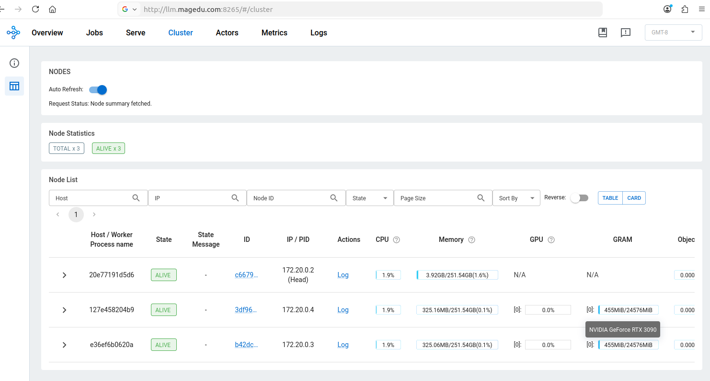
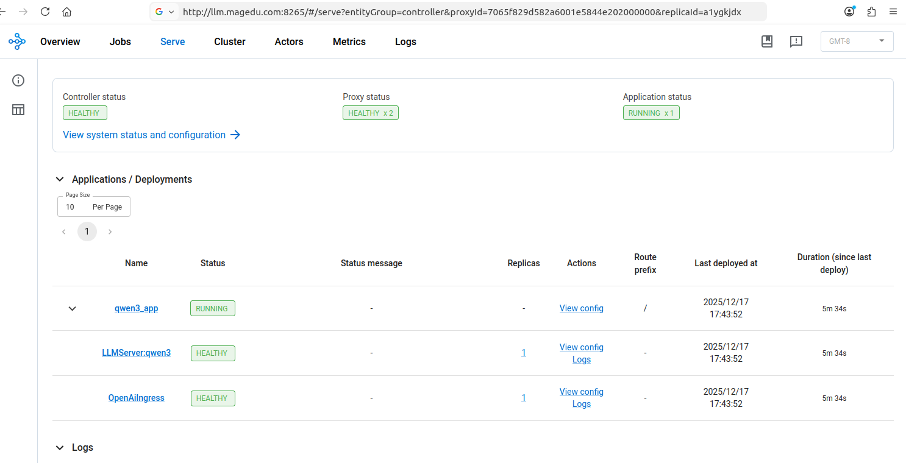
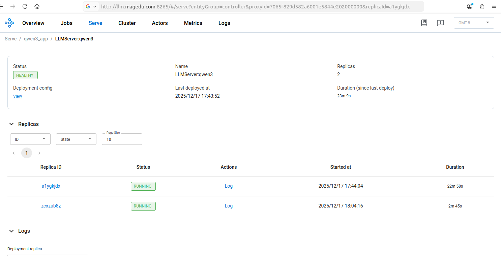

# 基于Docker Compose的Ray Cluster 


本示例提供了通过docker compose快速启动Ray Cluster集群的相关配置。


## 环境说明


**本示例环境：**

- OS：Ubuntu Server 2204
- GPU：共三块，仅两块 RTX 3090 可用，Device ID分别对应0和2
- 启动三个Service Container，组成Ray Cluster：
  - 一个是Head Node（ray-head），不为其分配GPU
  - 另外两个是Worker Node（ray-worker-1和ray-worker-2），每个容器各分配一个GPU


**Docker Compose文件说明：**

- docker-compose.yml：使用Ray的官方镜像，能够拉起Ray Cluster集群，但没有内置vLLM；
  - 绑定了宿主机的6379（GCS）、8265（Dashboard）和10001（Ray Client ）端口；
- docker-compose-vllm-ray.yml：使用vLLM的官方镜像，内置有Ray，但不完整（没有Dashboard等），需要在其基础上重新安装Ray组件；本示例重新升级安装了Ray组件至2.52.1版本，而vLLM的版本为0.11.2；
  - 绑定了宿主机的6379（GCS）、8265（Dashboard）、10001（Ray Client ）和8000（Ray Serve HTTP Proxy）端口；
  - 将宿主机的/Models/Pretrained_Models/目录基于卷关联到了容器的同一路径的目录上，该目录存储有事先下载好的模型权重，例如Qwen3-0.6B等；


## 启动Ray Cluster


首先，在宿主机上创建日志目录，以便于将Ray的各进程的日志通过卷进行持久保存。需要注意的是，Ray的各进行是以UID 1000和GID 1000的身份在运行，因此需要将创建的目录赋予该用户写权限，否则可能会导致服务无法正常启动。

```
mkdir -pv logs/{head,worker1,worker2}
chown -R 1000:1000 logs/*
```


接下来，基于Docker Compose的配置启动服务即可。下面的命令，用于启动基于Ray官方镜像的集群。需要注意的是，它没有内置vLLM，无法运行模型服务。

```
docker-compose up -d
```

> 注意：
>
> 1. 需要在主机上安装好的nvidia-container-toolkit，且能够在容器中正常加载GPU；
>
> 2. 未启用rootless模型式，上面的命令需要以管理员的身份运行；


在宿主机上，访问本机地址的8265端口，即可通过Dashboard验证集群状态。




或者，也可以通过ray status命令来获取集群的状态。若宿主机上没有ray CLI可用，也可以到ray-head容器中执行。

```bash
# 先进入ray-head的交互式接口
docker-compose exec ray-head /bin/bash
(base) ray@20e77191d5d6:~$

# 而后在交互式接口中执行如下命令
ray status
```

该命令会返回类似如下信息，这通常表明集群已经正常运行。

```
======== Autoscaler status: 2025-12-17 17:13:41.621247 ========
Node status
---------------------------------------------------------------
Active:
 1 node_b42dc72b19a98faaa12fafa38765a60e0e89d2922c43339b098d3a53
 1 node_3df968d63d736f6163e240171678962a8aaf805e384b5d50db43e0ed
 1 node_c66795488903d46d107a0e1c6f7490c85a37abd5985aa900a882d9f0
Pending:
 (no pending nodes)
Recent failures:
 (no failures)

Resources
---------------------------------------------------------------
Total Usage:
 0.0/192.0 CPU
 0.0/2.0 GPU
 0B/725.38GiB memory
 0B/27.94GiB object_store_memory

From request_resources:
 (none)
Pending Demands:
 (no resource demands)
```


若需要提交Job，进行Cluster的健康状态测试，可以集群外部的主机（例如宿主机）上安装ray模块（建议使用虚拟python环境），而后在scripts目录下，运行如下命令。

```bash
ray job submit --address http://127.0.0.1:8265  --working-dir ./  -- python3 ray_cluster_healthcheck.py
```

若集群处于健康状态，它通常会返回类似如下信息。

```
Job submission server address: http://127.0.0.1:8265
2025-12-18 09:19:53,360 INFO dashboard_sdk.py:355 -- Uploading package gcs://_ray_pkg_15af417da410af14.zip.
2025-12-18 09:19:53,361 INFO packaging.py:588 -- Creating a file package for local module './'.

-------------------------------------------------------
Job 'raysubmit_ZVR3G2din2araCkb' submitted successfully
-------------------------------------------------------

......

=== Ray Cluster Health Check ===
Alive nodes: 3
 - 172.20.0.4 | CPUs=64.0 | GPUs=1.0
 - 172.20.0.2 | CPUs=64.0 | GPUs=0
 - 172.20.0.3 | CPUs=64.0 | GPUs=1.0

......

=== Health Check Summary ===
CPU hosts: 1
GPU hosts: 2
Object Store hosts: 1

Ray Cluster health check completed successfully.

------------------------------------------
Job 'raysubmit_ZVR3G2din2araCkb' succeeded
------------------------------------------
```


如果需要，可以运行如下命令，停止Ray Cluster相关的服务，并清理日志文件。

```bash
docker-compose down
rm -rf logs/{head,worker1,worker2}/*
```


## vLLM和Ray Cluster

本节用于说明如何基于Docker Compose启动带有vLLM的Ray Cluster，并在集群上运行模型服务。

### 启动集群

首先，在宿主机上创建日志目录，以便于将Ray的各进程的日志通过卷进行持久保存。方法请参考前一节，如若已经创建，可直接跳过该步骤。

```
mkdir -pv logs/{head,worker1,worker2}
chown -R 1000:1000 logs/*
```


接下来，基于Docker Compose的配置启动服务即可。下面的命令，用于启动基于vLLM官方镜像build的新镜像的集群，它更新了镜像中的ray至2.52.1版本，并补充安装依赖的部分其它组件。在ray-head服务启动时新创建的镜像标签为“vllm-ray:latest”，该镜像将直接被后续的两个容器ray-worker-1和ray-worker-2所共用。

```
docker-compose -f docker-compose-vllm-ray.yml up -d
```

> 提示：集群服务启动后的验证方式与前一节相同，这里不再赘述。请参考前一节的示例进行集群验证。


### 运行模型服务

若需要提交Job到集群上，需要集群外部的主机（例如宿主机）上安装ray模块（建议使用虚拟python环境），而后在serve_deploy目录下，运行如下命令。它会在Ray Cluster上部署一个Serve Application，基于vLLM推理引擎运行一个名为"qwen3"的模型服务。

```bash
ray job submit --address http://127.0.0.1:8265  --working-dir ./  -- serve deploy qwen3_app_autoscaling.yaml
```

> 注意：基于docker-compose-vllm-ray.yml启动的worker node实例，通过卷将宿主机的/Models/Pretrained_Models/目录关联到容器上，该目录中存储有事先下载好的模型权重。如果你的模型权重文件下载到了别处，需要分别对docker-compose-vllm-ray.yml和qwen3_app_autoscaling.yaml文件中的路径作出相应的修改。


通过Dashboard或者ray job命令即可了解相应Job的状态，如下图所示，Serve Application已经正常工作，共有一个副本。




Ray Serve支持实例的自动扩容和缩容，qwen3_app_autoscaling.yaml文件中使用了如下配置来支持扩缩容的规模。

```yaml
autoscaling_config:
  min_replicas: 1
  max_replicas: 2  # 根据负载和节点数调整
  target_ongoing_requests: 5  # 关键指标, 每个replica目标并发数
  upscale_delay: 5.0       # 扩容延迟（秒），建议 30~60
  downscale_delay: 30.0    # 缩容延迟（秒），建议 300~600
```


Locust是常用于对模型服务发起压力测试的工具。安装好locust模块，基于scripts目录下locustfile.py额发生过的运行如下命令，即可启动测试。它模拟20个用户的并发请求，以每秒5个新请求的速率进行创建，直到最大20个。20个并发远超过了前面自动扩缩容配置中每个实例的目标负载（5个），所以延迟5秒钟之后即会触发扩容操作。Serve HTTP Proxy运行于Head Node，并且默认监听于8000端口。

```
locust -f scripts/locustfile.py --host http://localhost:8000 --headless -u 20 -r 5 --run-time 5m
```


扩容结果如下图所示。




等压测命令运行5分钟后退出之后，若30秒内并发请求总数不超过5个，该serve application即会执行缩容操作。
