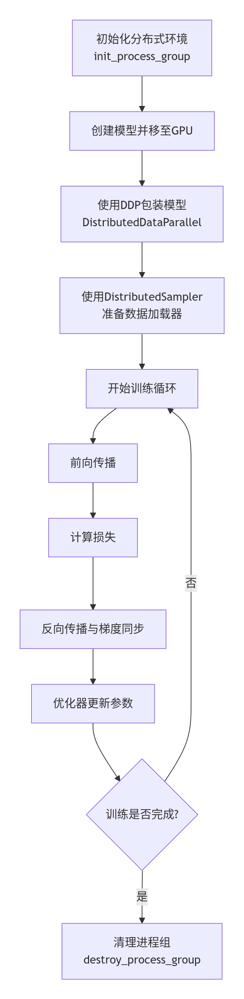

# PyTorch DDP基础示例

PyTorch 的 `DistributedDataParallel`(DDP) 是一种基于**多进程**的分布式数据并行训练方式。它通过将数据划分为多个子批次，在每个 GPU 上独立计算前向和反向传播，然后使用高效的集合通信操作（如 `all_reduce`）同步梯度，确保所有模型副本的参数保持一致。

DDP 的训练流程涉及多个关键步骤，从环境初始化到最终的参数更新，下图概括了这一过程：




## 代码功能分段说明

**分布式训练设置**：

- setup_distributed：初始化分布式环境，依赖 torchrun 提供的环境变量 RANK 和 WORLD_SIZE，使用 NCCL 后端。
- cleanup_distributed：清理分布式进程组。

**数据准备与 BPE 分词器**：

- prepare_data：加载 WikiText-2-raw-v1 或 WikiText-103-v1 数据集，提取文本。
- train_bpe_tokenizer：训练 BPE 分词器，保存为 JSON 文件。

**数据集处理**：

- TokenizedDataset：将文本通过 BPE 分词器编码，生成固定长度的训练块（block_size=128），支持因果语言建模。

**Transformer 模型定义**：

- CausalSelfAttention：实现因果自注意力机制。
- FeedForward：前馈网络层。
- TransformerBlock：Transformer 块，包含注意力层和前馈层。
- GPTLike：完整的 GPT-like 模型。

**训练函数**：

- main：主训练逻辑，解析命令行参数，设置 GPU 数量，加载数据和模型，进行多轮训练，支持单/多 GPU 模式和混合精度。


## 启动训练的命令

**1. 安装依赖**：

```bash
pip install torch datasets tokenizers
```

**2. 启动命令：**

默认使用所有 GPU（例如 2 个）。

```bash
torchrun --nproc_per_node=2 script.py
```

若要指定使用1个GPU，则使用如下命令。

```bash
torchrun --nproc_per_node=1 script.py --num_gpus 1
```

若要使用更多的自定义参数，可以参考如下命令。

```bash
torchrun --nproc_per_node=2 script.py --epochs 5 --batch_size 32 --vocab_size 5000
```


