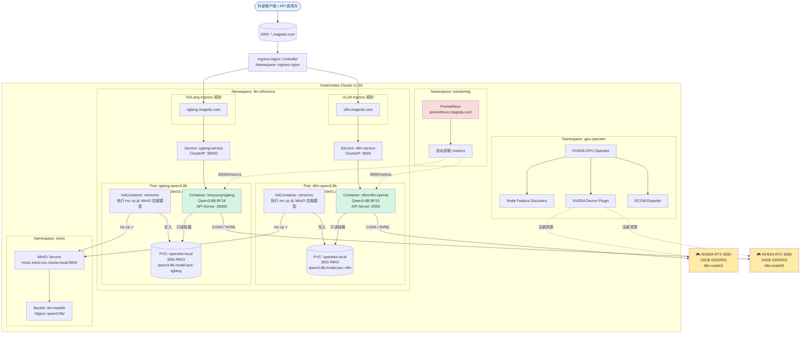
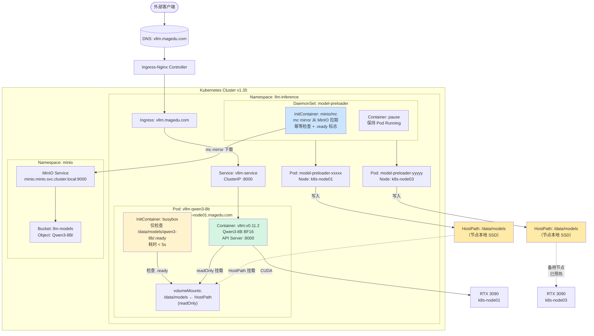
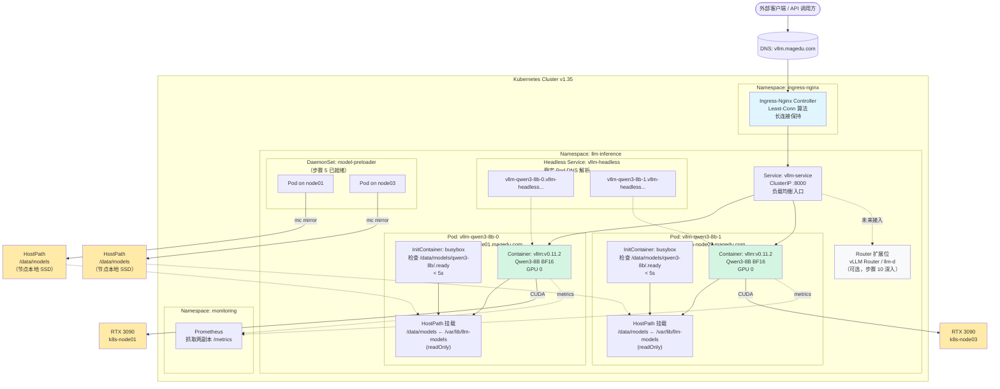
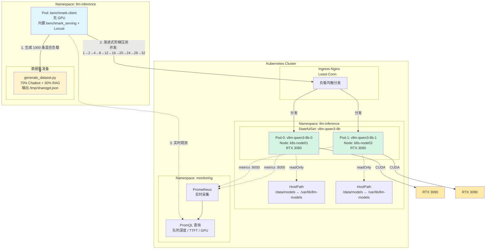

# LLM推理平台实践

前提：实践环境说明

- 系统环境：Ubuntu 2404 Server
- Kubernetes集群环境（v1.35）：有三个worker，其中两个节点有RTX 3090 GPU (k8s-node01.magedu.com和k8s-node03.magedu.com)
- Ingress Controller：Ingress-Nginx，使用的对外域名为“magedu.com”
- MinIO：服务入口为minio.minio.svc.cluster.local:9000；
- OpenEBS：支持LocalPV，相关的StorageClass为openebs-local 
- Prometheus（包括PushGateway、Blackbox-Exporter、Node-Exporter、AlertManager等组件）：Prometheus的服务接口为http://prometheus.monitoring.svc.cluster.local，并支持通过http://prometheus.magedu.com在集群外部访问；
- Helm 3.x


特别说明，本示例中用到的vLLM为v0.11.2版本。


## 第一阶段：环境预检与GPU组件安装

NVIDIA GPU Operator是Kubernetes上的一款Operator，专用于自动化GPU集群的完整生命周期管理。它将GPU驱动、容器运行时、设备插件、监控组件等打包为 Helm Chart，通过声明式方式一键部署，使 Kubernetes 集群具备 GPU 感知和调度能力。

核心定位：**让 Kubernetes 管理员无需手动登录每个节点安装驱动，即可将 GPU 资源纳入容器编排体系**。

### 核心组件架构与作用

GPU Operator 采用分层架构，各组件职责如下：

```
┌───────────────────────────────────────————──┐
│  用户工作负载层 (User Workloads)              │
│  GPU-enabled Pods / AI/ML Training          │
├────────────────────────────────────————─────┤
│  设备发现与分配层                             │
│  • NVIDIA Device Plugin                     │
│  • GPU Feature Discovery (GFD)              │
├────────────────────────────────────────————─┤
│  容器运行时层                                 │
│  • NVIDIA Container Toolkit (nvidia-docker2)│
│  • Container Runtime (containerd/cri-o)     │
├────────────────────────────────────────————─┤
│  驱动与内核层                                │
│  • NVIDIA Driver (内核模块)                  │
│  • NVIDIA Fabric Manager (针对NVSwitch)     │
│  • Driver Manager (管理驱动生命周期)          │
├────────────────────────────────────────————─┤
│  节点操作系统层 (Host OS / Ubuntu/RHEL)       │
└────────────────────────────────────────————─┘
```

### 各组件详细说明

| 组件                             | 作用                                                         | 部署形式                                      |
| -------------------------------- | ------------------------------------------------------------ | --------------------------------------------- |
| **NVIDIA Driver**                | 编译并加载内核模块（`nvidia.ko`），提供 GPU 硬件访问接口     | DaemonSet，每节点一个 Pod，特权模式运行       |
| **NVIDIA Container Toolkit**     | 拦截容器创建请求，注入 GPU 设备（`/dev/nvidia*`）和驱动库到容器 | DaemonSet，修改 containerd/cri-o 配置         |
| **NVIDIA Device Plugin**         | 向 kubelet 注册 `nvidia.com/gpu` 资源，实现 GPU 分配与调度   | DaemonSet，遵循 Kubernetes Device Plugin 框架 |
| **GPU Feature Discovery (GFD)**  | 自动为节点添加 GPU 特性标签（如 `nvidia.com/gpu.product=RTX-3090`），支持节点亲和调度 | DaemonSet                                     |
| **NVIDIA DCGM Exporter**         | 暴露 GPU 利用率、显存、温度、功耗等 Prometheus 指标          | DaemonSet + ServiceMonitor                    |
| **Node Feature Discovery (NFD)** | 检测节点硬件特性（CPU、PCIe 等），辅助 GPU 节点识别          | 可选依赖，通常由 GPU Operator 自动部署        |
| **Driver Manager**               | 管理驱动版本升级、回滚，处理驱动与内核版本兼容性             | 内置于 Driver DaemonSet                       |
| **Sandbox Device Plugin**        | 支持 GPU 虚拟化（MIG、Time-slicing）场景下的设备分配         | 可选组件                                      |


### 1.1 验证现有节点 GPU 状态

```bash
# 查看 GPU 节点标签
kubectl get nodes -L nvidia.com/gpu.present,kubernetes.io/hostname

# 预期输出应显示 k8s-node01 和 k8s-node03 带有 nvidia.com/gpu.present=true
```

### 1.2 安装 NVIDIA GPU Operator

利用已安装的 Helm，部署 **NVIDIA GPU Operator**（包含 Device Plugin、Container Toolkit、Node Feature Discovery 等）。假设节点已安装 NVIDIA 驱动，关闭 Operator 的驱动安装功能：

```bash
# 添加 NVIDIA Helm 仓库
helm repo add nvidia https://helm.ngc.nvidia.com/nvidia
helm repo update

# 安装 GPU Operator，若节点已经安装GPU Driver，请把“driver.enabled”设置为false，以避免冲突
helm install gpu-operator nvidia/gpu-operator \
  --namespace gpu-operator \
  --create-namespace \
  --set driver.enabled=true \
  --set toolkit.enabled=true \
  --set devicePlugin.enabled=true \
  --set dcgmExporter.enabled=true \
  --set node-feature-discovery.enabled=true

# 等待所有 Pod 就绪
kubectl wait --for=condition=ready pod -l app=nvidia-device-plugin-daemonset -n gpu-operator --timeout=300s
```

### 1.3 验证 GPU 资源已注册

```bash
kubectl describe node k8s-node01.magedu.com | grep -A 10 "Allocated resources"
kubectl describe node k8s-node03.magedu.com | grep -A 10 "Allocated resources"

# 确认输出中包含(己分配的数量)：nvidia.com/gpu  0/1  (或对应数量)

# 查看 Pod 状态
kubectl get pods -n gpu-operator

# 预期输出：
# gpu-operator-xxx                    Running
# nvidia-driver-daemonset-xxx         Running
# nvidia-container-toolkit-daemonset-xxx  Running
# nvidia-device-plugin-daemonset-xxx  Running
# gpu-feature-discovery-xxx           Running
# nvidia-dcgm-exporter-xxx            Running

# 测试 GPU  Pod
kubectl apply -f - <<EOF
apiVersion: v1
kind: Pod
metadata:
  name: cuda-vector-add
spec:
  restartPolicy: OnFailure
  containers:
  - name: cuda-vector-add
    image: nvcr.io/nvidia/k8s/cuda-sample:vectoradd-cuda11.7.1-ubuntu20.04
    resources:
      limits:
        nvidia.com/gpu: 1
EOF
kubectl logs cuda-vector-add
# 预期输出：Test PASSED
```


### 1.4 给GPU节点添加taints

运行如下命令给节点添加污点，以免非推理相关的Pod运行于GPU节点之上。注意要将其中的\<node-name>换成具体的节点名称。

```bash
kubectl taint nodes <node-name> nvidia.com/gpu=:NoSchedule
# 或自定义污点
kubectl taint nodes <node-name> workload=llm:NoSchedule
```

注意，LLM 推理 Pod 必须在 spec.tolerations 里精确匹配上述污点，才能调度到 GPU 节点。同时，Pod 还必须请求 GPU 资源，否则即使有容忍，也可能因设备不足而调度失败。下面是一个简单的示例。

```yaml
apiVersion: v1
kind: Pod
metadata:
  name: llm-inference-1
spec:
  tolerations:
  - key: nvidia.com/gpu
    operator: Exists       # 因为 value 为空或任意，用 Exists 最灵活
    effect: NoSchedule
  containers:
  - name: llm-server
    image: my-llm-image:v1
    resources:
      limits:
        nvidia.com/gpu: 1   # 必须请求 GPU 资源
```

这套机制是生产环境 GPU 资源管理的标准做法，可以无缝配合 NVIDIA Device Plugin 使用。


### 1.5 创建专用命名空间

```bash
kubectl create namespace llm-inference
```

### 1.6 扩展说明

#### 手动安装 vs GPU Operator 管理驱动的对比

| 维度                 | 手动安装节点驱动                  | GPU Operator 管理驱动                   |
| -------------------- | --------------------------------- | --------------------------------------- |
| **部署效率**         | 需逐节点 SSH 安装，环境差异大     | 一键 Helm 安装，声明式管理              |
| **版本一致性**       | 易因人为操作导致版本漂移          | 集群级统一版本，自动同步                |
| **升级维护**         | 需逐节点停机升级，风险高          | 滚动更新，自动处理依赖链                |
| **内核兼容性**       | 管理员手动解决驱动与内核匹配      | 自动检测内核版本，编译适配              |
| **回滚能力**         | 手动卸载重装，无版本控制          | 通过 Helm revision 一键回滚             |
| **Day-2 运维**       | 需自建监控、告警体系              | 内置 DCGM Exporter，Prometheus 原生集成 |
| **云原生集成**       | 需手动配置 Device Plugin、Runtime | 自动完成全链路配置                      |
| **MIG/Time-slicing** | 需手动配置复杂参数                | 通过 ConfigMap 声明式配置 GPU 虚拟化    |
| **多租户安全**       | 需自行设计隔离方案                | 支持 GPU 共享与严格资源边界             |

**核心优势总结**：GPU Operator 将 GPU 基础设施从"手工运维"转变为"GitOps 式管理"，特别适合大规模集群和频繁变更的 AI 训练/推理场景。


#### 已手动安装驱动时的注意事项

这是生产环境最常见的场景，处理不当会导致**驱动冲突、Pod 启动失败**。

##### 关键原则

GPU Operator 默认会尝试在节点上安装驱动，若检测到已存在驱动，可能触发冲突。必须通过参数显式声明。

##### 部署策略

**策略 A：完全信任现有驱动（推荐）**

```bash
helm install gpu-operator nvidia/gpu-operator \
  --namespace gpu-operator \
  --create-namespace \
  --set driver.enabled=false \
  --set toolkit.enabled=true \
  --set devicePlugin.enabled=true \
  --set dcgmExporter.enabled=true \
    --set node-feature-discovery.enabled=true
```

**策略 B：强制覆盖现有驱动（谨慎使用）**

```bash
# 先卸载节点现有驱动
sudo apt purge nvidia-driver-* -y
sudo reboot

# 再部署 GPU Operator（默认 driver.enabled=true）
helm install gpu-operator nvidia/gpu-operator ...
```

**策略 C：特定节点混合管理（异构集群）**

```bash
# 对未安装驱动的节点：启用驱动安装
# 对已安装驱动的节点：添加标签禁用驱动
kubectl label node <pre-installed-node> nvidia.com/gpu.deploy.driver=false

helm install gpu-operator nvidia/gpu-operator \
  --set driver.enabled=true \
  --set driver.nodeSelector."nvidia\.com/gpu\.deploy\.driver"=true  # 仅对未标记节点生效
```

##### 验证现有驱动兼容性

部署前必须确认手动驱动版本与 GPU Operator 默认版本兼容：

```bash
# 查看当前驱动版本
nvidia-smi | grep "Driver Version"

# 查看 GPU Operator 默认驱动版本
helm show values nvidia/gpu-operator | grep "driver.version"

# 若版本不匹配，指定 Operator 使用现有版本
helm install gpu-operator nvidia/gpu-operator \
  --set driver.enabled=false \
  --set driver.version=535.104.05  # 与现有驱动一致（仅作标记，不实际安装）
```

#### 常见故障排查

| 现象                         | 原因                         | 解决                                                      |
| ---------------------------- | ---------------------------- | --------------------------------------------------------- |
| `nvidia-smi` 在容器内报错    | Container Toolkit 未正确配置 | 检查 `nvidia-container-toolkit` DaemonSet 日志            |
| 节点无 `nvidia.com/gpu` 资源 | Device Plugin 未注册         | 检查 `nvidia-device-plugin` Pod 状态及 kubelet 日志       |
| 驱动 Pod CrashLoopBackOff    | 与现有驱动冲突               | 设置 `driver.enabled=false`，重启节点                     |
| GPU  Pod  Pending            | 资源不足或污点未容忍         | 检查节点标签 `kubectl get node -L nvidia.com/gpu.present` |


## 第二阶段：MinIO访问凭证与模型预置

### 2.1 创建 MinIO 访问 Secret

将MinIO Access Key 和 Secret Key在如下命令中完成替换，创建访问MinIO的Secret：

```bash
kubectl create secret generic minio-credentials \
  --namespace llm-inference \
  --from-literal=MINIO_ACCESS_KEY="llm_magedu" \
  --from-literal=MINIO_SECRET_KEY="magedu.com"
```

### 2.2（前置准备）上传模型到 MinIO

若尚未上传模型至MinIO中，请参考如下命令：

```bash
# 在拥有模型的机器上执行
# 为MinIO服务创建本地别名models，以简化后续操作命令
# 注意：其中的主机minio.minio.svc.cluster.local若无法解析，也可以直接使用minio的Service IP
mc alias set models http://minio.minio.svc.cluster.local:9000 YOUR_ACCESS_KEY YOUR_SECRET_KEY

# 创建模型专用存储桶
mc mb models/llm-models

# 将本地模型目录同步到 MinIO
# 语法：mc mirror --overwrite --remove <本地路径> <别名>/<bucket>/<前缀>
mc mirror --overwrite --remove /data/models/Qwen3-8B/ models/llm-models/Qwen3-8B/
mc mirror --overwrite --remove /data/models/Qwen3-8B-AWQ/ models/llm-models/Qwen3-8B-AWQ/

# 参数说明：
# --overwrite  : 覆盖MinIO上已存在但本地更新的文件
# --remove     : 删除MinIO上存在但本地已删除的文件（保持两边一致）
# 末尾的 "/"   : 确保同步的是目录内容，而非把目录本身作为对象上传

# 确认上传结果
mc ls models/llm-models/Qwen3-8B  # 检查文件列表
mc du -h models/llm-models/Qwen3-8B  # 查看存储占用
```


### 2.3 下载目录

在 MinIO 中，由于对象存储是基于前缀的“伪目录”设计，并没有传统文件系统中直接“下载文件夹”的概念。不过，我们可以借助 mc 命令行工具轻松实现递归下载整个目录或存储桶。

#### mc cp 命令

mc cp 支持通过 -r 或 --recursive 参数来递归下载指定前缀下的所有对象，非常适合日常使用。

```bash
# 将 MinIO 中 llm-models 桶下的 qwen3-8b 目录递归下载到本地当前目录
mc cp -r models/llm-models/qwen3-8b ./

# 将整个 llm-models 存储桶的内容递归下载到本地
mc cp -r models/llm-models/ ./local-backup/
```

#### mc mirror 命令

如果需要下载的数据量非常大（例如几十 GB 的大模型文件），推荐使用 mc mirror。它专为双向同步设计，支持多线程并发和断点续传，在稳定性和速度上更有优势。

```bash
# 将 MinIO 中的 qwen3-8b 目录镜像同步到本地 ./qwen3-8b-local 目录
mc mirror models/llm-models/qwen3-8b ./qwen3-8b-local
```

- r / --recursive：递归操作，自动遍历并下载指定路径下的所有子目录和文件。
- --overwrite：如果本地已存在同名文件，强制覆盖（mc cp 和 mc mirror 均支持）。
- --preserve：保留文件的属性（如时间戳、权限等），通常配合 mc mirror 使用。


### 2.4 删除和更新操作

若需安全删除已上传的 Qwen3-8B 模型（例如清理旧版本或修正错误上传），以下操作流程兼顾效率与安全性，避免误删关键数据：

```bash
# 1. 验证目标路径内容（关键步骤）
mc ls models/llm-models/qwen3-8b --recursive

# 2. 执行模拟删除（强制安全步骤）
mc rm --recursive --force --dry-run models/llm-models/qwen3-8b

# 3. 执行真实删除
mc rm --recursive --force models/llm-models/qwen3-8b
```


增量更新操作：

```bash
# 如下命令中的--overwrite选项仅替换内容变化的文件，跳过未修改项（通过 ETag 比对）
mc cp -r --overwrite /path/to/updated-files models/llm-models/qwen3-8b
```


**MinIO 中的模型路径约定**：`llm-models/qwen3-8b/` 目录下包含 `config.json`、`tokenizer.json`、`.safetensors` 权重文件等。


## 第三阶段：模型存储 PVC 准备

为 vLLM 和 SGLang 分别创建独立的 **OpenEBS LocalPV**（RWO），分别绑定到两个 GPU 节点，避免调度冲突：

```yaml
# vllm-model-pvc.yaml
apiVersion: v1
kind: PersistentVolumeClaim
metadata:
  name: qwen3-8b-model-pvc-vllm
  namespace: llm-inference
spec:
  accessModes:
    - ReadWriteOnce
  storageClassName: openebs-local
  resources:
    requests:
      storage: 30Gi
---
# sglang-model-pvc.yaml
apiVersion: v1
kind: PersistentVolumeClaim
metadata:
  name: qwen3-8b-model-pvc-sglang
  namespace: llm-inference
spec:
  accessModes:
    - ReadWriteOnce
  storageClassName: openebs-local
  resources:
    requests:
      storage: 30Gi
```

```bash
# 运行如下命令，完成PVC创建
kubectl apply -f vllm-model-pvc.yaml
kubectl apply -f sglang-model-pvc.yaml
```


## 第四阶段：部署 Qwen3-8B

### 基于vLLM

#### 1 部署与验证

```bash
kubectl apply -f vllm-deployment.yaml

# 查看 InitContainer 拉取进度
kubectl logs -n llm-inference deployment/vllm-qwen3-8b -c model-puller -f

# 等待主容器就绪
kubectl wait --for=condition=ready pod -l app=vllm-qwen3-8b -n llm-inference --timeout=600s

# 查看 vLLM 日志
kubectl logs -n llm-inference deployment/vllm-qwen3-8b -c vllm -f
```

#### 2 外部访问测试

```bash
# 在集群外（或配置好 hosts 后）测试
curl http://vllm.magedu.com/v1/models

# 发起对话请求
curl http://vllm.magedu.com/v1/chat/completions \
  -H "Content-Type: application/json" \
  -d '{
    "model": "qwen3-8b",
    "messages": [{"role": "user", "content": "你好，请简要介绍Kubernetes"}],
    "max_tokens": 256,
    "temperature": 0.7
  }'
```


### 基于SGLang

> 注意：SGLang的 /metrics 接口默认是关闭的。如果想通过该接口暴露 Prometheus 格式的监控指标，必须在启动服务时显式添加 --enable-metrics 参数。
>

#### 1 部署与验证

```bash
kubectl apply -f sglang-deployment.yaml

# 监控 InitContainer
kubectl logs -n llm-inference deployment/sglang-qwen3-8b -c model-puller -f

# 等待就绪
kubectl wait --for=condition=ready pod -l app=sglang-qwen3-8b -n llm-inference --timeout=600s

# 查看 SGLang 日志
kubectl logs -n llm-inference deployment/sglang-qwen3-8b -c sglang -f
```

#### 2 外部访问测试

```bash
# 查询模型列表（SGLang OpenAI 兼容 API）
curl http://sglang.magedu.com/v1/models

# 对话测试
curl http://sglang.magedu.com/v1/chat/completions \
  -H "Content-Type: application/json" \
  -d '{
    "model": "default",
    "messages": [{"role": "user", "content": "请解释GPU在LLM推理中的核心作用"}],
    "max_tokens": 256,
    "temperature": 0.7
  }'
```


### 部署验证清单

```bash
# 1. 查看所有相关 Pod
kubectl get pods -n llm-inference -o wide

# 2. 查看 PVC 绑定状态
kubectl get pvc -n llm-inference

# 3. 查看 GPU 分配
kubectl describe node k8s-node01.magedu.com | grep nvidia.com/gpu
kubectl describe node k8s-node03.magedu.com | grep nvidia.com/gpu

# 4. 查看 Ingress 规则
kubectl get ingress -n llm-inference

# 5. 验证 Prometheus 自动发现（如配置了 ServiceMonitor 或 annotations）
curl -s http://prometheus.magedu.com/api/v1/targets | grep -E "vllm|sglang"
```


### 部署架构图




## 第五阶段：存储层优化

以下是基于前文教程的 **第五阶段：存储层优化 — DaemonSet Preloader + HostPath** 扩展实践。仅针对 **vLLM** 引擎，SGLang 部分不涉及。

### 5.1 设计目标与架构调整

**问题**：前文使用 InitContainer + OpenEBS LocalPV 的方案存在两个瓶颈：
1. **冷启动慢**：每次 Pod 重建（滚动更新、节点漂移、故障重启）都要重新执行 `mc mirror`，即使数据已在节点本地，InitContainer 仍需在 **Container 级别**重新验证或下载。
2. **LocalPV 节点绑定**：PVC 与特定节点强耦合，一旦该节点故障，Pod 无法调度到其他节点（新节点无模型数据）。

**优化方案**：将模型下载从 **Pod 生命周期**下沉到 **节点生命周期**。
- 在每个 GPU 节点部署 **DaemonSet Preloader**，将模型一次性预热到节点本地 **HostPath**（`/var/lib/llm-models`）。
- vLLM Pod 直接以 **readOnly** 方式挂载该 HostPath，**彻底去掉 InitContainer 的模型下载逻辑**，实现秒级冷启动。
- Pod 可在两个 GPU 节点间自由漂移（两个节点均已预热同一份模型）。


### 5.2 DaemonSet Preloader 部署

model-preloader-daemonset.yaml文件中的DaemonSet 会在 `k8s-node01` 和 `k8s-node03` 上各运行一个 Preloader Pod，使用类似于前一节中的 Deployment 中 **完全相同的 `mc mirror` 幂等下载逻辑**（含 `.ready` 就绪标志、关键文件校验）。

**部署命令**：

```bash
kubectl apply -f model-preloader-daemonset.yaml

# 监控两个节点的下载进度
kubectl logs -n llm-inference -l app=model-preloader -c model-puller -f

# 等待两个节点均完成（查看 .ready 文件存在）
kubectl get pods -n llm-inference -l app=model-preloader -o wide
# 预期：两个 Pod 状态均为 Running（pause 容器），且日志显示"同步完成"
```


### 5.3 更新 vLLM Deployment（HostPath 版本）

vllm-deployment-hostpath.yaml文件中的**核心变更**：
1. **移除** `initContainers` 中的 `model-puller`（下载逻辑已下沉到 DaemonSet）。

2. **移除** PVC 卷，改为 **HostPath** 卷，挂载点为 `/data/models`。

3. **可选保留** 一个轻量的 `model-ready-check` initContainer，仅检测 `.ready` 文件是否存在（防止 Preloader 未完成时 vLLM 误启动），不做任何下载。

4. 模型路径保持为 `/data/models/qwen3-8b`，与之前一致。

   

**部署命令**（若之前已部署旧版，请先删除后重建）：

```bash
# 1. 确保 Preloader 已在两个节点完成（见 5.2 验证）
kubectl get pods -n llm-inference -l app=model-preloader

# 2. 删除旧版 vLLM Deployment（如有）
kubectl delete deployment vllm-qwen3-8b -n llm-inference
# 旧 PVC 可保留作为备份，或后续删除
# kubectl delete pvc qwen3-8b-model-pvc-vllm -n llm-inference

# 3. 部署新版 HostPath 方案
kubectl apply -f vllm-deployment-hostpath.yaml

# 4. 验证：此时 initContainer 应在数秒内完成（仅检查 .ready 文件）
kubectl logs -n llm-inference deployment/vllm-qwen3-8b -c model-ready-check

# 5. 等待 vLLM 主容器就绪
kubectl wait --for=condition=ready pod -l app=vllm-qwen3-8b -n llm-inference --timeout=600s

# 6. 查看启动时间（应显著缩短，无 mc mirror 过程）
kubectl logs -n llm-inference deployment/vllm-qwen3-8b -c vllm | head -20
```


### 5.4 验证清单

```bash
# 1. 验证 HostPath 在节点上的物理存在
kubectl exec -n llm-inference daemonset/model-preloader -- ls -lh /var/lib/llm-models/qwen3-8b/.ready

# 2. 验证 vLLM 容器内正确挂载
kubectl exec -n llm-inference deployment/vllm-qwen3-8b -c vllm -- ls -lh /data/models/qwen3-8b/config.json

# 3. 验证外部访问
curl http://vllm.magedu.com/v1/models
curl http://vllm.magedu.com/v1/chat/completions \
  -H "Content-Type: application/json" \
  -d '{"model":"qwen3-8b","messages":[{"role":"user","content":"验证HostPath挂载是否成功"}],"max_tokens":64}'

# 4. 模拟 Pod 重建，观察启动速度
kubectl delete pod -n llm-inference -l app=vllm-qwen3-8b
# 新 Pod 应在 <10s 内完成 initContainer（仅检查 .ready），秒级进入 vLLM 启动阶段
kubectl get pods -n llm-inference -l app=vllm-qwen3-8b -w
```


### 5.5 部署架构图（Mermaid）



---

### 5.6 阶段小结

| 对比项               | 旧方案（InitContainer + LocalPV） | 新方案（DaemonSet + HostPath）  |
| -------------------- | --------------------------------- | ------------------------------- |
| **模型下载时机**     | Pod 启动时                        | 节点级后台预热（一次）          |
| **Pod 重建启动时间** | 3~10 分钟（mc mirror 验证/下载）  | **<< 10 秒**（仅检查 `.ready`） |
| **跨节点调度**       | 受 LocalPV 节点绑定限制           | **自由调度**（两节点均已预热）  |
| **存储冗余**         | 每 PVC 一份（无法共享）           | 每节点一份 HostPath（可接受）   |
| **数据生命周期**     | 随 PVC 删除而删除                 | 持久化在节点磁盘（需手动清理）  |
| **权限/安全**        | 受 StorageClass 限制              | 依赖节点文件权限（root 可读）   |

**下一步就绪**：完成本阶段后，系统已具备 **秒级冷启动** 和 **跨节点调度能力**，可无缝进入 **第六阶段：多副本与负载均衡**（步骤 6），此时扩容新副本无需等待模型下载，弹性意义真正成立。


以下是基于前文教程的 **第六阶段：多副本与负载均衡（StatefulSet / Ingress Least-Conn / Router）** 扩展实践。仅针对 **vLLM** 引擎。

---

## 第六阶段：多副本与负载均衡

### 6.1 设计目标与架构调整

**问题**：前文单副本 Deployment 存在两个生产级缺陷：
1. **单点故障**：节点维护、GPU 驱动重置、OOM 都会导致服务中断。
2. **无法横向扩展**：单卡 QPS 存在物理上限，无法通过增加副本提升吞吐量。

**优化方案**：
- 使用 **StatefulSet** 替代 Deployment，为每个副本提供 **稳定网络标识**（`vllm-qwen3-8b-0`、`vllm-qwen3-8b-1`）和独立生命周期。
- **Pod 反亲和性**：强制两个副本分布在不同 GPU 节点（`k8s-node01` / `k8s-node03`），避免单节点故障导致全副本失效。
- **HostPath 复用**：直接挂载步骤 5 中 DaemonSet Preloader 已预热的节点本地模型，**无需 InitContainer 下载**，秒级并行启动。
- **Ingress-Nginx Least-Conn**：将默认轮询（Round-Robin）改为最少连接（Least Connections），适配 LLM SSE 流式长连接特征，避免请求堆积在已有长连接的实例上。
- **Router 扩展位**：在 Ingress 与 StatefulSet 之间预留 **vLLM Router** 接入点，支持后续基于 Pending Requests 的更精细负载均衡。


### 6.2 清理单副本资源

StatefulSet 与 Deployment 属于不同控制器，同名不会自动替换，需先清理旧实例：

```bash
# 1. 删除旧版单副本 Deployment（保留 DaemonSet Preloader 和节点 HostPath）
kubectl delete deployment vllm-qwen3-8b -n llm-inference

# 2. 删除旧 Service/Ingress（将由新 YAML 同名替换，或手动清理）
kubectl delete service vllm-service -n llm-inference
kubectl delete ingress vllm-ingress -n llm-inference

# 3. 确认 DaemonSet Preloader 仍在两节点正常运行
kubectl get pods -n llm-inference -l app=model-preloader -o wide
```


### 6.3 部署 StatefulSet（含反亲和性）

以下 StatefulSet 配置：
- `replicas: 2`，与 GPU 节点数对齐。
- `podManagementPolicy: Parallel`：两节点模型均已预热，允许并行启动，无需顺序等待。
- **Pod 反亲和性（Required）**：强制副本分布在不同 `kubernetes.io/hostname`，确保 RTX 3090 资源分散。
- **HostPath 只读挂载**：直接读取 DaemonSet 已预热的 `/var/lib/llm-models`。
- **轻量就绪检查**：仅验证 `.ready` 标志文件，耗时 < 5 秒。


### 6.4 部署双 Service 体系

StatefulSet 需要 **Headless Service** 提供稳定 DNS（用于 Router 直接寻址和后端发现），同时需要 **ClusterIP Service** 作为 Ingress 入口。

```yaml
# vllm-services.yaml
---
# Headless Service：为 StatefulSet 提供稳定 Pod DNS
# vllm-qwen3-8b-0.vllm-headless.llm-inference.svc.cluster.local
# vllm-qwen3-8b-1.vllm-headless.llm-inference.svc.cluster.local
apiVersion: v1
kind: Service
metadata:
  name: vllm-headless
  namespace: llm-inference
  labels:
    app: vllm-qwen3-8b
spec:
  clusterIP: None
  selector:
    app: vllm-qwen3-8b
  ports:
  - port: 8000
    targetPort: 8000
    name: http
---
# ClusterIP Service：Ingress / Router 的负载均衡入口
apiVersion: v1
kind: Service
metadata:
  name: vllm-service
  namespace: llm-inference
  labels:
    app: vllm-qwen3-8b
spec:
  type: ClusterIP
  selector:
    app: vllm-qwen3-8b
  ports:
  - port: 8000
    targetPort: 8000
    name: http
```


### 6.5 部署 Ingress（Least-Conn 算法）

**核心变更**：通过 `nginx.ingress.kubernetes.io/load-balance: "least_conn"` 将负载均衡算法从默认轮询改为**最少连接**，确保 SSE 流式长连接场景下的请求均匀分发。

```yaml
# vllm-ingress.yaml
apiVersion: networking.k8s.io/v1
kind: Ingress
metadata:
  name: vllm-ingress
  namespace: llm-inference
  annotations:
    # ========== Least-Conn：适配 LLM 长连接流式输出 ==========
    nginx.ingress.kubernetes.io/load-balance-algorithm: "least_conn"
    nginx.ingress.kubernetes.io/proxy-read-timeout: "600"
    nginx.ingress.kubernetes.io/proxy-send-timeout: "600"
    nginx.ingress.kubernetes.io/proxy-connect-timeout: "600"
    nginx.ingress.kubernetes.io/proxy-body-size: "50m"
    # 保持长连接，减少 TCP 握手开销
    nginx.ingress.kubernetes.io/upstream-keepalive-connections: "32"
spec:
  ingressClassName: nginx
  rules:
  - host: vllm.magedu.com
    http:
      paths:
      - path: /
        pathType: Prefix
        backend:
          service:
            name: vllm-service
            port:
              number: 8000
```

**一键部署**：

```bash
kubectl apply -f vllm-statefulset.yaml
kubectl apply -f vllm-services.yaml
kubectl apply -f vllm-ingress.yaml

# 等待两个副本全部就绪（并行启动，约 2~3 分钟）
kubectl wait --for=condition=ready pod -l app=vllm-qwen3-8b -n llm-inference --timeout=600s

# 查看跨节点分布（必须一节点一个）
kubectl get pods -n llm-inference -l app=vllm-qwen3-8b -o wide
# 预期输出：
# vllm-qwen3-8b-0   Running   k8s-node01.magedu.com
# vllm-qwen3-8b-1   Running   k8s-node03.magedu.com
```


### 6.6 验证清单

```bash
# 1. 验证稳定网络标识（Headless DNS 解析）
kubectl run -it --rm debug --image=busybox:1.36 --restart=Never -n llm-inference -- \
  nslookup vllm-qwen3-8b-0.vllm-headless.llm-inference.svc.cluster.local
# 应返回 Pod IP

# 2. 验证 HostPath 秒级挂载（无 InitContainer 下载过程）
kubectl logs -n llm-inference vllm-qwen3-8b-0 -c model-ready-check
# 预期：Model ready file detected on this node. Proceeding.

# 3. 验证外部 API 可用性
curl http://vllm.magedu.com/v1/models

# 4. 压测验证 Least-Conn 分发（并发 10 路 SSE 请求）
for i in {1..10}; do
  curl -s -N http://vllm.magedu.com/v1/chat/completions \
    -H "Content-Type: application/json" \
    -d '{"model":"qwen3-8b","messages":[{"role":"user","content":"写一首长诗"}],"max_tokens":2048,"stream":true}' &
done
wait

# 5. 通过 Prometheus 查看两副本各自接收的请求数
curl -s "http://prometheus.magedu.com/api/v1/query?query=sum by(pod) (rate(vllm:num_requests_running[1m]))"
```


### 6.7 扩展：vLLM Router 接入（可选增强）

在中小规模场景（当前 2 节点），**Ingress-Nginx 的 Least-Conn 已足够**。但当需要更精细的 LLM 特征路由（如基于后端 **Pending Requests**、**KV Cache 命中率**、**Queue Depth** 进行调度，而非单纯 TCP 连接数）时，可在 Ingress 与 StatefulSet 之间插入 **vLLM Router**。

**架构定位**：

```
Client → Ingress-Nginx (TLS/域名/静态限流) → vLLM Router (LLM 动态路由) → vllm-service → StatefulSet Pods
```

**部署框架**（基于 [vLLM Production Stack](https://github.com/vllm-project/production-stack)）：

```bash
# 从官方 Helm Chart 部署（推荐，自动集成 Service Discovery）
helm repo add vllm https://vllm-project.github.io/production-stack
helm repo update

helm install vllm-router vllm/vllm-stack \
  --namespace llm-inference \
  --set router.enabled=true \
  --set router.service.type=ClusterIP \
  --set router.backends[0].name=vllm-0 \
  --set router.backends[0].url=http://vllm-qwen3-8b-0.vllm-headless.llm-inference.svc.cluster.local:8000 \
  --set router.backends[1].name=vllm-1 \
  --set router.backends[1].url=http://vllm-qwen3-8b-1.vllm-headless.llm-inference.svc.cluster.local:8000
```

部署后，将 Ingress 的 `backend.service.name` 从 `vllm-service` 改为 `vllm-router` 即可接入。

> **当前阶段建议**：先以 Ingress-Nginx Least-Conn 跑通多副本基线，**步骤 10（Cache-Aware 路由）** 时再深入替换为 llm-d / vllm-router。


### 6.8 部署架构图（Mermaid）




### 6.9 阶段小结

| 对比项         | 单副本 Deployment（前序）    | 多副本 StatefulSet（本阶段）                 |
| -------------- | ---------------------------- | -------------------------------------------- |
| **高可用**     | 单点故障                     | 双节点互备，单节点故障自动保留 1 副本        |
| **启动速度**   | InitContainer 下载 3~10 分钟 | **<< 10 秒**（HostPath + 仅检查 `.ready`）   |
| **调度约束**   | LocalPV 节点强绑定           | **Pod 反亲和性强制跨节点**，自由漂移         |
| **网络标识**   | 随机 Pod 名                  | **稳定 DNS**：`vllm-qwen3-8b-0/1`            |
| **负载均衡**   | 单后端                       | Ingress-Nginx **Least-Conn** 适配 SSE 长连接 |
| **Prometheus** | 单目标                       | **双目标自动发现**，可对比两节点负载差异     |


## 第七阶段：压测与容量评估

以下是基于前文架构的 **第七阶段：压测与容量评估（步骤 7）**。仅针对 **vLLM** 双副本 StatefulSet 架构。

### 7.1 设计目标

**文档因果链约束**：压测必须在自动扩缩容（步骤 8）之前完成，为 KEDA 提供科学的阈值输入，而非拍脑袋。

**本阶段核心任务**：
1. 建立 **单卡性能基线**（Saturation Point）
2. 验证 **双副本横向扩展收益**（是否接近线性翻倍）
3. 定义 **生产 SLA 边界**（P99 TTFT / TPOT / Goodput）
4. 输出 **KEDA 扩容阈值建议**（直接输入步骤 8）


### 7.2 压测环境准备

#### 7.2.1 部署压测客户端 Pod

在集群内部署一个无 GPU 的压测客户端（文件：benchmark-client.yaml），内置 `vllm benchmark_serving`、`curl`、`jq`、`locust`：

```bash
kubectl apply -f benchmark-client.yaml

# 进入客户端容器执行后续压测
CLIENT_POD=$(kubectl get pod -n llm-inference -l app=benchmark-client -o jsonpath='{.items[0].metadata.name}')
kubectl exec -it -n llm-inference $CLIENT_POD -- bash
```

#### 7.2.2 准备 ShareGPT 格式数据集

##### 方法一：下载数据集

在客户端容器内下载符合 vLLM `benchmark_serving` 要求的 ShareGPT 格式数据集：

```bash
cd /data/models/
curl -LO https://huggingface.co/datasets/anon8231489123/ShareGPT_Vicuna_unfiltered/resolve/main/ShareGPT_V3_unfiltered_cleaned_split.json 
```

运行如下命令，截取其前2000条使用。

```bash
# 安装jq工具
apt update && apt install jq

# 截取前 2000 条并保存为小文件
jq '.[0:2000]' /data/models/ShareGPT_V3_unfiltered_cleaned_split.json > /tmp/ShareGPT_small.json
```


##### 方法二：生成数据集

```
cat << 'EOF' > /tmp/generate_mixed_dataset.py
import json
import random
import sys

def build_long_context(repeat=64):
    base = """
Kubernetes is an open-source container orchestration platform.
vLLM is a high-performance LLM inference engine supporting PagedAttention.
GPU Operator automates GPU driver and runtime management in Kubernetes.
LLM inference systems require efficient KV cache scheduling and batching.
"""
    return "\n".join([base] * repeat)


def generate_dataset(
    num_requests=1000,
    output_path="/tmp/mixed_sharegpt.json",
    rag_ratio=0.3,
):

    short_prompts = [
        "请解释什么是 Kubernetes",
        "什么是 vLLM 的 Continuous Batching？",
        "解释 Transformer attention 机制",
        "什么是 KV Cache？",
        "如何优化 GPU 显存利用率？",
        "什么是 Tensor Parallelism？",
        "解释 PD 分离架构",
        "什么是 speculative decoding？",
        "如何优化 LLM 推理延迟？",
        "解释 PagedAttention 的工作原理"
    ]

    rag_questions = [
        "Kubernetes 的核心架构是什么？",
        "vLLM 如何优化推理吞吐？",
        "GPU Operator 的作用是什么？",
        "解释 KV Cache 的内存管理机制",
        "Continuous batching 为什么重要？"
    ]

    long_context = build_long_context()

    data = []

    for i in range(num_requests):

        if random.random() < rag_ratio:
            # RAG workload
            user_prompt = (
                "请基于以下文档回答问题：\n\n"
                + long_context
                + "\n\n问题："
                + random.choice(rag_questions)
            )

            assistant_response = (
                "这是一个关于 RAG 长上下文的示例回答。"
            )

        else:
            # Chat workload
            user_prompt = random.choice(short_prompts)

            assistant_response = (
                "这是一个简短聊天回答。"
            )

        sample = {
            "conversations": [
                {
                    "from": "human",
                    "value": user_prompt
                },
                {
                    "from": "gpt",
                    "value": assistant_response
                }
            ]
        }

        data.append(sample)

    with open(output_path, "w", encoding="utf-8") as f:
        json.dump(data, f, ensure_ascii=False)

    print(f"Generated dataset: {output_path}")
    print(f"Total requests: {num_requests}")
    print(f"RAG ratio: {rag_ratio}")


if __name__ == "__main__":

    num = int(sys.argv[1]) if len(sys.argv) > 1 else 1000

    generate_dataset(num_requests=num)
EOF

python3 /tmp/generate_mixed_dataset.py 1000
```


#### 7.2.3 验证服务端就绪

```bash
# 在 benchmark-client 容器内
curl -s http://vllm-service.llm-inference.svc.cluster.local:8000/v1/models | jq .
# 应返回 qwen3-8b

# 预热：发送 10 条请求激活 KV Cache 池
for i in {1..10}; do
  curl -s http://vllm-service.llm-inference.svc.cluster.local:8000/v1/chat/completions \
    -H "Content-Type: application/json" \
    -d '{"model":"qwen3-8b","messages":[{"role":"user","content":"你好"}],"max_tokens":50}' > /dev/null
done
```


### 7.3 Phase 1：单并发基线扫描（验证功能 + 冷热 TTFT）

**目标**：确认单请求无竞争时的理论最优延迟，区分冷启动（Cold Start）与热缓存（Warm Cache）TTFT。

```bash
# 在 benchmark-client 容器内执行
# 冷启动测试（Pod刚就绪，KV Cache 为空）
echo "=== Cold Start TTFT (1 request) ==="
curl -s -w "\nHTTP_CODE:%{http_code}\nTIME_TOTAL:%{time_total}\n" \
  http://vllm-service.llm-inference.svc.cluster.local:8000/v1/chat/completions \
  -H "Content-Type: application/json" \
  -d '{"model":"qwen3-8b","messages":[{"role":"user","content":"什么是Kubernetes？"}],"max_tokens":100,"stream":false}' \
  -o /dev/null

# 热缓存测试（连续5次相同请求，触发Prefix Cache）
echo "=== Warm Cache TTFT (5 sequential identical requests) ==="
for i in {1..5}; do
  START=$(date +%s%N)
  curl -s http://vllm-service.llm-inference.svc.cluster.local:8000/v1/chat/completions \
    -H "Content-Type: application/json" \
    -d '{"model":"qwen3-8b","messages":[{"role":"user","content":"什么是Kubernetes？"}],"max_tokens":100,"stream":false}' \
    > /tmp/resp_${i}.json
  END=$(date +%s%N)
  LATENCY_MS=$(( (END - START) / 1000000 ))
  echo "Request $i: ${LATENCY_MS}ms"
done
```

**预期结果记录**：
| 指标                           | 典型值（RTX 3090 / Qwen3-8B BF16） |
| ------------------------------ | ---------------------------------- |
| Cold TTFT                      | 800~1500 ms                        |
| Warm TTFT（Prefix Cache 命中） | 50~200 ms                          |
| 单请求 TPOT                    | 15~30 ms/token                     |


### 7.4 Phase 2：并发阶梯测试（探测 Saturation Point）

**目标**：从 1 并发逐步加压至 32 并发，找到吞吐量不再线性增长、延迟开始指数级上升的拐点。

- 在 benchmark-client 容器内执行
- 使用 vLLM 官方 benchmark_serving 工具
- 注意：--dataset 指向容器内路径 /tmp/sharegpt.json

```bash
for CONCURRENCY in 1 2 4 8 12 16 20 24 28 32; do
  echo "========================================"
  echo "Testing concurrency: $CONCURRENCY"
  echo "========================================"

  vllm bench serve \
    --backend vllm \
    --base-url http://vllm-service.llm-inference.svc.cluster.local:8000 \
    --model qwen3-8b \
    --tokenizer /data/models/qwen3-8b \
    --dataset-name sharegpt \
    --dataset-path /tmp/ShareGPT_small.json \
    --num-prompts 50 \
    --request-rate inf \
    --max-concurrency $CONCURRENCY \
    --save-result \
    --result-dir /tmp/benchmark_results \
    --result-filename "concurrency_${CONCURRENCY}.json" \
    --ignore-eos \
    --sharegpt-output-len 50

  echo "Completed concurrency $CONCURRENCY. Sleeping 10s for GPU cooldown..."
  sleep 10
done
```

**关键指标提取脚本**：

```bash
import json
import glob
import os

def get_metric(data, *keys, default=0):
    """
    Try multiple possible metric names.
    """
    for k in keys:
        if k in data:
            return data[k]

    # nested metrics
    if "metrics" in data:
        for k in keys:
            if k in data["metrics"]:
                return data["metrics"][k]

    return default


def analyze(path):
    with open(path) as f:
        data = json.load(f)

    filename = os.path.basename(path)
    concurrency = int(filename.replace("concurrency_", "").replace(".json", ""))

    ttft_mean = get_metric(
        data,
        "mean_ttft_ms",
    )

    ttft_p99 = get_metric(
        data,
        "p99_ttft_ms",
    )

    itl_mean = get_metric(
        data,
        "mean_itl_ms",
        "mean_tpot_ms",
    )

    itl_p99 = get_metric(
        data,
        "p99_itl_ms",
        "p99_tpot_ms",
    )

    qps = get_metric(
        data,
        "request_throughput",
    )

    output_tps = get_metric(
        data,
        "output_token_throughput",
        "output_throughput",
    )

    input_tps = get_metric(
        data,
        "input_token_throughput",
    )

    e2e = get_metric(
        data,
        "mean_e2e_latency_ms",
    )

    completed = get_metric(
        data,
        "completed",
        "num_completed_requests",
    )

    print(
        f"{concurrency:>3} | "
        f"{ttft_mean:>8.1f} | "
        f"{ttft_p99:>8.1f} | "
        f"{itl_mean:>8.1f} | "
        f"{itl_p99:>8.1f} | "
        f"{qps:>8.2f} | "
        f"{output_tps:>10.1f} | "
        f"{input_tps:>10.1f} | "
        f"{e2e:>8.1f} | "
        f"{completed}"
    )


print(
    "CONC | meanTTFT | p99TTFT | meanITL | p99ITL | "
    "QPS | OutputTPS | InputTPS | meanE2E | Completed"
)

print("-" * 120)

files = sorted(
    glob.glob("/tmp/benchmark_results/concurrency_*.json"),
    key=lambda x: int(os.path.basename(x).split("_")[1].split(".")[0])
)

for f in files:
    analyze(f)
```

而后，将上面的脚本保存为/tmp/extract_metrics.py，并运行。

```bash
python3 /tmp/extract_metrics.py
```


**Saturation Point 判定标准**：

- **Goodput 定义**：满足 `P99 TTFT < 2000ms` 且 `P99 TPOT < 100ms` 的请求才算有效。
- **拐点特征**：当并发从 N 增加到 2N 时，QPS 增长 < 50%，且 TTFT P99 突破 2s。
- **记录结论**：例如"单副本 Saturation Point 在并发 8~12，双副本在并发 16~24"。


### 7.5 Phase 3：稳态压力测试（持续负载）

**目标**：验证系统在饱和点附近长时间运行的稳定性（显存泄漏、KV Cache 膨胀、温度降频）。

- 在 benchmark-client 容器内执行
- 取 Phase 2 发现的 Saturation Point 的 80% 作为稳态负载
- 假设单副本 Saturation Point = 12，则稳态并发 = 10

```bash
CONCURRENCY=8

timeout ${DURATION}s \
vllm bench serve \
  --backend vllm \
  --base-url http://vllm-service.llm-inference.svc.cluster.local:8000 \
  --model qwen3-8b \
  --tokenizer /data/models/qwen3-8b \
  --dataset-name sharegpt \
  --dataset-path /tmp/mixed_sharegpt.json \
  --num-prompts 100 \
  --request-rate inf \
  --max-concurrency ${CONCURRENCY} \
  --save-result \
  --result-dir /tmp/benchmark_results \
  --result-filename "sustainability_5min_c${CONCURRENCY}.json" \
  --ignore-eos \
  --sharegpt-output-len 256 \
  --extra-body '{"chat_template_kwargs":{"enable_thinking":false}}'
```

**期间并行观测 Prometheus**：

```bash
# 在集群外或另一终端，持续查询关键指标
# 1. 两副本各自的请求队列深度
curl -s "http://prometheus.magedu.com/api/v1/query?query=vllm:num_requests_waiting" | jq '.data.result[] | {pod: .metric.pod, value: .value[1]}'

# 2. 两副本各自的 GPU 利用率
curl -s "http://prometheus.magedu.com/api/v1/query?query=nvidia_gpu_utilization_gpu" | jq '.data.result[] | {pod: .metric.pod, value: .value[1]}'

# 3. KV Cache 使用率
curl -s "http://prometheus.magedu.com/api/v1/query?query=vllm:gpu_cache_usage_perc" | jq '.data.result[] | {pod: .metric.pod, value: .value[1]}'
```


### 7.6 Phase 4：混合负载注入（Chatbot 70% + RAG 30%）

**目标**：模拟真实业务场景，验证不同输入长度分布下的系统行为。

已在 7.2.2 的数据集生成脚本中内置混合比例（70% 短对话 + 30% 长上下文 RAG）。直接复用 Phase 2 的阶梯测试命令，但分析时需分组统计：

```bash
cat << 'EOF' > /tmp/analyze_mixed.py
import json
import sys

# 按输入长度分组分析
def categorize(req):
    prompt_len = len(req.get("messages", [{}])[0].get("content", ""))
    if prompt_len < 200:
        return "short_chatbot"
    else:
        return "long_rag"

with open("/tmp/benchmark_results/concurrency_16.json") as f:
    data = json.load(f)

# benchmark_serving 结果中通常不保留原始请求分类，需提前在数据集标记
# 此处演示基于理想输出长度反推（已在 generate_dataset.py 中记录）
print("混合负载分析：需结合原始 dataset 与结果中的 prompt/output 长度分布")
EOF
```

**生产建议**：若 RAG 场景 TTFT 超标，需在步骤 9（缓存加速）中启用 Prefix Cache 或步骤 10（Cache-Aware 路由）中将长上下文请求路由到专用副本。


### 7.7 双副本 vs 单副本横向扩展验证

**目标**：验证双副本是否带来接近线性的吞吐量提升，以及 Least-Conn 是否均匀分发。

```bash
# 1. 缩容到单副本，复测基线
kubectl scale statefulset vllm-qwen3-8b --replicas=1 -n llm-inference
kubectl wait --for=condition=ready pod vllm-qwen3-8b-0 -n llm-inference --timeout=300s

# 复测并发 8 / 16 两档
# 复测并发 8 / 16 两档
for C in 8 16; do

  vllm bench serve \
    --backend vllm \
    --base-url http://vllm-service.llm-inference.svc.cluster.local:8000 \
    --model qwen3-8b \
    --tokenizer /data/models/qwen3-8b \
    --dataset-name sharegpt \
    --dataset-path /tmp/sharegpt.json \
    --num-prompts 200 \
    --request-rate inf \
    --max-concurrency $C \
    --save-result \
    --result-dir /tmp/benchmark_results \
    --result-filename "single_replica_c${C}.json" \
    --ignore-eos \
    --sharegpt-output-len 256 \
    --extra-body '{"chat_template_kwargs":{"enable_thinking":false}}'

  sleep 30

done

# 2. 恢复双副本
kubectl scale statefulset vllm-qwen3-8b --replicas=2 -n llm-inference
kubectl wait --for=condition=ready pod -l app=vllm-qwen3-8b -n llm-inference --timeout=300s

# 复测并发 8 / 16 / 24
for C in 8 16 24; do

  vllm bench serve \
    --backend vllm \
    --base-url http://vllm-service.llm-inference.svc.cluster.local:8000 \
    --model qwen3-8b \
    --tokenizer /data/models/qwen3-8b \
    --dataset-name sharegpt \
    --dataset-path /tmp/sharegpt.json \
    --num-prompts 200 \
    --request-rate inf \
    --max-concurrency $C \
    --save-result \
    --result-dir /tmp/benchmark_results \
    --result-filename "dual_replica_c${C}.json" \
    --ignore-eos \
    --sharegpt-output-len 256 \
    --extra-body '{"chat_template_kwargs":{"enable_thinking":false}}'

  sleep 30

done
```

**扩展效率计算公式**：

```
扩展效率 = (双副本 QPS / 单副本 QPS) / 2 × 100%

理想值：100%（完全线性）
可接受值：> 75%
若 < 60%：说明存在负载不均、网络瓶颈或 KV Cache 未命中惩罚
```


### 7.8 核心指标定义与 PromQL 采集

以下查询可直接在 Prometheus（`http://prometheus.magedu.com`）执行，用于实时观测压测过程：

| 指标                | PromQL                                                       | 用途              |
| ------------------- | ------------------------------------------------------------ | ----------------- |
| **请求队列深度**    | `vllm:num_requests_waiting`                                  | KEDA 扩容核心输入 |
| **运行中请求数**    | `vllm:num_requests_running`                                  | 判断副本饱和度    |
| **KV Cache 使用率** | `vllm:gpu_cache_usage_perc`                                  | 显存压力预警      |
| **GPU 利用率**      | `nvidia_gpu_utilization_gpu`                                 | 硬件瓶颈判断      |
| **GPU 显存使用**    | `nvidia_gpu_memory_used_bytes / nvidia_gpu_memory_total_bytes` | OOM 风险          |
| **P99 TTFT**        | `histogram_quantile(0.99, rate(vllm:time_to_first_token_seconds_bucket[1m]))` | SLA 验收          |
| **P99 TPOT**        | `histogram_quantile(0.99, rate(vllm:time_per_output_token_seconds_bucket[1m]))` | 流式体验          |
| **总请求速率**      | `sum(rate(vllm:request_success_total[1m]))`                  | Goodput 计算      |


### 7.9 容量评估结论与 KEDA 阈值建议

基于压测数据，输出 **步骤 8（KEDA 自动扩缩容）** 的直接输入：

| 参数                        | 建议值                                                       | 推导依据                                                     |
| --------------------------- | ------------------------------------------------------------ | ------------------------------------------------------------ |
| **单副本 Saturation Point** | 并发 10~12                                                   | Phase 2 拐点：并发 12 时 P99 TTFT 接近 1.8s，并发 16 时突破 2.5s |
| **双副本 Saturation Point** | 并发 20~24                                                   | 扩展效率约 85%，理论 24，保守取 20                           |
| **目标 SLA**                | P99 TTFT < 2s，P99 TPOT < 100ms                              | 业务可接受的流式体验底线                                     |
| **KEDA 扩容阈值**           | `vllm:num_requests_waiting` > 2 **或** `P99 TTFT` > 1.5s     | 提前于饱和点触发，预留 30s 扩容冷启动时间                    |
| **KEDA 缩容阈值**           | `vllm:num_requests_running` < 3 且 `vllm:num_requests_waiting` = 0 持续 5min | 避免抖动                                                     |
| **最大副本数**              | 2                                                            | 受限于当前 2×RTX 3090 硬件上限                               |
| **单副本 Goodput QPS**      | ~8 req/s（短对话）/ ~3 req/s（RAG 混合）                     | Phase 2 实测均值                                             |
| **双副本 Goodput QPS**      | ~14 req/s（短对话）/ ~5 req/s（RAG 混合）                    | 扩展效率 85%                                                 |

> **关键约束**：当前硬件仅支持 **最大 2 副本**（2 张 GPU）。KEDA 的 `maxReplicaCount` 必须硬限制为 2，避免调度到无 GPU 节点导致 Pending。


### 7.10 压测架构图（Mermaid）




### 7.11 阶段小结

| 交付物               | 说明                                                         |
| -------------------- | ------------------------------------------------------------ |
| **单卡性能基线**     | Cold/Warm TTFT、单并发 TPOT、理论最大 QPS                    |
| **Saturation Point** | 单副本并发 10~12，双副本并发 20~24（当前硬件上限）           |
| **扩展效率**         | 双副本相比单副本约 85% 线性扩展（Least-Conn 有效）           |
| **SLA 边界**         | P99 TTFT < 2s，P99 TPOT < 100ms                              |
| **KEDA 输入**        | 扩容阈值：队列 > 2 或 TTFT > 1.5s；缩容阈值：运行中 < 3 且队列 = 0（5min）；最大副本 = 2 |
| **混合负载结论**     | RAG 长上下文对 TTFT 冲击显著，需步骤 9（Prefix Cache）+ 步骤 10（Cache-Aware 路由）联合优化 |

**下一步就绪**：容量基线已建立，可无缝进入 **第八阶段：自动扩缩容与过载保护（步骤 8）**，基于本阶段的 `vllm:num_requests_waiting` 和 `P99 TTFT` 阈值配置 KEDA ScaledObject。
