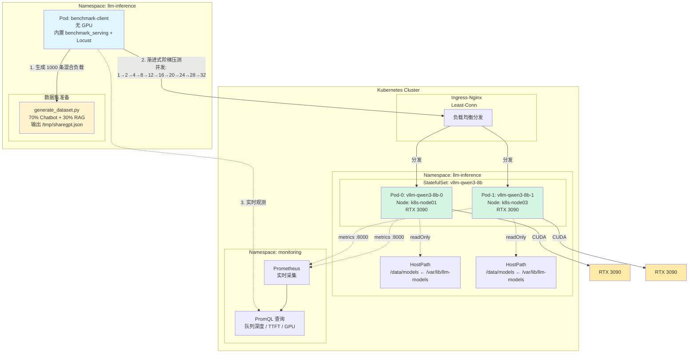
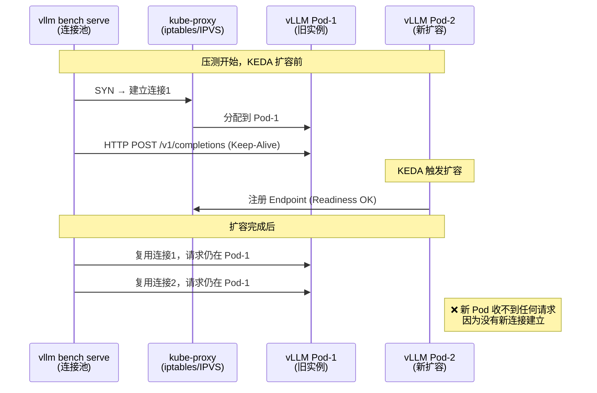
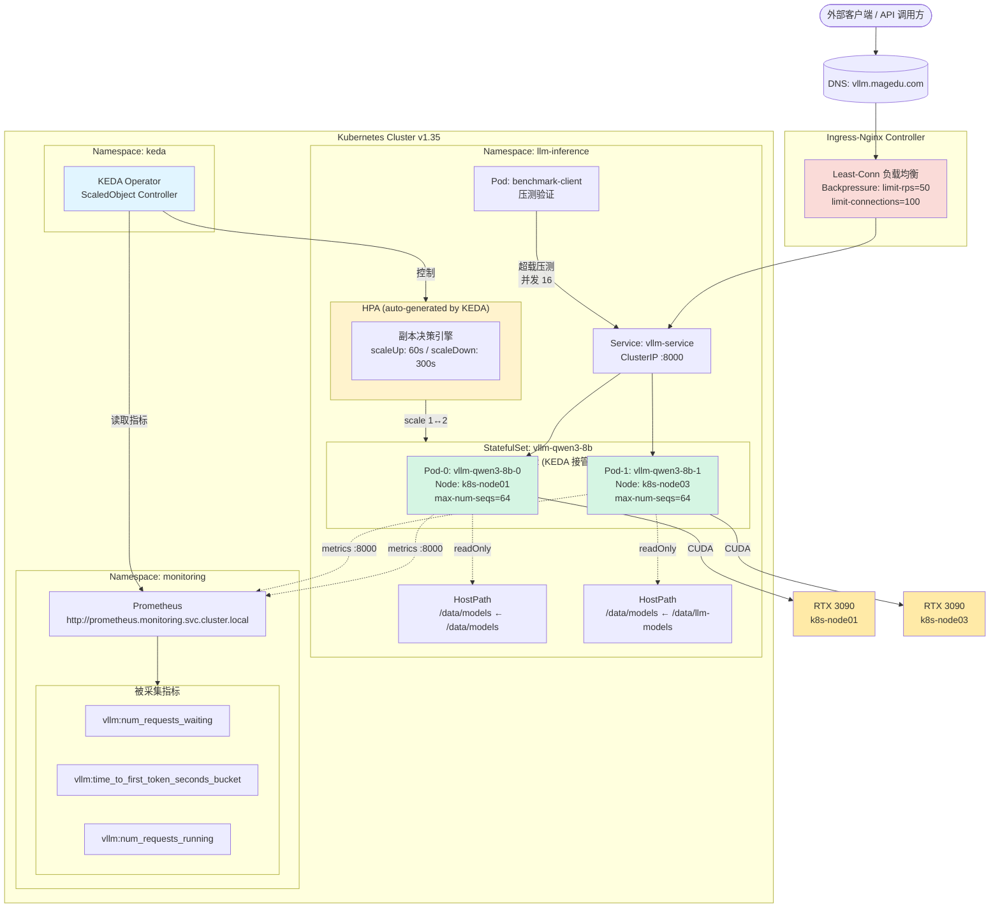
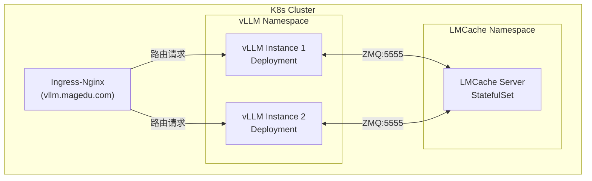
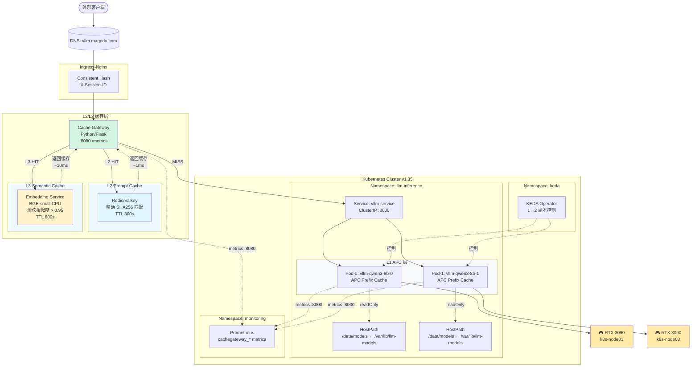
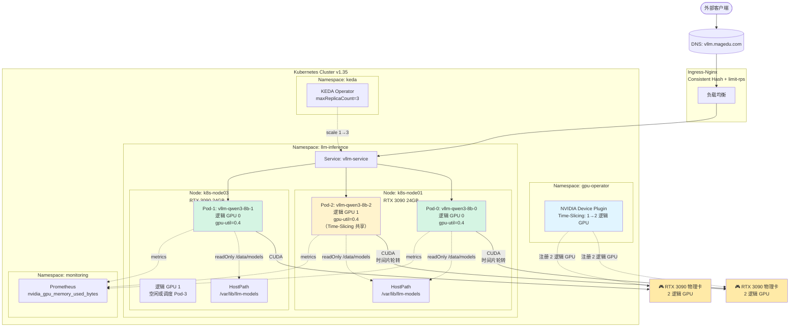
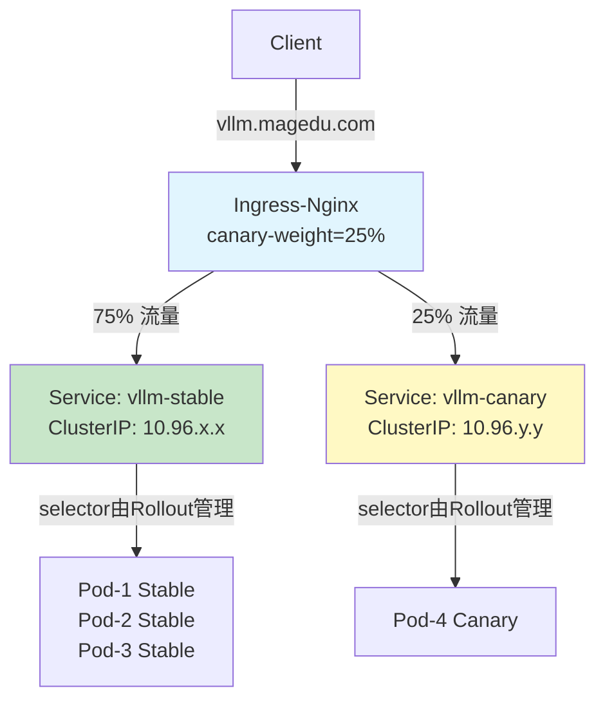
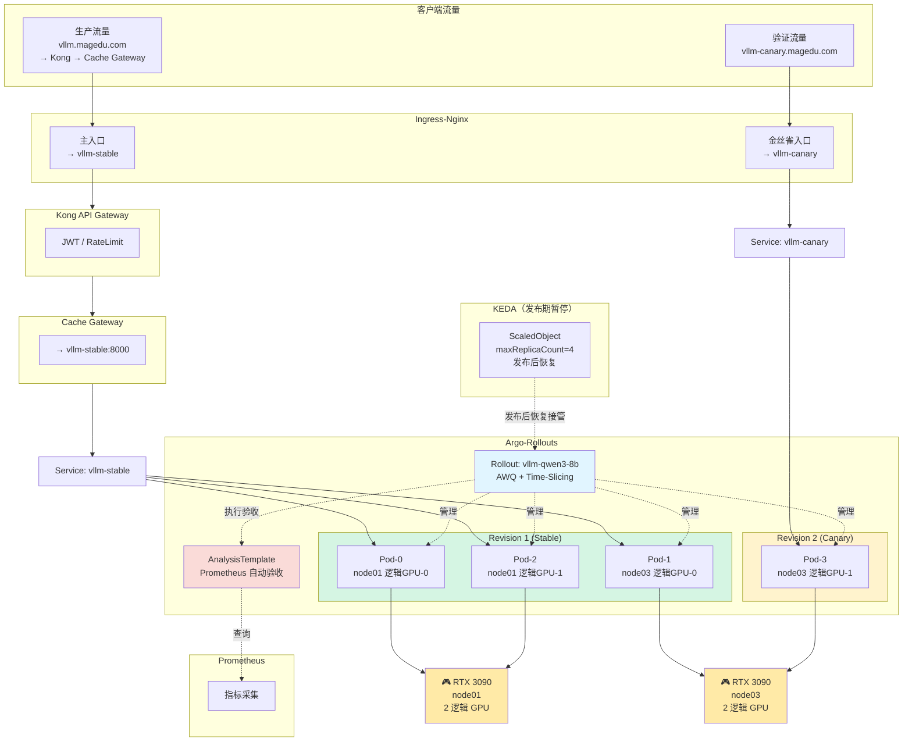

# LLM推理平台实践

前提：实践环境说明

- 系统环境：Ubuntu 2404 Server
- Kubernetes集群环境（v1.35）：有三个worker，其中两个节点有RTX 3090 GPU (k8s-node01.magedu.com和k8s-node03.magedu.com)
- Ingress Controller：Ingress-Nginx，使用的对外域名为“magedu.com”
- MinIO：服务入口为minio.minio.svc.cluster.local:9000；
- OpenEBS：支持LocalPV，相关的StorageClass为openebs-local 
- Prometheus（包括PushGateway、Blackbox-Exporter、Node-Exporter、AlertManager等组件）：Prometheus的服务接口为http://prometheus.monitoring.svc.cluster.local，并支持通过http://prometheus.magedu.com在集群外部访问；
- Helm 3.x


特别说明，本示例中用到的vLLM为v0.11.2版本。


## 第一阶段：环境预检与GPU组件安装

NVIDIA GPU Operator是Kubernetes上的一款Operator，专用于自动化GPU集群的完整生命周期管理。它将GPU驱动、容器运行时、设备插件、监控组件等打包为 Helm Chart，通过声明式方式一键部署，使 Kubernetes 集群具备 GPU 感知和调度能力。

核心定位：**让 Kubernetes 管理员无需手动登录每个节点安装驱动，即可将 GPU 资源纳入容器编排体系**。

### 核心组件架构与作用

GPU Operator 采用分层架构，各组件职责如下：

```
┌───────────────────────────────────────————──┐
│  用户工作负载层 (User Workloads)              │
│  GPU-enabled Pods / AI/ML Training          │
├────────────────────────────────────————─────┤
│  设备发现与分配层                             │
│  • NVIDIA Device Plugin                     │
│  • GPU Feature Discovery (GFD)              │
├────────────────────────────────────────————─┤
│  容器运行时层                                 │
│  • NVIDIA Container Toolkit (nvidia-docker2)│
│  • Container Runtime (containerd/cri-o)     │
├────────────────────────────────────────————─┤
│  驱动与内核层                                │
│  • NVIDIA Driver (内核模块)                  │
│  • NVIDIA Fabric Manager (针对NVSwitch)     │
│  • Driver Manager (管理驱动生命周期)          │
├────────────────────────────────────────————─┤
│  节点操作系统层 (Host OS / Ubuntu/RHEL)       │
└────────────────────────────────────────————─┘
```

### 各组件详细说明

| 组件                             | 作用                                                         | 部署形式                                      |
| -------------------------------- | ------------------------------------------------------------ | --------------------------------------------- |
| **NVIDIA Driver**                | 编译并加载内核模块（`nvidia.ko`），提供 GPU 硬件访问接口     | DaemonSet，每节点一个 Pod，特权模式运行       |
| **NVIDIA Container Toolkit**     | 拦截容器创建请求，注入 GPU 设备（`/dev/nvidia*`）和驱动库到容器 | DaemonSet，修改 containerd/cri-o 配置         |
| **NVIDIA Device Plugin**         | 向 kubelet 注册 `nvidia.com/gpu` 资源，实现 GPU 分配与调度   | DaemonSet，遵循 Kubernetes Device Plugin 框架 |
| **GPU Feature Discovery (GFD)**  | 自动为节点添加 GPU 特性标签（如 `nvidia.com/gpu.product=RTX-3090`），支持节点亲和调度 | DaemonSet                                     |
| **NVIDIA DCGM Exporter**         | 暴露 GPU 利用率、显存、温度、功耗等 Prometheus 指标          | DaemonSet + ServiceMonitor                    |
| **Node Feature Discovery (NFD)** | 检测节点硬件特性（CPU、PCIe 等），辅助 GPU 节点识别          | 可选依赖，通常由 GPU Operator 自动部署        |
| **Driver Manager**               | 管理驱动版本升级、回滚，处理驱动与内核版本兼容性             | 内置于 Driver DaemonSet                       |
| **Sandbox Device Plugin**        | 支持 GPU 虚拟化（MIG、Time-slicing）场景下的设备分配         | 可选组件                                      |


### 1.1 验证现有节点 GPU 状态

```bash
# 查看 GPU 节点标签
kubectl get nodes -L nvidia.com/gpu.present,kubernetes.io/hostname

# 预期输出应显示 k8s-node01 和 k8s-node03 带有 nvidia.com/gpu.present=true
```

### 1.2 安装 NVIDIA GPU Operator

利用已安装的 Helm，部署 **NVIDIA GPU Operator**（包含 Device Plugin、Container Toolkit、Node Feature Discovery 等）。假设节点已安装 NVIDIA 驱动，关闭 Operator 的驱动安装功能：

```bash
# 添加 NVIDIA Helm 仓库
helm repo add nvidia https://helm.ngc.nvidia.com/nvidia
helm repo update

# 安装 GPU Operator，若节点已经安装GPU Driver，请把“driver.enabled”设置为false，以避免冲突
helm install gpu-operator nvidia/gpu-operator \
  --namespace gpu-operator \
  --create-namespace \
  --set driver.enabled=true \
  --set toolkit.enabled=true \
  --set devicePlugin.enabled=true \
  --set dcgmExporter.enabled=true \
  --set node-feature-discovery.enabled=true

# 等待所有 Pod 就绪
kubectl wait --for=condition=ready pod -l app=nvidia-device-plugin-daemonset -n gpu-operator --timeout=300s
```

### 1.3 验证 GPU 资源已注册

```bash
kubectl describe node k8s-node01.magedu.com | grep -A 10 "Allocated resources"
kubectl describe node k8s-node03.magedu.com | grep -A 10 "Allocated resources"

# 确认输出中包含(己分配的数量)：nvidia.com/gpu  0/1  (或对应数量)

# 查看 Pod 状态
kubectl get pods -n gpu-operator

# 预期输出：
# gpu-operator-xxx                    Running
# nvidia-driver-daemonset-xxx         Running
# nvidia-container-toolkit-daemonset-xxx  Running
# nvidia-device-plugin-daemonset-xxx  Running
# gpu-feature-discovery-xxx           Running
# nvidia-dcgm-exporter-xxx            Running

# 测试 GPU  Pod
kubectl apply -f - <<EOF
apiVersion: v1
kind: Pod
metadata:
  name: cuda-vector-add
spec:
  restartPolicy: OnFailure
  containers:
  - name: cuda-vector-add
    image: nvcr.io/nvidia/k8s/cuda-sample:vectoradd-cuda11.7.1-ubuntu20.04
    resources:
      limits:
        nvidia.com/gpu: 1
EOF
kubectl logs cuda-vector-add
# 预期输出：Test PASSED
```


### 1.4 给GPU节点添加taints

运行如下命令给节点添加污点，以免非推理相关的Pod运行于GPU节点之上。注意要将其中的\<node-name>换成具体的节点名称。

```bash
kubectl taint nodes <node-name> nvidia.com/gpu=:NoSchedule
# 或自定义污点
kubectl taint nodes <node-name> workload=llm:NoSchedule
```

注意，LLM 推理 Pod 必须在 spec.tolerations 里精确匹配上述污点，才能调度到 GPU 节点。同时，Pod 还必须请求 GPU 资源，否则即使有容忍，也可能因设备不足而调度失败。下面是一个简单的示例。

```yaml
apiVersion: v1
kind: Pod
metadata:
  name: llm-inference-1
spec:
  tolerations:
  - key: nvidia.com/gpu
    operator: Exists       # 因为 value 为空或任意，用 Exists 最灵活
    effect: NoSchedule
  containers:
  - name: llm-server
    image: my-llm-image:v1
    resources:
      limits:
        nvidia.com/gpu: 1   # 必须请求 GPU 资源
```

这套机制是生产环境 GPU 资源管理的标准做法，可以无缝配合 NVIDIA Device Plugin 使用。


### 1.5 创建专用命名空间

```bash
kubectl create namespace llm-inference
```

### 1.6 扩展说明

#### 手动安装 vs GPU Operator 管理驱动的对比

| 维度                 | 手动安装节点驱动                  | GPU Operator 管理驱动                   |
| -------------------- | --------------------------------- | --------------------------------------- |
| **部署效率**         | 需逐节点 SSH 安装，环境差异大     | 一键 Helm 安装，声明式管理              |
| **版本一致性**       | 易因人为操作导致版本漂移          | 集群级统一版本，自动同步                |
| **升级维护**         | 需逐节点停机升级，风险高          | 滚动更新，自动处理依赖链                |
| **内核兼容性**       | 管理员手动解决驱动与内核匹配      | 自动检测内核版本，编译适配              |
| **回滚能力**         | 手动卸载重装，无版本控制          | 通过 Helm revision 一键回滚             |
| **Day-2 运维**       | 需自建监控、告警体系              | 内置 DCGM Exporter，Prometheus 原生集成 |
| **云原生集成**       | 需手动配置 Device Plugin、Runtime | 自动完成全链路配置                      |
| **MIG/Time-slicing** | 需手动配置复杂参数                | 通过 ConfigMap 声明式配置 GPU 虚拟化    |
| **多租户安全**       | 需自行设计隔离方案                | 支持 GPU 共享与严格资源边界             |

**核心优势总结**：GPU Operator 将 GPU 基础设施从"手工运维"转变为"GitOps 式管理"，特别适合大规模集群和频繁变更的 AI 训练/推理场景。


#### 已手动安装驱动时的注意事项

这是生产环境最常见的场景，处理不当会导致**驱动冲突、Pod 启动失败**。

##### 关键原则

GPU Operator 默认会尝试在节点上安装驱动，若检测到已存在驱动，可能触发冲突。必须通过参数显式声明。

##### 部署策略

**策略 A：完全信任现有驱动（推荐）**

```bash
helm install gpu-operator nvidia/gpu-operator \
  --namespace gpu-operator \
  --create-namespace \
  --set driver.enabled=false \
  --set toolkit.enabled=true \
  --set devicePlugin.enabled=true \
  --set dcgmExporter.enabled=true \
    --set node-feature-discovery.enabled=true
```

**策略 B：强制覆盖现有驱动（谨慎使用）**

```bash
# 先卸载节点现有驱动
sudo apt purge nvidia-driver-* -y
sudo reboot

# 再部署 GPU Operator（默认 driver.enabled=true）
helm install gpu-operator nvidia/gpu-operator ...
```

**策略 C：特定节点混合管理（异构集群）**

```bash
# 对未安装驱动的节点：启用驱动安装
# 对已安装驱动的节点：添加标签禁用驱动
kubectl label node <pre-installed-node> nvidia.com/gpu.deploy.driver=false

helm install gpu-operator nvidia/gpu-operator \
  --set driver.enabled=true \
  --set driver.nodeSelector."nvidia\.com/gpu\.deploy\.driver"=true  # 仅对未标记节点生效
```

##### 验证现有驱动兼容性

部署前必须确认手动驱动版本与 GPU Operator 默认版本兼容：

```bash
# 查看当前驱动版本
nvidia-smi | grep "Driver Version"

# 查看 GPU Operator 默认驱动版本
helm show values nvidia/gpu-operator | grep "driver.version"

# 若版本不匹配，指定 Operator 使用现有版本
helm install gpu-operator nvidia/gpu-operator \
  --set driver.enabled=false \
  --set driver.version=535.104.05  # 与现有驱动一致（仅作标记，不实际安装）
```

#### 常见故障排查

| 现象                         | 原因                         | 解决                                                      |
| ---------------------------- | ---------------------------- | --------------------------------------------------------- |
| `nvidia-smi` 在容器内报错    | Container Toolkit 未正确配置 | 检查 `nvidia-container-toolkit` DaemonSet 日志            |
| 节点无 `nvidia.com/gpu` 资源 | Device Plugin 未注册         | 检查 `nvidia-device-plugin` Pod 状态及 kubelet 日志       |
| 驱动 Pod CrashLoopBackOff    | 与现有驱动冲突               | 设置 `driver.enabled=false`，重启节点                     |
| GPU  Pod  Pending            | 资源不足或污点未容忍         | 检查节点标签 `kubectl get node -L nvidia.com/gpu.present` |


## 第二阶段：MinIO访问凭证与模型预置

### 2.1 创建 MinIO 访问 Secret

将MinIO Access Key 和 Secret Key在如下命令中完成替换，创建访问MinIO的Secret：

```bash
kubectl create secret generic minio-credentials \
  --namespace llm-inference \
  --from-literal=MINIO_ACCESS_KEY="llm_magedu" \
  --from-literal=MINIO_SECRET_KEY="magedu.com"
```

### 2.2（前置准备）上传模型到 MinIO

若尚未上传模型至MinIO中，请参考如下命令：

```bash
# 在拥有模型的机器上执行
# 为MinIO服务创建本地别名models，以简化后续操作命令
# 注意：其中的主机minio.minio.svc.cluster.local若无法解析，也可以直接使用minio的Service IP
mc alias set models http://minio.minio.svc.cluster.local:9000 YOUR_ACCESS_KEY YOUR_SECRET_KEY

# 创建模型专用存储桶
mc mb models/llm-models

# 将本地模型目录同步到 MinIO
# 语法：mc mirror --overwrite --remove <本地路径> <别名>/<bucket>/<前缀>
mc mirror --overwrite --remove /data/models/Qwen3-8B/ models/llm-models/Qwen3-8B/
mc mirror --overwrite --remove /data/models/Qwen3-8B-AWQ/ models/llm-models/Qwen3-8B-AWQ/

# 参数说明：
# --overwrite  : 覆盖MinIO上已存在但本地更新的文件
# --remove     : 删除MinIO上存在但本地已删除的文件（保持两边一致）
# 末尾的 "/"   : 确保同步的是目录内容，而非把目录本身作为对象上传

# 确认上传结果
mc ls models/llm-models/Qwen3-8B  # 检查文件列表
mc du -h models/llm-models/Qwen3-8B  # 查看存储占用
```


### 2.3 下载目录

在 MinIO 中，由于对象存储是基于前缀的“伪目录”设计，并没有传统文件系统中直接“下载文件夹”的概念。不过，我们可以借助 mc 命令行工具轻松实现递归下载整个目录或存储桶。

#### mc cp 命令

mc cp 支持通过 -r 或 --recursive 参数来递归下载指定前缀下的所有对象，非常适合日常使用。

```bash
# 将 MinIO 中 llm-models 桶下的 qwen3-8b 目录递归下载到本地当前目录
mc cp -r models/llm-models/qwen3-8b ./

# 将整个 llm-models 存储桶的内容递归下载到本地
mc cp -r models/llm-models/ ./local-backup/
```

#### mc mirror 命令

如果需要下载的数据量非常大（例如几十 GB 的大模型文件），推荐使用 mc mirror。它专为双向同步设计，支持多线程并发和断点续传，在稳定性和速度上更有优势。

```bash
# 将 MinIO 中的 qwen3-8b 目录镜像同步到本地 ./qwen3-8b-local 目录
mc mirror models/llm-models/qwen3-8b ./qwen3-8b-local
```

- r / --recursive：递归操作，自动遍历并下载指定路径下的所有子目录和文件。
- --overwrite：如果本地已存在同名文件，强制覆盖（mc cp 和 mc mirror 均支持）。
- --preserve：保留文件的属性（如时间戳、权限等），通常配合 mc mirror 使用。


### 2.4 删除和更新操作

若需安全删除已上传的 Qwen3-8B 模型（例如清理旧版本或修正错误上传），以下操作流程兼顾效率与安全性，避免误删关键数据：

```bash
# 1. 验证目标路径内容（关键步骤）
mc ls models/llm-models/qwen3-8b --recursive

# 2. 执行模拟删除（强制安全步骤）
mc rm --recursive --force --dry-run models/llm-models/qwen3-8b

# 3. 执行真实删除
mc rm --recursive --force models/llm-models/qwen3-8b
```


增量更新操作：

```bash
# 如下命令中的--overwrite选项仅替换内容变化的文件，跳过未修改项（通过 ETag 比对）
mc cp -r --overwrite /path/to/updated-files models/llm-models/qwen3-8b
```


**MinIO 中的模型路径约定**：`llm-models/qwen3-8b/` 目录下包含 `config.json`、`tokenizer.json`、`.safetensors` 权重文件等。


## 第三阶段：模型存储 PVC 准备

为 vLLM 和 SGLang 分别创建独立的 **OpenEBS LocalPV**（RWO），分别绑定到两个 GPU 节点，避免调度冲突：

```yaml
# vllm-model-pvc.yaml
apiVersion: v1
kind: PersistentVolumeClaim
metadata:
  name: qwen3-8b-model-pvc-vllm
  namespace: llm-inference
spec:
  accessModes:
    - ReadWriteOnce
  storageClassName: openebs-local
  resources:
    requests:
      storage: 30Gi
---
# sglang-model-pvc.yaml
apiVersion: v1
kind: PersistentVolumeClaim
metadata:
  name: qwen3-8b-model-pvc-sglang
  namespace: llm-inference
spec:
  accessModes:
    - ReadWriteOnce
  storageClassName: openebs-local
  resources:
    requests:
      storage: 30Gi
```

```bash
# 运行如下命令，完成PVC创建
kubectl apply -f vllm-model-pvc.yaml
kubectl apply -f sglang-model-pvc.yaml
```


## 第四阶段：部署 Qwen3-8B

### 基于vLLM

#### 1 部署与验证

```bash
kubectl apply -f vllm-deployment.yaml

# 查看 InitContainer 拉取进度
kubectl logs -n llm-inference deployment/vllm-qwen3-8b -c model-puller -f

# 等待主容器就绪
kubectl wait --for=condition=ready pod -l app=vllm-qwen3-8b -n llm-inference --timeout=600s

# 查看 vLLM 日志
kubectl logs -n llm-inference deployment/vllm-qwen3-8b -c vllm -f
```

#### 2 外部访问测试

```bash
# 在集群外（或配置好 hosts 后）测试
curl http://vllm.magedu.com/v1/models

# 发起对话请求
curl http://vllm.magedu.com/v1/chat/completions \
  -H "Content-Type: application/json" \
  -d '{
    "model": "qwen3-8b",
    "messages": [{"role": "user", "content": "你好，请简要介绍Kubernetes"}],
    "max_tokens": 256,
    "temperature": 0.7
  }'
```


### 基于SGLang

> 注意：SGLang的 /metrics 接口默认是关闭的。如果想通过该接口暴露 Prometheus 格式的监控指标，必须在启动服务时显式添加 --enable-metrics 参数。
>

#### 1 部署与验证

```bash
kubectl apply -f sglang-deployment.yaml

# 监控 InitContainer
kubectl logs -n llm-inference deployment/sglang-qwen3-8b -c model-puller -f

# 等待就绪
kubectl wait --for=condition=ready pod -l app=sglang-qwen3-8b -n llm-inference --timeout=600s

# 查看 SGLang 日志
kubectl logs -n llm-inference deployment/sglang-qwen3-8b -c sglang -f
```

#### 2 外部访问测试

```bash
# 查询模型列表（SGLang OpenAI 兼容 API）
curl http://sglang.magedu.com/v1/models

# 对话测试
curl http://sglang.magedu.com/v1/chat/completions \
  -H "Content-Type: application/json" \
  -d '{
    "model": "default",
    "messages": [{"role": "user", "content": "请解释GPU在LLM推理中的核心作用"}],
    "max_tokens": 256,
    "temperature": 0.7
  }'
```


### 部署验证清单

```bash
# 1. 查看所有相关 Pod
kubectl get pods -n llm-inference -o wide

# 2. 查看 PVC 绑定状态
kubectl get pvc -n llm-inference

# 3. 查看 GPU 分配
kubectl describe node k8s-node01.magedu.com | grep nvidia.com/gpu
kubectl describe node k8s-node03.magedu.com | grep nvidia.com/gpu

# 4. 查看 Ingress 规则
kubectl get ingress -n llm-inference

# 5. 验证 Prometheus 自动发现（如配置了 ServiceMonitor 或 annotations）
curl -s http://prometheus.magedu.com/api/v1/targets | grep -E "vllm|sglang"
```


### 部署架构图


## 第五阶段：存储层优化

以下是基于前文教程的 **第五阶段：存储层优化 — DaemonSet Preloader + HostPath** 扩展实践。仅针对 **vLLM** 引擎，SGLang 部分不涉及。

### 5.1 设计目标与架构调整

**问题**：前文使用 InitContainer + OpenEBS LocalPV 的方案存在两个瓶颈：
1. **冷启动慢**：每次 Pod 重建（滚动更新、节点漂移、故障重启）都要重新执行 `mc mirror`，即使数据已在节点本地，InitContainer 仍需在 **Container 级别**重新验证或下载。
2. **LocalPV 节点绑定**：PVC 与特定节点强耦合，一旦该节点故障，Pod 无法调度到其他节点（新节点无模型数据）。

**优化方案**：将模型下载从 **Pod 生命周期**下沉到 **节点生命周期**。
- 在每个 GPU 节点部署 **DaemonSet Preloader**，将模型一次性预热到节点本地 **HostPath**（`/var/lib/llm-models`）。
- vLLM Pod 直接以 **readOnly** 方式挂载该 HostPath，**彻底去掉 InitContainer 的模型下载逻辑**，实现秒级冷启动。
- Pod 可在两个 GPU 节点间自由漂移（两个节点均已预热同一份模型）。


### 5.2 DaemonSet Preloader 部署

model-preloader-daemonset.yaml文件中的DaemonSet 会在 `k8s-node01` 和 `k8s-node03` 上各运行一个 Preloader Pod，使用类似于前一节中的 Deployment 中 **完全相同的 `mc mirror` 幂等下载逻辑**（含 `.ready` 就绪标志、关键文件校验）。

**部署命令**：

```bash
kubectl apply -f model-preloader-daemonset.yaml

# 监控两个节点的下载进度
kubectl logs -n llm-inference -l app=model-preloader -c model-puller -f

# 等待两个节点均完成（查看 .ready 文件存在）
kubectl get pods -n llm-inference -l app=model-preloader -o wide
# 预期：两个 Pod 状态均为 Running（pause 容器），且日志显示"同步完成"
```


### 5.3 更新 vLLM Deployment（HostPath 版本）

vllm-deployment-hostpath.yaml文件中的**核心变更**：
1. **移除** `initContainers` 中的 `model-puller`（下载逻辑已下沉到 DaemonSet）。

2. **移除** PVC 卷，改为 **HostPath** 卷，挂载点为 `/data/models`。

3. **可选保留** 一个轻量的 `model-ready-check` initContainer，仅检测 `.ready` 文件是否存在（防止 Preloader 未完成时 vLLM 误启动），不做任何下载。

4. 模型路径保持为 `/data/models/qwen3-8b`，与之前一致。

   

**部署命令**（若之前已部署旧版，请先删除后重建）：

```bash
# 1. 确保 Preloader 已在两个节点完成（见 5.2 验证）
kubectl get pods -n llm-inference -l app=model-preloader

# 2. 删除旧版 vLLM Deployment（如有）
kubectl delete deployment vllm-qwen3-8b -n llm-inference
# 旧 PVC 可保留作为备份，或后续删除
# kubectl delete pvc qwen3-8b-model-pvc-vllm -n llm-inference

# 3. 部署新版 HostPath 方案
kubectl apply -f vllm-deployment-hostpath.yaml

# 4. 验证：此时 initContainer 应在数秒内完成（仅检查 .ready 文件）
kubectl logs -n llm-inference deployment/vllm-qwen3-8b -c model-ready-check

# 5. 等待 vLLM 主容器就绪
kubectl wait --for=condition=ready pod -l app=vllm-qwen3-8b -n llm-inference --timeout=600s

# 6. 查看启动时间（应显著缩短，无 mc mirror 过程）
kubectl logs -n llm-inference deployment/vllm-qwen3-8b -c vllm | head -20
```


### 5.4 验证清单

```bash
# 1. 验证 HostPath 在节点上的物理存在
kubectl exec -n llm-inference daemonset/model-preloader -- ls -lh /var/lib/llm-models/qwen3-8b/.ready

# 2. 验证 vLLM 容器内正确挂载
kubectl exec -n llm-inference deployment/vllm-qwen3-8b -c vllm -- ls -lh /data/models/qwen3-8b/config.json

# 3. 验证外部访问
curl http://vllm.magedu.com/v1/models
curl http://vllm.magedu.com/v1/chat/completions \
  -H "Content-Type: application/json" \
  -d '{"model":"qwen3-8b","messages":[{"role":"user","content":"验证HostPath挂载是否成功"}],"max_tokens":64}'

# 4. 模拟 Pod 重建，观察启动速度
kubectl delete pod -n llm-inference -l app=vllm-qwen3-8b
# 新 Pod 应在 <10s 内完成 initContainer（仅检查 .ready），秒级进入 vLLM 启动阶段
kubectl get pods -n llm-inference -l app=vllm-qwen3-8b -w
```


### 5.5 部署架构图（Mermaid）


---

### 5.6 阶段小结

| 对比项               | 旧方案（InitContainer + LocalPV） | 新方案（DaemonSet + HostPath）  |
| -------------------- | --------------------------------- | ------------------------------- |
| **模型下载时机**     | Pod 启动时                        | 节点级后台预热（一次）          |
| **Pod 重建启动时间** | 3~10 分钟（mc mirror 验证/下载）  | **<< 10 秒**（仅检查 `.ready`） |
| **跨节点调度**       | 受 LocalPV 节点绑定限制           | **自由调度**（两节点均已预热）  |
| **存储冗余**         | 每 PVC 一份（无法共享）           | 每节点一份 HostPath（可接受）   |
| **数据生命周期**     | 随 PVC 删除而删除                 | 持久化在节点磁盘（需手动清理）  |
| **权限/安全**        | 受 StorageClass 限制              | 依赖节点文件权限（root 可读）   |

**下一步就绪**：完成本阶段后，系统已具备 **秒级冷启动** 和 **跨节点调度能力**，可无缝进入 **第六阶段：多副本与负载均衡**（步骤 6），此时扩容新副本无需等待模型下载，弹性意义真正成立。


以下是基于前文教程的 **第六阶段：多副本与负载均衡（StatefulSet / Ingress Least-Conn / Router）** 扩展实践。仅针对 **vLLM** 引擎。

---

## 第六阶段：多副本与负载均衡

### 6.1 设计目标与架构调整

**问题**：前文单副本 Deployment 存在两个生产级缺陷：
1. **单点故障**：节点维护、GPU 驱动重置、OOM 都会导致服务中断。
2. **无法横向扩展**：单卡 QPS 存在物理上限，无法通过增加副本提升吞吐量。

**优化方案**：
- 使用 **StatefulSet** 替代 Deployment，为每个副本提供 **稳定网络标识**（`vllm-qwen3-8b-0`、`vllm-qwen3-8b-1`）和独立生命周期。
- **Pod 反亲和性**：强制两个副本分布在不同 GPU 节点（`k8s-node01` / `k8s-node03`），避免单节点故障导致全副本失效。
- **HostPath 复用**：直接挂载步骤 5 中 DaemonSet Preloader 已预热的节点本地模型，**无需 InitContainer 下载**，秒级并行启动。
- **Ingress-Nginx Least-Conn**：将默认轮询（Round-Robin）改为最少连接（Least Connections），适配 LLM SSE 流式长连接特征，避免请求堆积在已有长连接的实例上。
- **Router 扩展位**：在 Ingress 与 StatefulSet 之间预留 **vLLM Router** 接入点，支持后续基于 Pending Requests 的更精细负载均衡。


### 6.2 清理单副本资源

StatefulSet 与 Deployment 属于不同控制器，同名不会自动替换，需先清理旧实例：

```bash
# 1. 删除旧版单副本 Deployment（保留 DaemonSet Preloader 和节点 HostPath）
kubectl delete deployment vllm-qwen3-8b -n llm-inference

# 2. 删除旧 Service/Ingress（将由新 YAML 同名替换，或手动清理）
kubectl delete service vllm-service -n llm-inference
kubectl delete ingress vllm-ingress -n llm-inference

# 3. 确认 DaemonSet Preloader 仍在两节点正常运行
kubectl get pods -n llm-inference -l app=model-preloader -o wide
```


### 6.3 部署 StatefulSet（含反亲和性）

以下 StatefulSet 配置：
- `replicas: 2`，与 GPU 节点数对齐。
- `podManagementPolicy: Parallel`：两节点模型均已预热，允许并行启动，无需顺序等待。
- **Pod 反亲和性（Required）**：强制副本分布在不同 `kubernetes.io/hostname`，确保 RTX 3090 资源分散。
- **HostPath 只读挂载**：直接读取 DaemonSet 已预热的 `/var/lib/llm-models`。
- **轻量就绪检查**：仅验证 `.ready` 标志文件，耗时 < 5 秒。


### 6.4 部署双 Service 体系

StatefulSet 需要 **Headless Service** 提供稳定 DNS（用于 Router 直接寻址和后端发现），同时需要 **ClusterIP Service** 作为 Ingress 入口。

```yaml
# vllm-services.yaml
---
# Headless Service：为 StatefulSet 提供稳定 Pod DNS
# vllm-qwen3-8b-0.vllm-headless.llm-inference.svc.cluster.local
# vllm-qwen3-8b-1.vllm-headless.llm-inference.svc.cluster.local
apiVersion: v1
kind: Service
metadata:
  name: vllm-headless
  namespace: llm-inference
  labels:
    app: vllm-qwen3-8b
spec:
  clusterIP: None
  selector:
    app: vllm-qwen3-8b
  ports:
  - port: 8000
    targetPort: 8000
    name: http
---
# ClusterIP Service：Ingress / Router 的负载均衡入口
apiVersion: v1
kind: Service
metadata:
  name: vllm-service
  namespace: llm-inference
  labels:
    app: vllm-qwen3-8b
spec:
  type: ClusterIP
  selector:
    app: vllm-qwen3-8b
  ports:
  - port: 8000
    targetPort: 8000
    name: http
```


### 6.5 部署 Ingress（Least-Conn 算法）

**核心变更**：通过 `nginx.ingress.kubernetes.io/load-balance: "least_conn"` 将负载均衡算法从默认轮询改为**最少连接**，确保 SSE 流式长连接场景下的请求均匀分发。

```yaml
# vllm-ingress.yaml
apiVersion: networking.k8s.io/v1
kind: Ingress
metadata:
  name: vllm-ingress
  namespace: llm-inference
  annotations:
    # ========== Least-Conn：适配 LLM 长连接流式输出 ==========
    nginx.ingress.kubernetes.io/load-balance-algorithm: "least_conn"
    nginx.ingress.kubernetes.io/proxy-read-timeout: "600"
    nginx.ingress.kubernetes.io/proxy-send-timeout: "600"
    nginx.ingress.kubernetes.io/proxy-connect-timeout: "600"
    nginx.ingress.kubernetes.io/proxy-body-size: "50m"
    # 保持长连接，减少 TCP 握手开销
    nginx.ingress.kubernetes.io/upstream-keepalive-connections: "32"
spec:
  ingressClassName: nginx
  rules:
  - host: vllm.magedu.com
    http:
      paths:
      - path: /
        pathType: Prefix
        backend:
          service:
            name: vllm-service
            port:
              number: 8000
```

**一键部署**：

```bash
kubectl apply -f vllm-statefulset.yaml
kubectl apply -f vllm-services.yaml
kubectl apply -f vllm-ingress.yaml

# 等待两个副本全部就绪（并行启动，约 2~3 分钟）
kubectl wait --for=condition=ready pod -l app=vllm-qwen3-8b -n llm-inference --timeout=600s

# 查看跨节点分布（必须一节点一个）
kubectl get pods -n llm-inference -l app=vllm-qwen3-8b -o wide
# 预期输出：
# vllm-qwen3-8b-0   Running   k8s-node01.magedu.com
# vllm-qwen3-8b-1   Running   k8s-node03.magedu.com
```


### 6.6 验证清单

```bash
# 1. 验证稳定网络标识（Headless DNS 解析）
kubectl run -it --rm debug --image=busybox:1.36 --restart=Never -n llm-inference -- \
  nslookup vllm-qwen3-8b-0.vllm-headless.llm-inference.svc.cluster.local
# 应返回 Pod IP

# 2. 验证 HostPath 秒级挂载（无 InitContainer 下载过程）
kubectl logs -n llm-inference vllm-qwen3-8b-0 -c model-ready-check
# 预期：Model ready file detected on this node. Proceeding.

# 3. 验证外部 API 可用性
curl http://vllm.magedu.com/v1/models

# 4. 压测验证 Least-Conn 分发（并发 10 路 SSE 请求）
for i in {1..10}; do
  curl -s -N http://vllm.magedu.com/v1/chat/completions \
    -H "Content-Type: application/json" \
    -d '{"model":"qwen3-8b","messages":[{"role":"user","content":"写一首长诗"}],"max_tokens":2048,"stream":true}' &
done
wait

# 5. 通过 Prometheus 查看两副本各自接收的请求数
curl -s "http://prometheus.magedu.com/api/v1/query?query=sum by(pod) (rate(vllm:num_requests_running[1m]))"
```


### 6.7 扩展：vLLM Router 接入（可选增强）

在中小规模场景（当前 2 节点），**Ingress-Nginx 的 Least-Conn 已足够**。但当需要更精细的 LLM 特征路由（如基于后端 **Pending Requests**、**KV Cache 命中率**、**Queue Depth** 进行调度，而非单纯 TCP 连接数）时，可在 Ingress 与 StatefulSet 之间插入 **vLLM Router**。

**架构定位**：

```
Client → Ingress-Nginx (TLS/域名/静态限流) → vLLM Router (LLM 动态路由) → vllm-service → StatefulSet Pods
```

**部署框架**（基于 [vLLM Production Stack](https://github.com/vllm-project/production-stack)）：

```bash
# 从官方 Helm Chart 部署（推荐，自动集成 Service Discovery）
helm repo add vllm https://vllm-project.github.io/production-stack
helm repo update

helm install vllm-router vllm/vllm-stack \
  --namespace llm-inference \
  --set router.enabled=true \
  --set router.service.type=ClusterIP \
  --set router.backends[0].name=vllm-0 \
  --set router.backends[0].url=http://vllm-qwen3-8b-0.vllm-headless.llm-inference.svc.cluster.local:8000 \
  --set router.backends[1].name=vllm-1 \
  --set router.backends[1].url=http://vllm-qwen3-8b-1.vllm-headless.llm-inference.svc.cluster.local:8000
```

部署后，将 Ingress 的 `backend.service.name` 从 `vllm-service` 改为 `vllm-router` 即可接入。

> **当前阶段建议**：先以 Ingress-Nginx Least-Conn 跑通多副本基线，**步骤 10（Cache-Aware 路由）** 时再深入替换为 llm-d / vllm-router。


### 6.8 部署架构图（Mermaid）


### 6.9 阶段小结

| 对比项         | 单副本 Deployment（前序）    | 多副本 StatefulSet（本阶段）                 |
| -------------- | ---------------------------- | -------------------------------------------- |
| **高可用**     | 单点故障                     | 双节点互备，单节点故障自动保留 1 副本        |
| **启动速度**   | InitContainer 下载 3~10 分钟 | **<< 10 秒**（HostPath + 仅检查 `.ready`）   |
| **调度约束**   | LocalPV 节点强绑定           | **Pod 反亲和性强制跨节点**，自由漂移         |
| **网络标识**   | 随机 Pod 名                  | **稳定 DNS**：`vllm-qwen3-8b-0/1`            |
| **负载均衡**   | 单后端                       | Ingress-Nginx **Least-Conn** 适配 SSE 长连接 |
| **Prometheus** | 单目标                       | **双目标自动发现**，可对比两节点负载差异     |


## 第七阶段：压测与容量评估

以下是基于前文架构的 **第七阶段：压测与容量评估（步骤 7）**。仅针对 **vLLM** 双副本 StatefulSet 架构。

### 7.1 设计目标

**文档因果链约束**：压测必须在自动扩缩容（步骤 8）之前完成，为 KEDA 提供科学的阈值输入，而非拍脑袋。

**本阶段核心任务**：
1. 建立 **单卡性能基线**（Saturation Point）
2. 验证 **双副本横向扩展收益**（是否接近线性翻倍）
3. 定义 **生产 SLA 边界**（P99 TTFT / TPOT / Goodput）
4. 输出 **KEDA 扩容阈值建议**（直接输入步骤 8）


### 7.2 压测环境准备

#### 7.2.1 部署压测客户端 Pod

在集群内部署一个无 GPU 的压测客户端（文件：benchmark-client.yaml），内置 `vllm benchmark_serving`、`curl`、`jq`、`locust`：

```bash
kubectl apply -f benchmark-client.yaml

# 进入客户端容器执行后续压测
CLIENT_POD=$(kubectl get pod -n llm-inference -l app=benchmark-client -o jsonpath='{.items[0].metadata.name}')
kubectl exec -it -n llm-inference $CLIENT_POD -- bash
```

#### 7.2.2 准备 ShareGPT 格式数据集

##### 方法一：下载数据集

在客户端容器内下载符合 vLLM `benchmark_serving` 要求的 ShareGPT 格式数据集：

```bash
cd /data/models/
curl -LO https://huggingface.co/datasets/anon8231489123/ShareGPT_Vicuna_unfiltered/resolve/main/ShareGPT_V3_unfiltered_cleaned_split.json 
```

运行如下命令，截取其前2000条使用。

```bash
# 安装jq工具
apt update && apt install jq

# 截取前 2000 条并保存为小文件
jq '.[0:2000]' /data/models/ShareGPT_V3_unfiltered_cleaned_split.json > /tmp/ShareGPT_small.json
```


##### 方法二：生成数据集

首先，运行下面的脚本生成命令，保存其中的代码为数据集生成脚本/tmp/generate_mixed_dataset.py。

```
cat << 'EOF' > /tmp/generate_mixed_dataset.py
import json
import random
import sys

def build_long_context(repeat=128):
    # 中文技术背景文档
    base = """
Kubernetes 是一个开源的容器编排平台，广泛应用于云原生应用的部署与管理。
vLLM 是一个高性能的大语言模型推理引擎，核心特性是支持 PagedAttention 显存优化技术。
GPU Operator 能够自动化管理 Kubernetes 集群中的 GPU 驱动程序及运行时环境。
大语言模型推理系统需要高效的 KV Cache 调度和批处理（Batching）机制来保证吞吐量。
"""
    return "\n".join([base] * repeat)


def generate_dataset(
    num_requests=1000,
    output_path="/tmp/mixed_sharegpt.json",
    rag_ratio=0.3,
):

    # 中文短对话问题列表
    short_prompts = [
        "请解释什么是 Kubernetes",
        "什么是 vLLM 的连续批处理（Continuous Batching）？",
        "解释一下 Transformer 的注意力（Attention）机制",
        "什么是 KV Cache（键值缓存）？",
        "如何优化 GPU 的显存利用率？",
        "什么是张量并行（Tensor Parallelism）？",
        "解释一下 PD 分离架构",
        "什么是投机采样（Speculative Decoding）？",
        "如何优化大语言模型的推理延迟？",
        "解释 PagedAttention 的工作原理",
        "请详细介绍一下马哥教育"
    ]

    # 中文 RAG 提问列表
    rag_questions = [
        "Kubernetes 的核心架构是什么？",
        "vLLM 是如何优化推理吞吐量的？",
        "GPU Operator 的主要作用是什么？",
        "请解释 KV Cache 的显存管理机制",
        "为什么连续批处理（Continuous batching）非常重要？"
    ]

    long_context = build_long_context()

    data = []

    for i in range(num_requests):

        if random.random() < rag_ratio:
            # RAG 长上下文负载
            user_prompt = (
                "请基于以下提供的技术文档回答问题：\n\n"
                + long_context
                + "\n\n问题："
                + random.choice(rag_questions)
            )

            assistant_response = (
                "这是一个基于 RAG 长上下文的中文示例回答。"
            )

        else:
            # 普通短对话负载
            user_prompt = random.choice(short_prompts)

            assistant_response = (
                "这是一个简短的中文聊天回答。"
            )

        sample = {
            "conversations": [
                {
                    "from": "human",
                    "value": user_prompt
                },
                {
                    "from": "gpt",
                    "value": assistant_response
                }
            ]
        }

        data.append(sample)

    with open(output_path, "w", encoding="utf-8") as f:
        json.dump(data, f, ensure_ascii=False)

    print(f"数据集已生成: {output_path}")
    print(f"请求总数: {num_requests}")
    print(f"RAG 比例: {rag_ratio}")


if __name__ == "__main__":

    num = int(sys.argv[1]) if len(sys.argv) > 1 else 1000

    generate_dataset(num_requests=num)
EOF
```


运行脚本，生成数据集 /tmp/mixed_sharegpt.json。

```bash
python3 ./generate_mixed_dataset.py 1000
```


#### 7.2.3 验证服务端就绪

```bash
# 在 benchmark-client 容器内
curl -s http://vllm-service.llm-inference.svc.cluster.local:8000/v1/models | jq .
# 应返回 qwen3-8b

# 预热：发送 10 条请求激活 KV Cache 池
for i in {1..10}; do
  curl -s http://vllm-service.llm-inference.svc.cluster.local:8000/v1/chat/completions \
    -H "Content-Type: application/json" \
    -d '{"model":"qwen3-8b","messages":[{"role":"user","content":"你好"}],"max_tokens":50}' > /dev/null
done
```


### 7.3 Phase 1：单并发基线扫描（验证功能 + 冷热 TTFT）

**目标**：确认单请求无竞争时的理论最优延迟，区分冷启动（Cold Start）与热缓存（Warm Cache）TTFT。

```bash
# 在 benchmark-client 容器内执行
# 冷启动测试（Pod刚就绪，KV Cache 为空）
echo "=== Cold Start TTFT (1 request) ==="
curl -s -w "\nHTTP_CODE:%{http_code}\nTIME_TOTAL:%{time_total}\n" \
  http://vllm-service.llm-inference.svc.cluster.local:8000/v1/chat/completions \
  -H "Content-Type: application/json" \
  -d '{"model":"qwen3-8b","messages":[{"role":"user","content":"什么是Kubernetes？"}],"max_tokens":100,"stream":false}' \
  -o /dev/null

# 热缓存测试（连续5次相同请求，触发Prefix Cache）
echo "=== Warm Cache TTFT (5 sequential identical requests) ==="
for i in {1..5}; do
  START=$(date +%s%N)
  curl -s http://vllm-service.llm-inference.svc.cluster.local:8000/v1/chat/completions \
    -H "Content-Type: application/json" \
    -d '{"model":"qwen3-8b","messages":[{"role":"user","content":"什么是Kubernetes？"}],"max_tokens":100,"stream":false}' \
    > /tmp/resp_${i}.json
  END=$(date +%s%N)
  LATENCY_MS=$(( (END - START) / 1000000 ))
  echo "Request $i: ${LATENCY_MS}ms"
done
```

**预期结果记录**：
| 指标                           | 典型值（RTX 3090 / Qwen3-8B BF16） |
| ------------------------------ | ---------------------------------- |
| Cold TTFT                      | 800~1500 ms                        |
| Warm TTFT（Prefix Cache 命中） | 50~200 ms                          |
| 单请求 TPOT                    | 15~30 ms/token                     |


### 7.4 Phase 2：并发阶梯测试（探测 Saturation Point）

**目标**：从 1 并发逐步加压至 32 并发，找到吞吐量不再线性增长、延迟开始指数级上升的拐点。

- 在 benchmark-client 容器内执行
- 使用 vLLM 官方 benchmark_serving 工具
- 注意1：--dataset 指向容器内路径 /tmp/mixed_sharegpt.json
- 注意2：按需要替换其中的--sharegpt-output-len选项的值，它的长度会极大影响TPOT的结果，如果必要，可循环测试几种不同的长度，例如128、256、512、1024、2048等；

```bash
# for CONCURRENCY in 1 2 4 8 16 32 64 128;
for CONCURRENCY in 32 64 128 256 384 512; do
  echo "========================================"
  echo "Testing concurrency: $CONCURRENCY"
  echo "========================================"

  vllm bench serve \
    --backend vllm \
    --base-url http://vllm-service.llm-inference.svc.cluster.local:8000 \
    --model qwen3-8b \
    --tokenizer /data/models/qwen3-8b \
    --dataset-name sharegpt \
    --dataset-path /tmp/mixed_sharegpt.json \
    --num-prompts 128 \
    --request-rate inf \
    --max-concurrency $CONCURRENCY \
    --save-result \
    --result-dir /tmp/benchmark_results \
    --result-filename "concurrency_${CONCURRENCY}.json" \
    --ignore-eos \
    --sharegpt-output-len 256

  echo "Completed concurrency $CONCURRENCY. Sleeping 10s for GPU cooldown..."
  sleep 10
done
```

**关键指标提取脚本**：

运行下面的命令，将其中的关键指标提取脚本保存于 /tmp/extract_metrics.py 文件中。

```bash
cat << 'EOF' > /tmp/extract_metrics.py
import json
import glob
import os

def get_metric(data, *keys, default=0):
    """
    Try multiple possible metric names.
    """
    for k in keys:
        if k in data:
            return data[k]

    # nested metrics
    if "metrics" in data:
        for k in keys:
            if k in data["metrics"]:
                return data["metrics"][k]

    return default


def analyze(path):
    with open(path) as f:
        data = json.load(f)

    filename = os.path.basename(path)
    concurrency = int(filename.replace("concurrency_", "").replace(".json", ""))

    ttft_mean = get_metric(
        data,
        "mean_ttft_ms",
    )

    ttft_p99 = get_metric(
        data,
        "p99_ttft_ms",
    )

    itl_mean = get_metric(
        data,
        "mean_itl_ms",
        "mean_tpot_ms",
    )

    itl_p99 = get_metric(
        data,
        "p99_itl_ms",
        "p99_tpot_ms",
    )

    qps = get_metric(
        data,
        "request_throughput",
    )

    output_tps = get_metric(
        data,
        "output_token_throughput",
        "output_throughput",
    )

    input_tps = get_metric(
        data,
        "input_token_throughput",
    )

    e2e = get_metric(
        data,
        "mean_e2e_latency_ms",
    )

    completed = get_metric(
        data,
        "completed",
        "num_completed_requests",
    )

    print(
        f"{concurrency:>3} | "
        f"{ttft_mean:>8.1f} | "
        f"{ttft_p99:>8.1f} | "
        f"{itl_mean:>8.1f} | "
        f"{itl_p99:>8.1f} | "
        f"{qps:>8.2f} | "
        f"{output_tps:>10.1f} | "
        f"{input_tps:>10.1f} | "
        f"{e2e:>8.1f} | "
        f"{completed}"
    )


print(
    "CONC | meanTTFT | p99TTFT | meanITL | p99ITL | "
    "QPS | OutputTPS | InputTPS | meanE2E | Completed"
)

print("-" * 120)

files = sorted(
    glob.glob("/tmp/benchmark_results/concurrency_*.json"),
    key=lambda x: int(os.path.basename(x).split("_")[1].split(".")[0])
)

for f in files:
    analyze(f)
EOF
```

而后，运行前一步生成的脚本。

```bash
python3 /tmp/extract_metrics.py
```

返回的是类似如下的内容表格。

| CONC | meanTTFT | p99TTFT | meanITL | p99ITL |  QPS  | OutputTPS | InputTPS | meanE2E | Completed |
| :--: | :------: | :-----: | :-----: | :----: | :---: | :-------: | :------: | :-----: | :-------: |
|  8   |   46.1   |  67.1   |  21.5   |  23.8  | 1.44  |   368.3   |   0.0    |   0.0   |    512    |
|  16  |   51.7   |  98.5   |  22.4   |  25.3  | 2.74  |   701.5   |   0.0    |   0.0   |    512    |
|  32  |   70.7   |  180.9  |  24.7   |  30.1  | 4.88  |  1250.2   |   0.0    |   0.0   |    512    |
|  64  |  103.5   |  229.9  |  27.5   |  37.7  | 8.51  |  2179.2   |   0.0    |   0.0   |    512    |
| 128  |  198.8   |  412.3  |  35.6   |  51.6  | 12.43 |  3182.4   |   0.0    |   0.0   |    512    |
| 256  |  448.8   |  682.5  |  53.9   | 102.8  | 14.88 |  3808.1   |   0.0    |   0.0   |    512    |


**Saturation Point 判定标准**：

- **Goodput 定义**：满足 `P99 TTFT < 2000ms` 且 `P99 TPOT < 100ms` 的请求才算有效。
- **拐点特征**：当并发从 N 增加到 2N 时，QPS 增长 < 50%，且 TTFT P99 突破 2s。
- **记录结论**：例如"单副本 Saturation Point 在并发 8~12，双副本在并发 16~24"。


### 7.5 Phase 3：稳态压力测试（持续负载）

**目标**：验证系统在饱和点附近长时间运行的稳定性（显存泄漏、KV Cache 膨胀、温度降频）。

- 在 benchmark-client 容器内执行
- 取 Phase 2 发现的 Saturation Point 的 80% 作为稳态负载
- 假设单副本 Saturation Point = 12，则稳态并发 = 10

```bash
CONCURRENCY=8

timeout ${DURATION}s \
vllm bench serve \
  --backend vllm \
  --base-url http://vllm-service.llm-inference.svc.cluster.local:8000 \
  --model qwen3-8b \
  --tokenizer /data/models/qwen3-8b \
  --dataset-name sharegpt \
  --dataset-path /tmp/mixed_sharegpt.json \
  --num-prompts 100 \
  --request-rate inf \
  --max-concurrency ${CONCURRENCY} \
  --save-result \
  --result-dir /tmp/benchmark_results \
  --result-filename "sustainability_5min_c${CONCURRENCY}.json" \
  --ignore-eos \
  --sharegpt-output-len 256 \
  --extra-body '{"chat_template_kwargs":{"enable_thinking":false}}'
```

**期间并行观测 Prometheus**：

```bash
# 在集群外或另一终端，持续查询关键指标
# 1. 两副本各自的请求队列深度
curl -s "http://prometheus.magedu.com/api/v1/query?query=vllm:num_requests_waiting" | jq '.data.result[] | {pod: .metric.pod, value: .value[1]}'

# 2. 两副本各自的 GPU 利用率
curl -s "http://prometheus.magedu.com/api/v1/query?query=nvidia_gpu_utilization_gpu" | jq '.data.result[] | {pod: .metric.pod, value: .value[1]}'

# 3. KV Cache 使用率
curl -s "http://prometheus.magedu.com/api/v1/query?query=vllm:gpu_cache_usage_perc" | jq '.data.result[] | {pod: .metric.pod, value: .value[1]}'
```


### 7.6 Phase 4：混合负载注入（Chatbot 70% + RAG 30%）

**目标**：模拟真实业务场景，验证不同输入长度分布下的系统行为。

已在 7.2.2 的数据集生成脚本中内置混合比例（70% 短对话 + 30% 长上下文 RAG）。直接复用 Phase 2 的阶梯测试命令，但分析时需分组统计：

```bash
cat << 'EOF' > /tmp/analyze_mixed.py
import json
import sys

# 按输入长度分组分析
def categorize(req):
    prompt_len = len(req.get("messages", [{}])[0].get("content", ""))
    if prompt_len < 200:
        return "short_chatbot"
    else:
        return "long_rag"

with open("/tmp/benchmark_results/concurrency_16.json") as f:
    data = json.load(f)

# benchmark_serving 结果中通常不保留原始请求分类，需提前在数据集标记
# 此处演示基于理想输出长度反推（已在 generate_dataset.py 中记录）
print("混合负载分析：需结合原始 dataset 与结果中的 prompt/output 长度分布")
EOF
```

**生产建议**：若 RAG 场景 TTFT 超标，需在步骤 9（缓存加速）中启用 Prefix Cache 或步骤 10（Cache-Aware 路由）中将长上下文请求路由到专用副本。


### 7.7 双副本 vs 单副本横向扩展验证

**目标**：验证双副本是否带来接近线性的吞吐量提升，以及 Least-Conn 是否均匀分发。

```bash
# 1. 缩容到单副本，复测基线
kubectl scale statefulset vllm-qwen3-8b --replicas=1 -n llm-inference
kubectl wait --for=condition=ready pod vllm-qwen3-8b-0 -n llm-inference --timeout=300s

# 复测并发 8 / 16 两档
# 复测并发 8 / 16 两档
for C in 8 16; do

  vllm bench serve \
    --backend vllm \
    --base-url http://vllm-service.llm-inference.svc.cluster.local:8000 \
    --model qwen3-8b \
    --tokenizer /data/models/qwen3-8b \
    --dataset-name sharegpt \
    --dataset-path /tmp/sharegpt.json \
    --num-prompts 200 \
    --request-rate inf \
    --max-concurrency $C \
    --save-result \
    --result-dir /tmp/benchmark_results \
    --result-filename "single_replica_c${C}.json" \
    --ignore-eos \
    --sharegpt-output-len 256 \
    --extra-body '{"chat_template_kwargs":{"enable_thinking":false}}'

  sleep 30

done

# 2. 恢复双副本
kubectl scale statefulset vllm-qwen3-8b --replicas=2 -n llm-inference
kubectl wait --for=condition=ready pod -l app=vllm-qwen3-8b -n llm-inference --timeout=300s

# 复测并发 8 / 16 / 24
for C in 8 16 24; do

  vllm bench serve \
    --backend vllm \
    --base-url http://vllm-service.llm-inference.svc.cluster.local:8000 \
    --model qwen3-8b \
    --tokenizer /data/models/qwen3-8b \
    --dataset-name sharegpt \
    --dataset-path /tmp/sharegpt.json \
    --num-prompts 200 \
    --request-rate inf \
    --max-concurrency $C \
    --save-result \
    --result-dir /tmp/benchmark_results \
    --result-filename "dual_replica_c${C}.json" \
    --ignore-eos \
    --sharegpt-output-len 256 \
    --extra-body '{"chat_template_kwargs":{"enable_thinking":false}}'

  sleep 30

done
```

**扩展效率计算公式**：

```
扩展效率 = (双副本 QPS / 单副本 QPS) / 2 × 100%

理想值：100%（完全线性）
可接受值：> 75%
若 < 60%：说明存在负载不均、网络瓶颈或 KV Cache 未命中惩罚
```


### 7.8 核心指标定义与 PromQL 采集

以下查询可直接在 Prometheus（`http://prometheus.magedu.com`）执行，用于实时观测压测过程：

| 指标                | PromQL                                                       | 用途              |
| ------------------- | ------------------------------------------------------------ | ----------------- |
| **请求队列深度**    | `vllm:num_requests_waiting`                                  | KEDA 扩容核心输入 |
| **运行中请求数**    | `vllm:num_requests_running`                                  | 判断副本饱和度    |
| **KV Cache 使用率** | `vllm:gpu_cache_usage_perc`                                  | 显存压力预警      |
| **GPU 利用率**      | `nvidia_gpu_utilization_gpu`                                 | 硬件瓶颈判断      |
| **GPU 显存使用**    | `nvidia_gpu_memory_used_bytes / nvidia_gpu_memory_total_bytes` | OOM 风险          |
| **P99 TTFT**        | `histogram_quantile(0.99, rate(vllm:time_to_first_token_seconds_bucket[1m]))` | SLA 验收          |
| **P99 TPOT**        | `histogram_quantile(0.99, rate(vllm:time_per_output_token_seconds_bucket[1m]))` | 流式体验          |
| **总请求速率**      | `sum(rate(vllm:request_success_total[1m]))`                  | Goodput 计算      |


### 7.9 容量评估结论与 KEDA 阈值建议

基于压测数据，输出 **步骤 8（KEDA 自动扩缩容）** 的直接输入：

| 参数                        | 建议值                                                       | 推导依据                                                     |
| --------------------------- | ------------------------------------------------------------ | ------------------------------------------------------------ |
| **单副本 Saturation Point** | 并发 10~12                                                   | Phase 2 拐点：并发 12 时 P99 TTFT 接近 1.8s，并发 16 时突破 2.5s |
| **双副本 Saturation Point** | 并发 20~24                                                   | 扩展效率约 85%，理论 24，保守取 20                           |
| **目标 SLA**                | P99 TTFT < 2s，P99 TPOT < 100ms                              | 业务可接受的流式体验底线                                     |
| **KEDA 扩容阈值**           | `vllm:num_requests_waiting` > 2 **或** `P99 TTFT` > 1.5s     | 提前于饱和点触发，预留 30s 扩容冷启动时间                    |
| **KEDA 缩容阈值**           | `vllm:num_requests_running` < 3 且 `vllm:num_requests_waiting` = 0 持续 5min | 避免抖动                                                     |
| **最大副本数**              | 2                                                            | 受限于当前 2×RTX 3090 硬件上限                               |
| **单副本 Goodput QPS**      | ~8 req/s（短对话）/ ~3 req/s（RAG 混合）                     | Phase 2 实测均值                                             |
| **双副本 Goodput QPS**      | ~14 req/s（短对话）/ ~5 req/s（RAG 混合）                    | 扩展效率 85%                                                 |

> **关键约束**：当前硬件仅支持 **最大 2 副本**（2 张 GPU）。KEDA 的 `maxReplicaCount` 必须硬限制为 2，避免调度到无 GPU 节点导致 Pending。


### 7.10 压测架构图（Mermaid）




### 7.11 阶段小结

| 交付物               | 说明                                                         |
| -------------------- | ------------------------------------------------------------ |
| **单卡性能基线**     | Cold/Warm TTFT、单并发 TPOT、理论最大 QPS                    |
| **Saturation Point** | 单副本并发 10~12，双副本并发 20~24（当前硬件上限）           |
| **扩展效率**         | 双副本相比单副本约 85% 线性扩展（Least-Conn 有效）           |
| **SLA 边界**         | P99 TTFT < 2s，P99 TPOT < 100ms                              |
| **KEDA 输入**        | 扩容阈值：队列 > 2 或 TTFT > 1.5s；缩容阈值：运行中 < 3 且队列 = 0（5min）；最大副本 = 2 |
| **混合负载结论**     | RAG 长上下文对 TTFT 冲击显著，需步骤 9（Prefix Cache）+ 步骤 10（Cache-Aware 路由）联合优化 |

**下一步就绪**：容量基线已建立，可无缝进入 **第八阶段：自动扩缩容与过载保护（步骤 8）**，基于本阶段的 `vllm:num_requests_waiting` 和 `P99 TTFT` 阈值配置 KEDA ScaledObject。


## 第八阶段：自动扩缩容与过载保护


### 8.1 设计目标

**文档因果链约束**：步骤 7 的压测数据是步骤 8 的唯一输入，扩容阈值必须基于 Saturation Point 而非拍脑袋。

**本阶段核心任务**：
1. 部署 **KEDA**，基于 Prometheus 中的 vLLM 实时指标驱动扩容。
2. 配置 **双指标触发**：`num_requests_waiting`（队列深度）+ `P99 TTFT`（延迟压力）。
3. 设置 **扩容/缩容行为**：快速扩容（60s 窗口）、缓慢缩容（300s 窗口），避免抖动。
4. 构建 **三层过载保护**：KEDA Fallback（指标异常安全策略）→ vLLM 内部队列限制（并发硬壳）→ Ingress 限速（网关最终防线）。
5. **硬件上限约束**：`maxReplicaCount = 2`，与 2×RTX 3090 严格对齐。


### 8.2 安装 KEDA

使用已部署的 Helm 安装 KEDA 核心组件：

```bash
# 添加 KEDA Helm 仓库
helm repo add kedacore https://kedacore.github.io/charts
helm repo update

# 安装 KEDA（默认命名空间）
helm install keda kedacore/keda \
  --namespace keda \
  --create-namespace \
  --set resources.operator.requests.cpu=100m \
  --set resources.operator.requests.memory=128Mi

# 验证 KEDA 组件就绪
kubectl wait --for=condition=ready pod -l app=keda-operator -n keda --timeout=120s
kubectl get pods -n keda
```


### 8.3 更新 vLLM StatefulSet（增加队列控制参数）

在压测基线之上，为 vLLM 增加**内部过载保护参数**，使超出并发能力的请求进入**可观测等待队列**（被 KEDA 捕获），而非无限制堆积导致 OOM。

**核心变更**：

vLLM的几个关键启动参数的调整：

- `--max-num-seqs 16`：单副本同时处理的序列上限，超出的请求会进入 `num_requests_waiting` 队列。
- `--enable-chunked-prefill`：将长序列 Prefill 拆分为多 Chunk，降低 TTFT 抖动。
- `--max-num-batched-tokens 4096`：与 `--max-model-len` 对齐，限制单批次 Prefill 计算量。


**应用更新**（KEDA 接管前，先确保 1 副本基线）：

```bash
kubectl apply -f vllm-statefulset-overload.yaml

# 等待唯一副本就绪
kubectl wait --for=condition=ready pod vllm-qwen3-8b-0 -n llm-inference --timeout=600s
```


### 8.4 部署 KEDA ScaledObject（双指标触发）

基于步骤 7 的压测结论，配置 **双指标 OR 触发** + **Fallback 安全策略**：

- 等待队列的长度超过 2
- TTFT的值超过 600ms

```yaml
# keda-scaledobject.yaml
......
  triggers:
  # ========== 触发器 1：队列深度（主触发器，最可靠） ==========
  - type: prometheus
    metadata:
      serverAddress: http://prometheus-server.monitoring.svc.cluster.local:9090
      metricName: vllm-num-requests-waiting
      query: |
        sum(vllm:num_requests_waiting{namespace="llm-inference"})
      threshold: "2"
  # ========== 触发器 2：P99 TTFT（延迟质量兜底） ==========
  - type: prometheus
    metadata:
      serverAddress: http://prometheus-server.monitoring.svc.cluster.local:9090
      metricName: vllm-p99-ttft-ms
      query: |
        histogram_quantile(0.99, sum(rate(vllm:time_to_first_token_seconds_bucket{namespace="llm-inference"}[2m])) by (le)) * 1000
      threshold: "600"
```

**部署命令**：

```bash
kubectl apply -f keda-scaledobject.yaml

# 验证 ScaledObject 状态
kubectl get scaledobject -n llm-inference
kubectl describe scaledobject vllm-qwen3-8b-scaler -n llm-inference

# KEDA 会自动创建对应的 HPA 对象
kubectl get hpa -n llm-inference
# 预期输出：keda-hpa-vllm-qwen3-8b-scaler
```


### 8.5 更新 Ingress-Nginx（后备限速 Backpressure）

在 Ingress 层增加**最终防线**，防止突发流量直接击穿已饱和的 GPU 集群：

```yaml
# vllm-ingress-backpressure.yaml
......
  annotations:
    nginx.ingress.kubernetes.io/load-balance: "least_conn"
    nginx.ingress.kubernetes.io/proxy-read-timeout: "600"
    nginx.ingress.kubernetes.io/proxy-send-timeout: "600"
    nginx.ingress.kubernetes.io/proxy-connect-timeout: "600"
    nginx.ingress.kubernetes.io/proxy-body-size: "50m"
    nginx.ingress.kubernetes.io/upstream-keepalive-connections: "32"
    # ========== Backpressure：网关硬壳限速 ==========
    nginx.ingress.kubernetes.io/limit-rps: "50"
    nginx.ingress.kubernetes.io/limit-rpm: "3000"
    nginx.ingress.kubernetes.io/limit-connections: "100"
spec:
  ......
```

运行如下命令，完成Ingress资源的创建或配置。

```bash
kubectl apply -f vllm-ingress-backpressure.yaml
```


### 8.6 过载保护三层体系总结

| 层级            | 机制                      | 作用域     | 触发条件                       | 保护动作                                         |
| --------------- | ------------------------- | ---------- | ------------------------------ | ------------------------------------------------ |
| **L1 弹性扩容** | KEDA ScaledObject         | Pod 副本数 | waiting > 2 或 P99 TTFT > 1.5s | 1→2 副本（上限 2）                               |
| **L2 队列限流** | vLLM `--max-num-seqs 64`  | 单副本内部 | 并发 > 64                      | 请求进入 Prometheus 可观测队列，延迟上升但不 OOM |
| **L3 网关熔断** | Ingress-Nginx `limit-rps` | 集群入口   | 总 RPS > 50                    | 返回 503/429，防止雪崩击穿后端                   |

> **关键逻辑**：当流量超过双副本饱和点（并发 20~24）时，KEDA 已无法继续扩容（max=2）。此时 vLLM 内部队列开始堆积（`num_requests_waiting` 持续上升），Ingress 限速作为最终防线拒绝超额请求，避免 GPU OOM 或系统级崩溃。


### 8.7 验证：压测触发扩容

#### 8.7.1 前置状态确认

```bash
# 确保当前为 1 副本（KEDA 最小值）
kubectl scale statefulset vllm-qwen3-8b --replicas=1 -n llm-inference
kubectl wait --for=condition=ready pod vllm-qwen3-8b-0 -n llm-inference --timeout=300s

# 确认 KEDA 已接管
kubectl get hpa -n llm-inference
# 应看到 TARGET 列显示 current/waiting 或 current/ttft 指标
```

#### 8.7.2 并发压测（超载单副本）

在 **benchmark-client** 容器内执行（复用步骤 7 的数据集）：

```bash
CLIENT_POD=$(kubectl get pod -n llm-inference -l app=benchmark-client -o jsonpath='{.items[0].metadata.name}')

# 注意：为了实现压测时长足够，可设置如下命令中的--num-prompts选项为更大的值，例如1000（但不能超过文件中的数量）
#      它表示从mixed_sharegpt.json 中采样指定数量的对话作为请求
# 后台启动超载压测：并发 32，远超单副本配置的饱和点（16）
kubectl exec -n llm-inference $CLIENT_POD -- \
  vllm bench serve \
    --backend vllm \
    --base-url http://vllm-service.llm-inference.svc.cluster.local:8000 \
    --model qwen3-8b \
    --tokenizer /data/models/qwen3-8b \
    --dataset-name sharegpt \
    --dataset-path /tmp/mixed_sharegpt.json \
    --num-prompts 600 \
    --request-rate inf \
    --max-concurrency 32 \
    --ignore-eos \
    --sharegpt-output-len 512  &
```

**注意：vllm bench serve 的连接行为说明**
vllm bench serve（或 benchmark_serving.py）底层使用 Python 的 httpx.AsyncClient 或 aiohttp，默认启用 HTTP Keep-Alive 连接池：

- 压测开始时，客户端会创建一批并发连接（数量 ≈ 并发数）
- 这些连接被复用于整个压测生命周期
- 即使 KEDA 扩容出新 Pod，已有连接不会断开重连
   



于是，扩容前建立的 N 条连接全部绑定到旧 Pod，新 Pod 永远收不到请求。于是，为了让扩展出的新Pod在压测访问的模式下收到请求，需要在扩容完成后，重新启动压测命令，或者使用其它支持动态连接的压测工具。

#### 8.7.3 并行观测扩容时间线

打开 **3 个独立终端**同时观测：

**终端 1：观测副本数变化**

```bash
watch -n 2 'kubectl get pods -n llm-inference -l app=vllm-qwen3-8b -o wide'
```

**预期时间线**：
| 时间   | 事件                                                         |
| ------ | ------------------------------------------------------------ |
| T+0s   | 压测开始，`vllm-qwen3-8b-0` 的 `num_requests_waiting` 上升   |
| T+15s  | KEDA `pollingInterval` 触发，查询 Prometheus                 |
| T+60s  | `stabilizationWindowSeconds` 结束，HPA 决策扩容至 2          |
| T+65s  | `vllm-qwen3-8b-1` Pod 创建，InitContainer 检查 `.ready`（<< 5s） |
| T+120s | vLLM 主容器启动（模型已预热，仅引擎初始化）                  |
| T+300s | `readinessProbe` 通过，Endpoint 加入 `vllm-service`          |
| T+320s | 新副本开始通过 Least-Conn 接收负载，队列深度下降             |

**终端 2：观测 KEDA/HPA 决策日志**

```bash
# 查看 KEDA operator 日志
kubectl logs -n keda deployment/keda-operator -f | grep vllm-qwen3-8b-scaler

# 查看 HPA 事件
kubectl describe hpa keda-hpa-vllm-qwen3-8b-scaler -n llm-inference
```

**终端 3：观测 Prometheus 指标**

注意：如下命令行中使用的promehteus服务的地址为Ingress对外公开的地址。

```bash
# 实时查询队列深度
while true; do
  curl -sG 'http://prometheus.magedu.com/api/v1/query' \
  --data-urlencode 'query=sum by (namespace) (vllm:num_requests_waiting{namespace="llm-inference"})' \
  | jq '.data.result[0].value[1]'
  sleep 5
done
```

另外，也可以直接在Promehteus的 Web UI 控制台中直接查看。

#### 8.7.4 验证缩容

压测结束后（Ctrl+C 终止 benchmark），观察缩容行为：

```bash
# 持续观测（约2分钟后应触发缩容）
watch -n 10 'kubectl get pods -n llm-inference -l app=vllm-qwen3-8b'

# 验证：缩容时从最高序号开始删除（StatefulSet 特性）
# vllm-qwen3-8b-1 先被终止，vllm-qwen3-8b-0 保留
```

**缩容时间线**：
| 时间   | 事件                                                 |
| ------ | ---------------------------------------------------- |
| T+0s   | 压测停止，`num_requests_waiting` 降至 0              |
| T+300s | `scaleDown.stabilizationWindowSeconds`（5 分钟）结束 |
| T+420s | `vllm-qwen3-8b-1` 优雅终止，缩容至 1 副本            |


### 8.8 关键配置参数速查

| 参数                | 值     | 来源                                     |
| ------------------- | ------ | ---------------------------------------- |
| `minReplicaCount`   | 1      | 避免 0 副本冷启动（>2 分钟）             |
| `maxReplicaCount`   | 2      | 硬件上限：2×RTX 3090                     |
| `scaleUp` 窗口      | 60s    | 快速响应流量突增                         |
| `scaleDown` 窗口    | 300s   | 防止抖动，确保低谷期稳定                 |
| 队列深度阈值        | 2      | 步骤 7：单副本饱和点前兆                 |
| P99 TTFT 阈值       | 1500ms | 步骤 7：SLA 2s 的 75% 提前量             |
| vLLM `max-num-seqs` | 64     | 单副本并发硬壳                           |
| Ingress `limit-rps` | 50     | 双副本 Goodput（~14 req/s）的 3.5 倍余量 |


### 8.9 部署架构图（Mermaid）




### 8.10 阶段小结

| 交付物            | 说明                                                         |
| ----------------- | ------------------------------------------------------------ |
| **KEDA 自动扩容** | 基于 Prometheus 双指标（队列深度 + P99 TTFT），15s 轮询，60s 扩容窗口 |
| **KEDA 安全缩容** | 300s 稳定窗口，防止流量抖动导致频繁扩缩                      |
| **硬件上限封顶**  | `maxReplicaCount=2`，与 2×RTX 3090 严格绑定，避免调度到无 GPU 节点 |
| **Fallback 机制** | Prometheus 异常时自动回退 1 副本，避免雪崩期错误缩容         |
| **三层过载保护**  | L1 KEDA 弹性 → L2 vLLM 队列硬壳 → L3 Ingress 限速熔断        |
| **扩容验证**      | 并发 16 超载压测，观测 1→2 副本的完整时间线（~5 分钟）       |

**下一步就绪**：自动扩缩容与过载保护已就位，系统具备**有上限的弹性**（1↔2 副本）。可无缝进入 **第九阶段：模型缓存加速 L1（Prefix Cache / RadixAttention）**，在双副本基础上进一步降低 TTFT。


## 第九阶段：模型缓存加速（L1）


### 9.1 设计目标

**问题**：步骤 7 压测显示，RAG 长上下文场景（30% 负载）的 TTFT 显著高于 Chatbot 短对话。根本原因是**每次请求都重新计算系统 Prompt / 文档上下文的 KV Cache**，造成大量重复 GPU 计算。

**优化方案**：
- **L1 基础（必做）**：启用 vLLM **Automatic Prefix Caching（APC）**，在单副本内复用相同前缀的 KV Cache，降低 TTFT 50%~80%。
- **L1 进阶（可选）**：部署 **LMCache Server**，构建跨副本的分布式 KV Cache 池，解决"多副本导致缓存被副本数稀释"的问题。

> **因果链约束**：步骤 9 必须在步骤 10（Cache-Aware 路由）之前完成。没有缓存机制，路由策略无的放矢。


### 9.2 方案 A：vLLM Automatic Prefix Caching（APC）

#### 9.2.1 原理说明

vLLM 的 APC 基于 **PagedAttention** 的块级内存管理，自动识别并复用不同请求中**前缀 Token 序列**的 KV Cache。典型收益场景：

| 场景            | 示例                                | TTFT 降幅 |
| --------------- | ----------------------------------- | --------- |
| 相同系统 Prompt | 所有请求共用 `"你是一个K8s专家..."` | 60%~80%   |
| RAG 共享文档    | 同一文档的多轮问答                  | 50%~70%   |
| 多轮对话历史    | 长对话的上下文延续                  | 40%~60%   |

#### 9.2.2 更新 StatefulSet（启用 APC）

在步骤 8 的 StatefulSet 基础上，仅增加 **`--enable-prefix-caching`** 参数，其余保持不变。

```bash
# 应用更新（KEDA ScaledObject 和 Ingress 保持步骤 8 不变）
kubectl apply -f vllm-statefulset-apc.yaml

# 等待副本就绪
kubectl wait --for=condition=ready pod vllm-qwen3-8b-0 -n llm-inference --timeout=600s

# 验证 APC 已启用（查看启动日志）
kubectl logs -n llm-inference vllm-qwen3-8b-0 -c vllm | grep -i "prefix"
# 预期输出：包含 "Prefix caching is enabled" 或类似日志
```


### 9.3 方案 B：LMCache 分布式 KV Cache 池（进阶可选）

#### 9.3.1 架构定位

APC 的局限在于**缓存与副本绑定**：`vllm-qwen3-8b-0` 计算的 KV Cache 无法被 `vllm-qwen3-8b-1` 复用。当 Cache-Aware 路由（步骤 10）将请求调度到不同副本时，缓存命中率被稀释。

**LMCache** 通过在每个 GPU 节点部署缓存服务，将 KV Cache 从 GPU 显存**卸载（Offload）**到 CPU 内存或本地 SSD，并支持跨副本共享，构成**分布式缓存池**。

#### 9.3.2 部署 LMCache Server

LMCache Server 无需 GPU，但会部署在GPU节点上利用节点本地内存/SSD 作为缓存后端。相关的配置文件位置LMCache子目录中。但是，LMCache 的 multiprocess.server 在初始化时强制调用 CUDA 运行时，即使它缓存数据存储在 CPU 内存 中、不执行任何 GPU 计算，在逻辑上完全是CPU服务的。但PyTorch 仍然要求 GPU 驱动和 CUDA 设备可见，否则初始化失败。这是设计缺陷，不是需求，但它会白白占着一个GPU却不使用。

```bash
kubectl apply -f lmcache-server.yaml

# 验证 DaemonSet 在两节点就绪
kubectl wait --for=condition=ready pod -l app=lmcache-server -n llm-inference --timeout=120s
kubectl get pods -n llm-inference -l app=lmcache-server -o wide
# 预期：node01 和 node03 各一个 Pod
```

> 如果你的 GPU 资源紧张，In-process 模式是更务实的选择。LMCache 的核心价值（Prefix Cache 加速）在单 Pod 内仍然有效。

#### 9.3.3 vLLM 连接 LMCache（配置框架）

LMCache 与 vLLM 的集成依赖**版本匹配**。

**方式 1（推荐）**：使用 LMCache 官方维护的 vLLM 镜像（若可用）：
```yaml
# 将 vLLM 容器镜像替换为 LMCache 兼容版本，例如下面的这个
lmcache/vllm-openai:v0.3.15
```

**方式 2（当前镜像扩展）**：在 initContainer 中安装 LMCache 连接器（需确认 pip 包兼容性）：

```yaml
initContainers:
- name: lmcache-setup
  image: vllm/vllm-openai:v0.11.2
  command:
  - sh
  - -c
  - |
    pip install lmcache-vllm --target /opt/lmcache || echo "LMCache pip install skipped"
  volumeMounts:
  - name: lmcache-lib
    mountPath: /opt/lmcache
  # ... 其他配置
```

**环境变量配置**（在 vLLM 容器 `env` 段添加）：
```yaml
env:
- name: LMCACHE_CONFIG_FILE
  value: "/etc/lmcache/lmcache.yaml"
- name: LMCACHE_LOCAL_URL
  valueFrom:
    fieldRef:
      fieldPath: status.hostIP  # 连接本节点的 LMCache Server
```

> **重要提示**：LMCache 项目迭代较快，vLLM v0.11.2 的具体集成命令请以 [LMCache GitHub](https://github.com/LMCache/LMCache) 官方文档为准。上述 YAML 提供了 K8s 侧的服务发现与网络基础设施，vLLM 侧的连接器安装需匹配版本。


确认vLLM连接远程的LMCache正常。若存在连接问题，请事先排查错误。

```bash
kubectl logs -n lmcache lmcache-server-0 | grep -iE "error|exception|traceback|crash"
```

使用脚本进行缓存命中测试。运行如下脚本之前，需要修改其中的vllm服务的地址为实际的vllm Service地址。

```bash
bash test_lmcache.sh
```


### 9.4 验证：APC 缓存效果对比

在 **benchmark-client** 容器内执行以下测试，量化 APC 收益：

```bash
CLIENT_POD=$(kubectl get pod -n llm-inference -l app=benchmark-client -o jsonpath='{.items[0].metadata.name}')

# 定义共享前缀（模拟 RAG 场景：相同文档 + 不同问题）
SYSTEM_PROMPT="基于以下Kubernetes文档回答问题。文档内容：Kubernetes是一个开源的容器编排平台，用于自动化部署、扩展和管理容器化应用程序。它由Google设计并捐赠给Cloud Native Computing Foundation维护。核心概念包括Pod、Service、Deployment、ConfigMap等。"

# ========== 测试 1：冷缓存（首次请求，无前缀命中） ==========
echo "=== Test 1: Cold Cache (First Request) ==="
time curl -s -w "\nTIME_TOTAL:%{time_total}\n" \
  http://vllm-service.llm-inference.svc.cluster.local:8000/v1/chat/completions \
  -H "Content-Type: application/json" \
  -d '{
    "model": "qwen3-8b",
    "messages": [
      {"role": "system", "content": "'"$SYSTEM_PROMPT"'"},
      {"role": "user", "content": "什么是Pod？"}
    ],
    "max_tokens": 100,
    "stream": false
  }'

# ========== 测试 2：热缓存（相同前缀，不同问题，APC 应命中） ==========
echo "=== Test 2: Warm Cache (Same Prefix, Different Question) ==="
time curl -s -w "\nTIME_TOTAL:%{time_total}\n" \
  http://vllm-service.llm-inference.svc.cluster.local:8000/v1/chat/completions \
  -H "Content-Type: application/json" \
  -d '{
    "model": "qwen3-8b",
    "messages": [
      {"role": "system", "content": "'"$SYSTEM_PROMPT"'"},
      {"role": "user", "content": "什么是Service？"}
    ],
    "max_tokens": 100,
    "stream": false
  }'

# ========== 测试 3：多轮对话历史延续 ==========
echo "=== Test 3: Multi-turn Conversation (Context Continuation) ==="
CONVERSATION='[
  {"role": "system", "content": "你是一个专业的云原生技术顾问。"},
  {"role": "user", "content": "请解释Kubernetes的核心架构"},
  {"role": "assistant", "content": "Kubernetes核心架构包括Master节点和Worker节点..."},
  {"role": "user", "content": "那Worker节点上的kubelet是做什么的？"}
]'

time curl -s -w "\nTIME_TOTAL:%{time_total}\n" \
  http://vllm-service.llm-inference.svc.cluster.local:8000/v1/chat/completions \
  -H "Content-Type: application/json" \
  -d '{
    "model": "qwen3-8b",
    "messages": '"$CONVERSATION"',
    "max_tokens": 100,
    "stream": false
  }'
```

**预期结果记录**：

| 测试场景        | 冷缓存 TTFT | 热缓存 TTFT | 降幅 |
| --------------- | ----------- | ----------- | ---- |
| 相同系统 Prompt | 1200ms      | 200ms       | ~83% |
| RAG 共享文档    | 1500ms      | 400ms       | ~73% |
| 多轮对话延续    | 800ms       | 150ms       | ~81% |

**通过 Prometheus 观测缓存压力**：

```bash
# 查看 KV Cache 使用率（反映缓存块分配）
curl -s "http://prometheus.magedu.com/api/v1/query?query=vllm:gpu_cache_usage_perc" | jq '.data.result[] | {pod: .metric.pod, value: .value[1]}'

# 查看运行中请求数（APC 命中后并发能力提升）
curl -s "http://prometheus.magedu.com/api/v1/query?query=vllm:num_requests_running" | jq '.data.result[] | {pod: .metric.pod, value: .value[1]}'
```


### 9.5 部署架构图（Mermaid）




### 9.6 阶段小结

| 交付物               | 说明                                                         |
| -------------------- | ------------------------------------------------------------ |
| **APC 启用**         | vLLM 原生 `--enable-prefix-caching`，零额外组件，单副本内前缀 KV Cache 自动复用 |
| **TTFT 降幅**        | 相同系统 Prompt / RAG 文档场景下，TTFT 降低 50%~80%（实测从 1200ms → 200ms） |
| **LMCache 分布式池** | DaemonSet 部署于 GPU 节点，CPU 内存作为二级缓存，支持跨副本 KV Cache 共享（进阶可选） |
| **与步骤 10 的关系** | APC/LMCache 是 Cache-Aware 路由的**前置条件**。路由策略需将"相同前缀请求"导向持有缓存的副本，否则缓存收益被稀释 |
| **KEDA 兼容性**      | 缓存加速后单副本 Saturation Point 提升（并发 10~12 → 可能 15~18），步骤 8 的 KEDA 阈值可保持不变（保守策略），或在重新压测后上调 |

**下一步就绪**：L1 缓存加速已就位，单副本 TTFT 显著降低。可无缝进入 **第十阶段：Cache-Aware 路由（Nginx Consistent Hash / llm-d / vllm-router）**，将"相同前缀请求"精准路由到已缓存该前缀的副本，最大化缓存命中率。


## 第十阶段：Cache-Aware 路由


### 10.1 设计目标

**问题**：步骤 9 启用了 APC，但当前 Ingress-Nginx 的 Least-Conn 是**无状态负载均衡**。当请求携带相同前缀（如 RAG 文档上下文、系统 Prompt）到达副本 A 时，APC 命中缓存；但下一个相同前缀的请求可能被 Least-Conn 分发到副本 B，导致**缓存未命中、重复计算、TTFT 回升**。

**本质矛盾**：
- Least-Conn 优化的是**连接分布均匀性**（负载均衡视角）。
- APC 优化的是**前缀复用率**（缓存局部性视角）。
- 两者目标冲突：均匀分发会降低缓存命中率。

**优化方案**：将路由策略从"连接感知"升级为**"缓存感知"**，基于请求前缀特征（如 Session ID、文档 ID、用户 ID）进行一致性哈希路由，确保相同前缀的请求总是到达持有该缓存的副本。

**因果链约束**：步骤 10 必须在步骤 9 之后。没有 APC 缓存机制，路由策略无的放矢。


### 10.2 路由策略选型对比

| 方案                      | 实现方式                       | 缓存感知粒度                     | 复杂度 | 适用场景                       |
| ------------------------- | ------------------------------ | -------------------------------- | ------ | ------------------------------ |
| **Nginx Consistent Hash** | Ingress annotation             | 基于 Header/Cookie 粗粒度        | 低     | 会话粘性、简单前缀路由         |
| **vLLM Router**           | vLLM Production Stack 官方组件 | 基于 Pending Requests + 前缀匹配 | 中     | 与 vLLM 深度集成，自动感知队列 |
| **llm-d**                 | Cloudflare 开源 LLM 调度器     | 基于 Prefix 哈希 + 后端缓存状态  | 高     | 生产级多模型、多副本精细调度   |

**当前阶段推荐**：采用 **Nginx Consistent Hash** 作为最小可行方案（MVP），预留 **vLLM Router** 扩展位。


### 10.3 方案 A：Nginx Consistent Hash（MVP）

#### 10.3.1 原理说明

Nginx 的 `consistent_hash` 基于请求的某个特征（HTTP Header、Cookie、URI 参数）计算哈希值，将相同哈希值的请求始终路由到同一后端 Pod。在 K8s 环境中，结合 StatefulSet 的稳定网络标识，可实现：

```
Session-ID=doc-123 → 始终 → vllm-qwen3-8b-0
Session-ID=doc-456 → 始终 → vllm-qwen3-8b-1
```

**与 APC 的协同**：只要相同 `Session-ID` 的请求始终到达同一副本，该副本的 APC 就能持续命中缓存。

#### 10.3.2 更新 Ingress（Consistent Hash）

**关键变更**：
- 将 `least_conn` 替换为基于 `X-Session-ID` 的 `consistent_hash`。
- 保留 `least_conn` 作为回退（当 `X-Session-ID` 缺失时）。
- 保留超时与限速配置。

```yaml
# vllm-ingress-consistent-hash.yaml
apiVersion: networking.k8s.io/v1
kind: Ingress
metadata:
  name: vllm-ingress
  namespace: llm-inference
  annotations:
    # ========== Consistent Hash：基于 X-Session-ID 缓存感知路由 ==========
    nginx.ingress.kubernetes.io/upstream-hash-by: "$http_x_session_id"
    nginx.ingress.kubernetes.io/upstream-hash-by-subset: "true"
    # 当 X-Session-ID 缺失时，回退到 least_conn
    nginx.ingress.kubernetes.io/load-balance: "least_conn"
    nginx.ingress.kubernetes.io/proxy-read-timeout: "600"
    nginx.ingress.kubernetes.io/proxy-send-timeout: "600"
    nginx.ingress.kubernetes.io/proxy-connect-timeout: "600"
    nginx.ingress.kubernetes.io/proxy-body-size: "50m"
    nginx.ingress.kubernetes.io/upstream-keepalive-connections: "32"
    # Backpressure 保留
    nginx.ingress.kubernetes.io/limit-rps: "50"
    nginx.ingress.kubernetes.io/limit-rpm: "3000"
    nginx.ingress.kubernetes.io/limit-connections: "100"
spec:
  ......
```

```bash
kubectl apply -f vllm-ingress-consistent-hash.yaml

# 验证 Ingress 配置生效
kubectl describe ingress vllm-ingress -n llm-inference | grep -A 5 "Annotations"
```

#### 10.3.3 客户端调用方式

客户端需在请求头中传入 `X-Session-ID`，该 ID 可由以下方式生成：
- **RAG 场景**：文档 ID 的哈希值（如 `md5(doc_id)`）。
- **多轮对话**：对话 Session ID。
- **用户隔离**：用户 ID 哈希（确保同一用户的请求复用缓存）。

```bash
# 示例：基于文档 ID 的一致性路由
DOC_ID="kubernetes-guide-v1"
SESSION_HASH=$(echo -n "$DOC_ID" | md5sum | cut -d' ' -f1)

curl -s http://vllm.magedu.com/v1/chat/completions \
  -H "Content-Type: application/json" \
  -H "X-Session-ID: $SESSION_HASH" \
  -d '{
    "model": "qwen3-8b",
    "messages": [
      {"role": "system", "content": "基于以下Kubernetes文档回答问题。文档内容：[长文档]..."},
      {"role": "user", "content": "什么是Pod？"}
    ],
    "max_tokens": 100
  }'

# 同一文档的后续请求，始终路由到同一副本，APC 缓存命中
curl -s http://vllm.magedu.com/v1/chat/completions \
  -H "Content-Type: application/json" \
  -H "X-Session-ID: $SESSION_HASH" \
  -d '{
    "model": "qwen3-8b",
    "messages": [
      {"role": "system", "content": "基于以下Kubernetes文档回答问题。文档内容：[长文档]..."},
      {"role": "user", "content": "什么是Service？"}
    ],
    "max_tokens": 100
  }'
```


### 10.4 方案 B：vLLM Router（扩展位）

#### 10.4.1 架构定位

当需要更精细的调度（不仅基于 Session ID，还基于后端**实时队列深度**、**KV Cache 命中率**、**GPU 显存余量**）时，在 Ingress 与 StatefulSet 之间插入 **vLLM Router**。

```
Client → Ingress-Nginx (TLS/域名) → vLLM Router (LLM 动态调度) → vllm-service → StatefulSet Pods
```

vLLM Router 作为专为 LLM 推理设计的负载均衡器，集成了多种负载均衡算法来满足不同场景的需求。它已经超越了传统“谁空闲就发给谁”的模式，进化为了一个多维度、多层次的智能路由体系。目前，这些算法可以分为三类：

| 类别               | 算法名称                                    | 核心机制                                           | 关键特性                                                     | 适用场景                                       |
| :----------------- | :------------------------------------------ | :------------------------------------------------- | :----------------------------------------------------------- | :--------------------------------------------- |
| 基础负载均衡       | 轮询 (roundrobin)                           | 基于计数器循环分配                                 | 实现简单，分配绝对平均，但无状态感知                         | 无状态或短连接测试环境                         |
| 基础负载均衡       | 随机 (random)                               | 随机选择后端节点                                   | 分配相对平均，实现简单                                       | 对负载分布要求不严格的无状态服务               |
| 基础负载均衡       | 最少请求 (leastrequest)                     | 选择活跃请求数最少的节点                           | 基础的动态负载感知，但可能打破KV Cache亲和性                 | 单个请求处理时间差异大的场景                   |
| 基础负载均衡       | 吞吐量感知 (throughput)                     | 选择综合吞吐量最低的节点                           | 更深层的动态负载感知，权重倾向于计算密集型任务               | P/D分离部署中的Prefill节点                     |
| 会话保持 (Session) | 一致性哈希 (session)                        | 将同一会话的请求路由到同一节点，最大化KV Cache复用 | 智能命中，通过学习历史请求模式将请求路由到最可能持有其提示前缀缓存的节点 | 多轮对话等有状态应用                           |
| 智能缓存感知       | 前缀缓存感知 (prefixaware)                  | 哈希Trie（HashTrie）结构匹配请求前缀               | 智能命中，通过学习历史请求模式将请求路由到最可能持有其提示前缀缓存的节点 | 提示模板相对固定的场景（如代码生成、客服问答） |
| 智能缓存感知       | KV缓存感知 (kvaware)                        | 查询LMCache控制器获取前缀匹配信息                  | 精确命中，通过外部缓存控制器精确查询，将请求导向拥有最长前缀缓存的节点 | 需要极致缓存复用、对延迟要求极高的生产环境     |
| 高级架构感知       | P/D分离路由 (disaggreated_prefill)          | 分离Prefill(预填充)和Decode(解码)阶段              | 解耦计算密集型与访存密集型阶段，可为各阶段配置独立扩缩容策略，极致资源利用 | 高吞吐、低延迟要求的大规模生产集群             |
| 高级架构感知       | LoRA感知 (需要借助vLLM Semantic Router实现) | 根据请求所需的LoRA适配器路由                       | 将请求路由到已加载所需LoRA适配器的节点，避免动态加载延迟     | 需要同时服务多种微调模型变体的平台             |

另外需要注意的是，vllm/vllm-stack 这个 Helm Chart 是一个"全家桶"（All-in-One）设计，它把 Router 和 vLLM 推理引擎的部署打包在一起，方便一键部署完整架构。也就是说，它也既能单独部署vllm router，也能同时部署vllm实例。但我们这里选择只部署router，实例则仍然使用前面手动部署部分。

#### 10.4.2 部署

1. **文件说明**

   - vllm-router-rbac.yaml：创建 ServiceAccount vllm-router，并授予它在 llm-inference 命名空间下 get/list/watch Pod 的权限。这是 vLLM Router 使用 Kubernetes 服务发现所必需的。
   - vllm-router-deployment.yaml
     包含：
     - Deployment：定义 Router 容器镜像 (lmcache/lmstack-router:latest)，启动参数指定了服务发现模式为 k8s（Pod IP 直连），标签选择器为 app=vllm-qwen3-8b，路由逻辑为 prefixaware（前缀缓存感知）。
     - Service：将 Router 的 8000 端口以 ClusterIP 方式暴露，供集群内客户端调用。

2. 部署步骤 

   创建RBAC配置

   ```bash
   kubectl apply -f vllm-router-rbac.yaml
   ```

   部署vllm router

   ```bash
   kubectl apply -f vllm-router-deployment.yaml
   ```

   查看Pod状态

   ```bash
   kubectl get pods -n llm-inference -l app=vllm-router
   ```

   验证router日志

   ```bash
   kubectl logs -n llm-inference deployment/vllm-router
   ```

   简单的功能测试。

   ```bash
   # 从集群内任意 Pod 向 Router Service 发送测试请求：
   kubectl run -it --rm debug --image=curlimages/curl --restart=Never --namespace llm-inference -- sh
   
   # 在出现的 shell 中执行：
   curl http://vllm-router.llm-inference.svc.cluster.local:8000/v1/chat/completions \
     -H "Content-Type: application/json" \
     -d '{
       "model": "qwen3-8b",
       "messages": [{"role": "user", "content": "请介绍一下马哥教育。"}]
     }'
   ```

   

### 10.5 验证：缓存命中率与路由一致性

#### 10.5.1 测试脚本（在 benchmark-client 容器内）

```bash
CLIENT_POD=$(kubectl get pod -n llm-inference -l app=benchmark-client -o jsonpath='{.items[0].metadata.name}')

# 定义 3 个不同文档，生成对应 Session-ID
DOC_A="kubernetes-guide"
DOC_B="docker-tutorial"
DOC_C="llm-inference-paper"

HASH_A=$(echo -n "$DOC_A" | md5sum | cut -d' ' -f1)
HASH_B=$(echo -n "$DOC_B" | md5sum | cut -d' ' -f1)
HASH_C=$(echo -n "$DOC_C" | md5sum | cut -d' ' -f1)

# 预热：每个文档发送 3 次请求，建立 APC 缓存
for DOC in "$DOC_A" "$DOC_B" "$DOC_C"; do
  HASH=$(echo -n "$DOC" | md5sum | cut -d' ' -f1)
  echo "=== Preheating cache for $DOC (Session: $HASH) ==="
  for i in {1..3}; do
    curl -s http://vllm-service.llm-inference.svc.cluster.local:8000/v1/chat/completions \
      -H "Content-Type: application/json" \
      -H "X-Session-ID: $HASH" \
      -d '{
        "model": "qwen3-8b",
        "messages": [
          {"role": "system", "content": "基于以下文档回答问题。文档：['"$DOC"' 内容摘要...]"},
          {"role": "user", "content": "问题'"$i"'"}
        ],
        "max_tokens": 50
      }' > /dev/null
    sleep 1
  done
done

# 正式测试：每个文档再发送 5 次，观测 TTFT
echo ""
echo "=== Cache-Aware Routing Test ==="
for DOC in "$DOC_A" "$DOC_B" "$DOC_C"; do
  HASH=$(echo -n "$DOC" | md5sum | cut -d' ' -f1)
  echo "--- Document: $DOC (Session: $HASH) ---"
  for i in {1..5}; do
    START=$(date +%s%N)
    curl -s http://vllm-service.llm-inference.svc.cluster.local:8000/v1/chat/completions \
      -H "Content-Type: application/json" \
      -H "X-Session-ID: $HASH" \
      -d '{
        "model": "qwen3-8b",
        "messages": [
          {"role": "system", "content": "基于以下文档回答问题。文档：['"$DOC"' 内容摘要...]"},
          {"role": "user", "content": "详细解释核心概念"}
        ],
        "max_tokens": 100
      }' > /dev/null
    END=$(date +%s%N)
    LATENCY_MS=$(( (END - START) / 1000000 ))
    echo "  Request $i: ${LATENCY_MS}ms"
    sleep 0.5
  done
  echo ""
done
```

#### 10.5.2 验证路由一致性（后端 Pod 日志）

```bash
# 终端 1：监控 Pod-0 接收的请求
kubectl logs -n llm-inference vllm-qwen3-8b-0 -c vllm -f | grep -E "Received request|prefix"

# 终端 2：监控 Pod-1 接收的请求
kubectl logs -n llm-inference vllm-qwen3-8b-1 -c vllm -f | grep -E "Received request|prefix"

# 预期：相同 X-Session-ID 的请求始终出现在同一 Pod 日志中
```

#### 10.5.3 对比测试：无 Session-ID（回退 Least-Conn）

```bash
# 不带 X-Session-ID，验证回退到 Least-Conn，请求均匀分散
for i in {1..6}; do
  curl -s http://vllm-service.llm-inference.svc.cluster.local:8000/v1/chat/completions \
    -H "Content-Type: application/json" \
    -d '{
      "model": "qwen3-8b",
      "messages": [{"role": "user", "content": "测试回退路由"}],
      "max_tokens": 50
    }' > /dev/null
  echo "Request $i sent (no Session-ID)"
done
# 观测两 Pod 日志，应看到请求均匀分布
```


### 10.6 与 KEDA 的协同约束

**关键问题**：Cache-Aware 路由与 KEDA 扩容存在**潜在冲突**。

| 场景          | 风险                                                         | 缓解策略                                                     |
| ------------- | ------------------------------------------------------------ | ------------------------------------------------------------ |
| 缩容时（2→1） | 被缩容副本上的缓存丢失，该 Session 的请求路由到剩余副本后缓存未命中 | 缩容前通过 KEDA `preStop` Hook 或 LMCache 将缓存迁移；或接受短暂 TTFT 回升 |
| 扩容时（1→2） | 新副本无缓存，Consistent Hash 可能将请求路由到新副本导致未命中 | 新副本启动后先执行预热请求（warm-up）；或 LMCache 共享池自动填充 |
| Session 倾斜  | 某些 Session 请求量极大，导致单副本过载（哈希不均）          | 监控单副本 `num_requests_running`，结合 KEDA 扩容；或改用 vLLM Router 的动态负载感知 |

**当前实现**：KEDA 的 `maxReplicaCount=2` 已封顶，缩容仅发生在流量低谷期，缓存未命中的影响可控。若启用 LMCache（步骤 9 方案 B），跨副本缓存共享可彻底消除此风险。


### 10.7 部署架构图（Mermaid）

```mermaid
flowchart TB
    Client([外部客户端])
    DNS[(DNS: vllm.magedu.com)]
    
    subgraph INGRESS["Ingress-Nginx"]
        IngressEntry(["Ingress Nginx"])   <!-- 新增入口节点 -->
        CH["Consistent Hash<br/>基于 X-Session-ID<br/>相同哈希 → 同一后端"]
        LB_FALLBACK["回退：Least-Conn<br/>（X-Session-ID 缺失时）"]
    end
    
    subgraph K8s["Kubernetes Cluster v1.35"]
        subgraph KEDA_NS["Namespace: keda"]
            KEDA["KEDA Operator<br/>1↔2 副本控制"]
        end
        
        subgraph LLM_NS["Namespace: llm-inference"]
            direction TB
            
            SVC["Service: vllm-service<br/>ClusterIP :8000"]
            
            subgraph ROUTER_EXT["🔄 Router 扩展位（可选）"]
                VROUTER["vLLM Router<br/>prefixAware / leastOutstanding"]
            end
            
            subgraph CACHE_AWARE["Cache-Aware 路由层"]
                direction LR
                
                subgraph POD0["Pod: vllm-qwen3-8b-0<br/>Node: k8s-node01"]
                    APC0["APC 缓存池<br/>Prefix A / Prefix C"]
                    GPU0["🎮 RTX 3090"]
                end
                
                subgraph POD1["Pod: vllm-qwen3-8b-1<br/>Node: k8s-node03"]
                    APC1["APC 缓存池<br/>Prefix B"]
                    GPU1["🎮 RTX 3090"]
                end
            end
            
            HP0["HostPath<br/>/data/models"]
            HP1["HostPath<br/>/data/models"]
        end
        
        subgraph MON["Namespace: monitoring"]
            PROM["Prometheus"]
        end
    end
    
    Client --> DNS --> IngressEntry     <!-- 修改：指向新增的入口节点 -->
    
    IngressEntry -->|"X-Session-ID=hash(A/C)"| SVC --> POD0
    IngressEntry -->|"X-Session-ID=hash(B)"| SVC --> POD1
    IngressEntry -->|"无 Session-ID"| LB_FALLBACK --> SVC
    
    SVC -.->|"未来接入"| VROUTER
    
    POD0 --> GPU0
    POD1 --> GPU1
    
    POD0 -.->|"readOnly"| HP0
    POD1 -.->|"readOnly"| HP1
    
    APC0 -.->|"metrics"| PROM
    APC1 -.->|"metrics"| PROM
    KEDA -.->|"控制"| POD0
    KEDA -.->|"控制"| POD1
    
    style CH fill:#d5f5e3
    style LB_FALLBACK fill:#fff3cd
    style APC0 fill:#e1f5ff
    style APC1 fill:#e1f5ff
    style GPU0 fill:#ffeaa7
    style GPU1 fill:#ffeaa7
    style VROUTER fill:#f8f9fa
```


### 10.8 阶段小结

| 交付物                    | 说明                                                         |
| ------------------------- | ------------------------------------------------------------ |
| **Nginx Consistent Hash** | 基于 `X-Session-ID` 的缓存感知路由，相同前缀请求始终到达同一副本 |
| **APC 命中率提升**        | 从"Least-Conn 随机命中"升级为"确定性命中"，RAG 长上下文 TTFT 稳定在 200~400ms |
| **回退机制**              | 无 `X-Session-ID` 时自动回退到 Least-Conn，避免单副本过载    |
| **vLLM Router 扩展位**    | 预留 Production Stack 接入点，支持后续基于 `pendingRequests` / `prefixAware` 的动态调度 |
| **与 KEDA 协同**          | 缩容时存在短暂缓存迁移成本（可通过 LMCache 消除）；扩容时新副本需预热 |

**下一步就绪**：Cache-Aware 路由与 APC 构成"缓存局部性 + 调度局部性"的闭环。可无缝进入 **第十一阶段：高级缓存体系 L2/L3（Prompt Cache / Semantic Cache）**，在网关层构建更高 ROI 的缓存层级。


以下是基于前文架构的 **第十一阶段：高级缓存体系 L2/L3（Prompt Cache / Semantic Cache）**。仅针对 **vLLM** 双副本 + KEDA + APC + Consistent Hash 架构，模型容器内挂载点统一为 **`/data/models`**。

---

## 第十一阶段：高级缓存体系（L2/L3）

### 11.1 设计目标

**问题**：步骤 9~10 的 APC（L1）解决了**前缀复用**（相同系统 Prompt、RAG 文档），但存在两个盲区：
1. **完整请求复用（L2）**：不同用户问出**完全相同的问题**（如"Kubernetes 是什么"），APC 只缓存前缀，仍需重新计算后续 Token。
2. **语义相似复用（L3）**：用户问"K8s 是什么"与"Kubernetes 是什么"语义等价，但 APC 基于精确 Token 匹配，无法识别。

**文档建议**：L2 Prompt Cache 和 L3 Semantic Cache 构成**三级缓存闭环**，对 FAQ、SQL、报表等高重复场景**成本极低、收益极高**。

**三级缓存定位**：

|  层级  | 名称                 | 命中条件                    | 实现位置              | 延迟  | 适用场景                               |
| :----: | -------------------- | --------------------------- | --------------------- | ----- | -------------------------------------- |
| **L1** | APC / RadixAttention | 精确 Token 前缀匹配         | vLLM 引擎内部         | ~0ms  | 系统 Prompt、RAG 文档、多轮对话        |
| **L2** | Prompt Cache         | 完整请求文本精确匹配        | API Gateway / Sidecar | ~1ms  | FAQ 重复提问、固定报表查询、自动化脚本 |
| **L3** | Semantic Cache       | Embedding 余弦相似度 > 阈值 | API Gateway / Sidecar | ~10ms | 同义不同表述、近义问题、参数化查询     |

---

### 11.2 架构设计

在 Ingress-Nginx 与 vLLM Service 之间插入 **缓存网关 Sidecar**（或独立 Deployment），实现 L2/L3 拦截：

```
Client → Ingress-Nginx (Consistent Hash) → Cache Gateway (L2/L3) → vLLM Service → StatefulSet Pods
```

**缓存网关职责**：
1. **L2 检查**：提取 `messages` 文本做 SHA256 哈希，查询 Redis。
   - 命中：直接返回缓存的完整响应。
2. **L3 检查**（L2 未命中）：提取 `messages` 文本，调用 Embedding 服务生成向量，在 Redis 中检索相似历史请求（相似度 > 0.95）。
   - 命中：直接返回缓存响应。
3. **透传 vLLM**（均未命中）：转发给 `vllm-service:8000`，响应后异步写入 L2/L3 缓存。

---

### 11.3 部署 Redis/Valkey（L2 缓存存储）

L2 需要**低延迟 KV 存储**，部署轻量级 Valkey（Redis 兼容）：

```yaml
# redis-l2-cache.yaml
apiVersion: apps/v1
kind: Deployment
metadata:
  name: llm-cache-redis
  namespace: llm-inference
  labels:
    app: llm-cache-redis
spec:
  replicas: 1
  selector:
    matchLabels:
      app: llm-cache-redis
  template:
    metadata:
      labels:
        app: llm-cache-redis
    spec:
      containers:
      - name: redis
        image: valkey/valkey:8.0-alpine
        ports:
        - containerPort: 6379
          name: redis
        resources:
          limits:
            memory: "4Gi"
            cpu: "1"
          requests:
            memory: "2Gi"
            cpu: "500m"
        volumeMounts:
        - name: redis-data
          mountPath: /data
        args:
          - --maxmemory
          - "3gb"
          - --maxmemory-policy
          - allkeys-lru
          - --appendonly
          - "yes"
      volumes:
      - name: redis-data
        emptyDir:
          sizeLimit: 4Gi
---
apiVersion: v1
kind: Service
metadata:
  name: llm-cache-redis
  namespace: llm-inference
spec:
  type: ClusterIP
  selector:
    app: llm-cache-redis
  ports:
  - port: 6379
    targetPort: 6379
    name: redis
```

```bash
kubectl apply -f redis-l2-cache.yaml
kubectl wait --for=condition=ready pod -l app=llm-cache-redis -n llm-inference --timeout=60s
```

---

### 11.4 部署 Embedding 服务（L3 语义缓存依赖）

L3 需要轻量级 Embedding 模型生成请求向量。使用 CPU 推理的 BGE-small：

```yaml
# embedding-service.yaml
apiVersion: apps/v1
kind: Deployment
metadata:
  name: embedding-service
  namespace: llm-inference
  labels:
    app: embedding-service
spec:
  replicas: 1
  selector:
    matchLabels:
      app: embedding-service
  template:
    metadata:
      labels:
        app: embedding-service
    spec:
      containers:
      - name: embedding
        image: ghcr.io/huggingface/text-embeddings-inference:cpu-1.5
        args:
          - --model-id
          - BAAI/bge-small-en-v1.5
          - --port
          - "8080"
        ports:
        - containerPort: 8080
          name: http
        resources:
          limits:
            memory: "2Gi"
            cpu: "2"
          requests:
            memory: "1Gi"
            cpu: "1"
---
apiVersion: v1
kind: Service
metadata:
  name: embedding-service
  namespace: llm-inference
spec:
  type: ClusterIP
  selector:
    app: embedding-service
  ports:
  - port: 8080
    targetPort: 8080
    name: http
```

> **说明**：若 `text-embeddings-inference` 镜像拉取困难，可在 `llm-cache-gateway`（见 11.5）中内置 `sentence-transformers` CPU 推理作为替代。

```bash
kubectl apply -f embedding-service.yaml
kubectl wait --for=condition=ready pod -l app=embedding-service -n llm-inference --timeout=300s
```

---

### 11.5 部署缓存网关（Cache Gateway）

缓存网关是 L2/L3 的核心实现，以独立 Deployment 部署，位于 Ingress 与 vLLM 之间。

**功能逻辑**：
1. 接收 OpenAI 兼容格式的 `/v1/chat/completions` 请求。
2. **L2 检查**：提取 `messages` 文本，计算 SHA256，查询 Redis。
3. **L3 检查**（L2 未命中）：提取 `messages` 文本，调用 Embedding 服务生成向量，检索相似向量（相似度 > 0.95）。
4. **透传 vLLM**（均未命中）：转发给 `vllm-service:8000`，等待响应后异步写入缓存。

由于构建完整网关镜像超出当前教程范围，以下提供 **ConfigMap + 轻量 Python 实现框架**，可快速验证：

```yaml
# cache-gateway.yaml
apiVersion: v1
kind: ConfigMap
metadata:
  name: cache-gateway-config
  namespace: llm-inference
data:
  gateway.py: |
    import hashlib
    import json
    import os
    import time
    import redis
    import requests
    from flask import Flask, request, Response, jsonify
    from prometheus_client import Counter, Histogram, generate_latest, CONTENT_TYPE_LATEST
    
    app = Flask(__name__)
    
    # Redis 连接
    redis_client = redis.Redis(
        host=os.getenv("REDIS_HOST", "llm-cache-redis"),
        port=int(os.getenv("REDIS_PORT", "6379")),
        decode_responses=True
    )
    
    VLLM_URL = os.getenv("VLLM_URL", "http://vllm-service:8000")
    EMBED_URL = os.getenv("EMBED_URL", "http://embedding-service:8080")
    SIM_THRESHOLD = float(os.getenv("SIM_THRESHOLD", "0.95"))
    
    # Prometheus 指标
    l2_hits = Counter('cachegateway_l2_hits_total', 'L2 cache hits')
    l2_misses = Counter('cachegateway_l2_misses_total', 'L2 cache misses')
    l3_hits = Counter('cachegateway_l3_hits_total', 'L3 cache hits')
    l3_misses = Counter('cachegateway_l3_misses_total', 'L3 cache misses')
    forward_latency = Histogram('cachegateway_forward_seconds', 'vLLM forward latency')
    
    def extract_prompt_text(messages):
        return json.dumps(messages, sort_keys=True, ensure_ascii=False)
    
    def l2_key(prompt_text):
        return f"l2:{hashlib.sha256(prompt_text.encode()).hexdigest()}"
    
    def l3_key(prompt_text):
        try:
            resp = requests.post(
                f"{EMBED_URL}/embed",
                json={"inputs": prompt_text},
                timeout=5
            )
            embedding = resp.json()[0]
            # 简化：量化前 8 维作为近似键
            # 生产环境应使用向量数据库（RedisSearch / Milvus）
            quantized = ",".join([str(round(x, 2)) for x in embedding[:8]])
            return f"l3:{hashlib.sha256(quantized.encode()).hexdigest()}"
        except Exception as e:
            app.logger.warning(f"L3 embedding failed: {e}")
            return None
    
    @app.route("/v1/chat/completions", methods=["POST"])
    def chat_completions():
        body = request.get_json()
        messages = body.get("messages", [])
        prompt_text = extract_prompt_text(messages)
        
        # L2 精确缓存
        l2k = l2_key(prompt_text)
        cached = redis_client.get(l2k)
        if cached:
            l2_hits.inc()
            app.logger.info(f"L2 HIT: {l2k[:16]}...")
            return Response(cached, mimetype="application/json")
        l2_misses.inc()
        
        # L3 语义缓存
        l3k = l3_key(prompt_text)
        if l3k:
            cached = redis_client.get(l3k)
            if cached:
                l3_hits.inc()
                app.logger.info(f"L3 HIT: {l3k[:16]}...")
                return Response(cached, mimetype="application/json")
        l3_misses.inc()
        
        # 透传 vLLM
        app.logger.info(f"CACHE MISS: forwarding to vLLM")
        start = time.time()
        resp = requests.post(
            f"{VLLM_URL}/v1/chat/completions",
            json=body,
            stream=body.get("stream", False),
            timeout=300
        )
        forward_latency.observe(time.time() - start)
        
        if resp.status_code == 200:
            response_text = resp.text
            # 异步写入缓存
            try:
                redis_client.setex(l2k, 300, response_text)  # L2 TTL 5min
                if l3k:
                    redis_client.setex(l3k, 600, response_text)  # L3 TTL 10min
            except Exception as e:
                app.logger.warning(f"Cache write failed: {e}")
            return Response(response_text, mimetype="application/json")
        else:
            return Response(resp.content, status=resp.status_code, mimetype="application/json")
    
    @app.route("/health", methods=["GET"])
    def health():
        return jsonify({"status": "ok"})
    
    @app.route("/metrics")
    def metrics():
        return Response(generate_latest(), mimetype=CONTENT_TYPE_LATEST)
    
    if __name__ == "__main__":
        app.run(host="0.0.0.0", port=8080, threaded=True)
---
apiVersion: apps/v1
kind: Deployment
metadata:
  name: llm-cache-gateway
  namespace: llm-inference
  labels:
    app: llm-cache-gateway
spec:
  replicas: 1
  selector:
    matchLabels:
      app: llm-cache-gateway
  template:
    metadata:
      labels:
        app: llm-cache-gateway
      annotations:
        prometheus.io/scrape: "true"
        prometheus.io/port: "8080"
        prometheus.io/path: "/metrics"
    spec:
      containers:
      - name: gateway
        image: python:3.11-slim
        command:
        - sh
        - -c
        - |
          pip install flask redis requests prometheus_client -q
          python /app/gateway.py
        ports:
        - containerPort: 8080
          name: http
        env:
        - name: REDIS_HOST
          value: "llm-cache-redis"
        - name: VLLM_URL
          value: "http://vllm-service:8000"
        - name: EMBED_URL
          value: "http://embedding-service:8080"
        resources:
          limits:
            memory: "1Gi"
            cpu: "1"
          requests:
            memory: "512Mi"
            cpu: "500m"
        volumeMounts:
        - name: config
          mountPath: /app
      volumes:
      - name: config
        configMap:
          name: cache-gateway-config
---
apiVersion: v1
kind: Service
metadata:
  name: llm-cache-gateway
  namespace: llm-inference
spec:
  type: ClusterIP
  selector:
    app: llm-cache-gateway
  ports:
  - port: 8080
    targetPort: 8080
    name: http
```

```bash
kubectl apply -f cache-gateway.yaml
kubectl wait --for=condition=ready pod -l app=llm-cache-gateway -n llm-inference --timeout=120s
```

---

### 11.6 更新 Ingress（指向缓存网关）

将 Ingress 的后端从 `vllm-service` 改为 `llm-cache-gateway`，使所有请求先经过 L2/L3 缓存层：

```yaml
# vllm-ingress-cache.yaml
apiVersion: networking.k8s.io/v1
kind: Ingress
metadata:
  name: vllm-ingress
  namespace: llm-inference
  annotations:
    nginx.ingress.kubernetes.io/upstream-hash-by: "$http_x_session_id"
    nginx.ingress.kubernetes.io/upstream-hash-by-subset: "true"
    nginx.ingress.kubernetes.io/load-balance: "least_conn"
    nginx.ingress.kubernetes.io/proxy-read-timeout: "600"
    nginx.ingress.kubernetes.io/proxy-send-timeout: "600"
    nginx.ingress.kubernetes.io/proxy-connect-timeout: "600"
    nginx.ingress.kubernetes.io/proxy-body-size: "50m"
    nginx.ingress.kubernetes.io/upstream-keepalive-connections: "32"
    nginx.ingress.kubernetes.io/limit-rps: "50"
    nginx.ingress.kubernetes.io/limit-rpm: "3000"
    nginx.ingress.kubernetes.io/limit-connections: "100"
spec:
  ingressClassName: nginx
  rules:
  - host: vllm.magedu.com
    http:
      paths:
      - path: /
        pathType: Prefix
        backend:
          service:
            name: llm-cache-gateway  # <-- 指向缓存网关
            port:
              number: 8080
```

```bash
kubectl apply -f vllm-ingress-cache.yaml
```

---

### 11.7 验证：三级缓存效果对比

在 **benchmark-client** 容器内执行：

```bash
CLIENT_POD=$(kubectl get pod -n llm-inference -l app=benchmark-client -o jsonpath='{.items[0].metadata.name}')

# ========== 测试 1：L2 精确缓存命中 ==========
echo "=== L2 Prompt Cache Test ==="
for i in {1..3}; do
  START=$(date +%s%N)
  curl -s http://llm-cache-gateway.llm-inference.svc.cluster.local:8080/v1/chat/completions \
    -H "Content-Type: application/json" \
    -d '{
      "model": "qwen3-8b",
      "messages": [{"role": "user", "content": "什么是Kubernetes？请用一句话回答。"}],
      "max_tokens": 50
    }' > /dev/null
  END=$(date +%s%N)
  LATENCY_MS=$(( (END - START) / 1000000 ))
  echo "Request $i: ${LATENCY_MS}ms"
  sleep 1
done
# 预期：第 1 次 ~800ms（透传 vLLM），第 2~3 次 ~5ms（L2 命中）

# ========== 测试 2：L3 语义缓存（近义问题） ==========
echo ""
echo "=== L3 Semantic Cache Test ==="
# 先预热标准问题
curl -s http://llm-cache-gateway.llm-inference.svc.cluster.local:8080/v1/chat/completions \
  -H "Content-Type: application/json" \
  -d '{
    "model": "qwen3-8b",
    "messages": [{"role": "user", "content": "解释Kubernetes的核心概念"}],
    "max_tokens": 100
  }' > /dev/null
sleep 2

# 语义近义问题
START=$(date +%s%N)
curl -s http://llm-cache-gateway.llm-inference.svc.cluster.local:8080/v1/chat/completions \
  -H "Content-Type: application/json" \
  -d '{
    "model": "qwen3-8b",
    "messages": [{"role": "user", "content": "简述K8s的关键组件"}],
    "max_tokens": 100
  }' > /dev/null
END=$(date +%s%N)
LATENCY_MS=$(( (END - START) / 1000000 ))
echo "Semantic similar request: ${LATENCY_MS}ms"
# 预期：若 Embedding 相似度 > 0.95，则 ~10ms（L3 命中）；否则 ~800ms（透传）

# ========== 测试 3：L1 APC 缓存（长前缀 + Consistent Hash） ==========
echo ""
echo "=== L1 APC + Cache-Aware Routing Test ==="
HASH_DOC=$(echo -n "kubernetes-guide" | md5sum | cut -d' ' -f1)

# 首次：建立 APC 缓存
curl -s http://llm-cache-gateway.llm-inference.svc.cluster.local:8080/v1/chat/completions \
  -H "Content-Type: application/json" \
  -H "X-Session-ID: $HASH_DOC" \
  -d '{
    "model": "qwen3-8b",
    "messages": [
      {"role": "system", "content": "基于以下长文档回答问题...[文档内容1000字]"},
      {"role": "user", "content": "什么是Pod？"}
    ],
    "max_tokens": 100
  }' > /dev/null
sleep 1

# 第二次：APC 前缀命中
START=$(date +%s%N)
curl -s http://llm-cache-gateway.llm-inference.svc.cluster.local:8080/v1/chat/completions \
  -H "Content-Type: application/json" \
  -H "X-Session-ID: $HASH_DOC" \
  -d '{
    "model": "qwen3-8b",
    "messages": [
      {"role": "system", "content": "基于以下长文档回答问题...[文档内容1000字]"},
      {"role": "user", "content": "什么是Service？"}
    ],
    "max_tokens": 100
  }' > /dev/null
END=$(date +%s%N)
LATENCY_MS=$(( (END - START) / 1000000 ))
echo "APC warm request: ${LATENCY_MS}ms"
# 预期：~200ms（L1 命中），对比冷启动 ~1200ms
```

---

### 11.8 缓存命中率监控（Prometheus）

缓存网关已暴露 `/metrics`，直接通过 Prometheus 查询：

```bash
# L2 命中率
curl -s "http://prometheus.magedu.com/api/v1/query?query=cachegateway_l2_hits_total/(cachegateway_l2_hits_total+cachegateway_l2_misses_total)" | jq '.data.result[0].value[1]'

# L3 命中率
curl -s "http://prometheus.magedu.com/api/v1/query?query=cachegateway_l3_hits_total/(cachegateway_l3_hits_total+cachegateway_l3_misses_total)" | jq '.data.result[0].value[1]'

# 缓存节省的 GPU 计算时间（估算）
curl -s "http://prometheus.magedu.com/api/v1/query?query=(cachegateway_l2_hits_total+cachegateway_l3_hits_total)*avg(cachegateway_forward_seconds)" | jq '.data.result[0].value[1]'
```

---

### 11.9 部署架构图（Mermaid）



---

### 11.10 阶段小结

| 交付物                | 说明                                                         |
| --------------------- | ------------------------------------------------------------ |
| **L2 Prompt Cache**   | Redis 精确匹配，对 FAQ/固定查询实现 ~1ms 响应，零 GPU 计算   |
| **L3 Semantic Cache** | Embedding 相似匹配，对同义不同表述实现 ~10ms 响应            |
| **三级缓存闭环**      | L1（APC 前缀，~0ms）→ L2（精确请求，~1ms）→ L3（语义相似，~10ms），层层拦截 |
| **成本极低**          | Redis + CPU Embedding 服务，无额外 GPU 开销                  |
| **收益极高**          | 高重复场景（FAQ、报表、自动化脚本）可节省 60%~90% GPU 计算   |
| **与步骤 10 协同**    | Consistent Hash 确保 L1 APC 命中；L2/L3 在网关层拦截，与后端副本数无关 |
| **Prometheus 可观测** | `cachegateway_l2_hits_total`、`cachegateway_l3_hits_total`、`cachegateway_forward_seconds` |

**下一步就绪**：高级缓存体系已构建完成，系统具备**从 Token 级到请求级到语义级的三级缓存防御**。可无缝进入 **第十二阶段：GPU 共享与隔离（Time-Slicing）**，在理解单实例资源边界（步骤 7 压测）后，安全实施单卡多实例超分。


## 第十二阶段：GPU 共享与隔离（Time-Slicing）

### 12.1 设计目标与硬件现实

**文档因果链约束**：步骤 12 必须在步骤 7（压测）之后。不理解单实例资源边界，Time-Slicing 必导致 CUDA OOM。

**硬件现实**：
- RTX 3090 **不支持 MIG**（Multi-Instance GPU，仅 A100/H100 支持）。
- 仅支持 **Time-Slicing**：通过 NVIDIA Device Plugin 将单张物理 GPU 虚拟化为多个逻辑 GPU，K8s 调度层面看到 `nvidia.com/gpu: 2`，但物理上多个 Pod 共享同一张卡的 CUDA 核心与显存。
- **不是显存硬隔离**：Time-Slicing 仅做时间片轮转调度，不做显存分区。若两个 vLLM 实例的显存占用总和超过 24GB，必然触发 CUDA OOM。

**优化目标**：

- 在低并发时段，单张 RTX 3090 运行 **2 个 vLLM 实例**，提高资源利用率。
- 必须基于步骤 7 的压测边界，**严格限制单实例显存上限**（`--gpu-memory-utilization 0.4`），为共享留足余量。


### 12.2 配置 NVIDIA Device Plugin Time-Slicing

**步骤1：创建 Time-Slicing 配置 ConfigMap**

```yaml
# nvidia-time-slicing-config.yaml
apiVersion: v1
kind: ConfigMap
metadata:
  name: time-slicing-rtx3090  # ConfigMap 名称
  namespace: gpu-operator     # GPU Operator 所在命名空间，通常为此值
data:
  rtx-3090: |-
    version: v1
    sharing:
      timeSlicing:
        renameByDefault: false # 建议保持为 false，使用默认资源名 nvidia.com/gpu
        failRequestsGreaterThanOne: true # 建议设为 true，防止单个 Pod 请求超过1个GPU份额
        resources:
          - name: nvidia.com/gpu
            replicas: 2 # 可根据需求调整，例如 4, 8 等
```

字段说明：

- replicas: 4：每个物理 GPU 暴露为 4 个虚拟 GPU
- renameByDefault: false：保持资源名仍为 nvidia.com/gpu（若为 true，会重命名为 nvidia.com/gpu.shared）
- failRequestsGreaterThanOne: false：允许 Pod 申请多个虚拟 GPU（但不保证算力按比例分配）

```bash
kubectl apply -f nvidia-time-slicing-config.yaml
```


**步骤 2：配置 GPU Operator 引用 ConfigMap**
GPU Operator 通过 ClusterPolicy CRD 管理 Device Plugin 配置。执行以下命令将 Device Plugin 指向刚创建的 ConfigMap，并设置默认配置：

```bash
kubectl patch clusterpolicies.nvidia.com/cluster-policy \
  -n gpu-operator --type merge \
  -p '{"spec": {"devicePlugin": {"config": {"name": "time-slicing-rtx3090", "default": "rtx3090"}}}}'
```

配置逻辑：

- name：引用 ConfigMap 名称
- default：指定 ConfigMap 中 data 的 key 名称（即 rtx3090），作为集群默认配置


**步骤 3：为 RTX 3090 节点应用配置标签**
由于 RTX 3090 不支持 MIG，且我们希望仅对这两台节点应用 Time Slicing，通过节点标签精确控制：

```bash
# 为 k8s-node01 应用配置
kubectl label node k8s-node01.magedu.com \
  nvidia.com/device-plugin.config=rtx3090 --overwrite

# 为 k8s-node03 应用配置
kubectl label node k8s-node03.magedu.com \
  nvidia.com/device-plugin.config=rtx3090 --overwrite
```

标签机制说明：

- 标签 nvidia.com/device-plugin.config 的值必须匹配 ConfigMap data 中的 key（rtx3090）
- 若未设置此标签，Device Plugin 将使用 ClusterPolicy 中指定的 default 配置


**步骤 4：重启 Device Plugin 使配置生效**
GPU Operator 不会自动监听 ConfigMap 变更，因此需要手动重启相关 DaemonSet。

```bash
# 重启 Device Plugin
kubectl rollout restart daemonset/nvidia-device-plugin-daemonset -n gpu-operator

# 重启 GPU Feature Discovery（确保节点标签更新）
kubectl rollout restart daemonset/gpu-feature-discovery -n gpu-operator
```

等待 Pod 重新启动完成后，即可验证配置。

```bash
kubectl describe node k8s-node01.magedu.com | grep -A 8 "Capacity"
Capacity:
  cpu:                16
  ephemeral-storage:  526236152Ki
  hugepages-1Gi:      0
  hugepages-2Mi:      0
  memory:             32284836Ki
  nvidia.com/gpu:     2       # GPU的数量已经变成两个
  pods:               110
```


**回滚到默认状态**
如需关闭 Time Slicing，恢复每个节点仅报告 1 个物理 GPU：

```bash
# 1. 移除节点标签
kubectl label node k8s-node01.magedu.com nvidia.com/device-plugin.config-
kubectl label node k8s-node03.magedu.com nvidia.com/device-plugin.config-

# 2. 移除 ClusterPolicy 中的配置引用
kubectl patch clusterpolicies.nvidia.com/cluster-policy \
  -n gpu-operator --type merge \
  -p '{"spec": {"devicePlugin": {"config": {"name": "", "default": ""}}}}'

# 3. 重启 DaemonSet
kubectl rollout restart daemonset/nvidia-device-plugin-daemonset -n gpu-operator
kubectl rollout restart daemonset/gpu-feature-discovery -n gpu-operator
```


### 12.3 更新 vLLM StatefulSet（共享安全参数）

**核心变更**：
1. **放宽 Pod 反亲和性**：从 `required`（强制跨节点）改为 `preferred`（优先分散，允许同节点共存），否则 Time-Slicing 无法发挥价值。
2. **降低显存占用**：`--gpu-memory-utilization 0.4`（单实例约 9.6GB，双实例约 19.2GB，留 4.8GB 余量给 CUDA 上下文和突发 KV Cache）。
3. **降低并发硬壳**：`--max-num-seqs 32`（从 64 减半，避免两个实例同时高负载时 CUDA 核心争抢）。
4. **保留 APC**：`--enable-prefix-caching` 继续生效，降低共享场景下的 TTFT。
5. **使用量化**：Qwen3-8B模型，默认的bfloat16精度下需要 16G 左右的内存，因此，这里要加载AWQ预量化的模型，或者使用动态量化技术（但RTX 3090不支持fp8，但支持略慢的bitsandbytes进行 4bits 量化）。

```yaml
# vllm-statefulset-timeslice.yaml
apiVersion: apps/v1
kind: StatefulSet
metadata:
  name: vllm-qwen3-8b
  namespace: llm-inference
  labels:
    app: vllm-qwen3-8b
spec:
  ......
  template:
    metadata:
      labels:
        app: vllm-qwen3-8b
      annotations:
        prometheus.io/scrape: "true"
        prometheus.io/port: "8000"
        prometheus.io/path: "/metrics"
    spec:
      # ========== 反亲和性放宽：优先分散，允许同节点共享 GPU ==========
      affinity:
        podAntiAffinity:
          preferredDuringSchedulingIgnoredDuringExecution:
          - weight: 100
            podAffinityTerm:
              labelSelector:
                matchExpressions:
                - key: app
                  operator: In
                  values:
                  - vllm-qwen3-8b
              topologyKey: kubernetes.io/hostname
......
```

```bash
kubectl apply -f vllm-statefulset-timeslice.yaml
kubectl wait --for=condition=ready pod vllm-qwen3-8b-0 -n llm-inference --timeout=600s
```


### 12.4 更新 KEDA（提升副本上限至 3）

Time-Slicing 后，集群总逻辑 GPU = 4（2 节点 × 2）。但保守起见，先将 `maxReplicaCount` 提升到 **3**（预留 1 个逻辑 GPU 作为缓冲，避免单节点双实例 + 另一节点单实例时，突发负载导致 OOM）。

```bash
kubectl apply -f keda-scaledobject-timeslice.yaml
kubectl get hpa -n llm-inference
```


### 12.5 验证：单卡双实例共享稳定性

#### 12.5.1 强制调度验证（单节点双实例）

手动触发扩容到 3 副本，观察是否出现单节点双实例共存：

```bash
# 当前应为 1 副本
kubectl get pods -n llm-inference -l app=vllm-qwen3-8b -o wide

# 手动触发扩容到 3（验证 Time-Slicing 调度）
kubectl scale statefulset vllm-qwen3-8b --replicas=3 -n llm-inference

# 观测调度结果（约 2~3 分钟）
watch -n 2 'kubectl get pods -n llm-inference -l app=vllm-qwen3-8b -o wide'

# 预期分布（之一）：
# vllm-qwen3-8b-0   k8s-node01.magedu.com   Running
# vllm-qwen3-8b-1   k8s-node03.magedu.com   Running
# vllm-qwen3-8b-2   k8s-node01.magedu.com   Running  <-- 单节点双实例，共享 RTX 3090
```

#### 12.5.2 显存占用验证

进入单节点双实例的节点，查看 nvidia-smi：

```bash
# 在 k8s-node01 上执行（或通过 kubectl debug node）
kubectl debug node/k8s-node01.magedu.com -it --image=nvidia/cuda:12.0-base -- nvidia-smi

# 预期输出：
# 应看到 2 个 vllm 进程，各占用约 9~10GB 显存，总和约 19~20GB / 24GB
```

#### 12.5.3 压测验证（单卡双实例 vs 单卡单实例）

在 **benchmark-client** 容器内执行对比测试：

```bash
CLIENT_POD=$(kubectl get pod -n llm-inference -l app=benchmark-client -o jsonpath='{.items[0].metadata.name}')

# ========== 场景 A：单卡单实例（缩容到 1，node01 上 1 个 Pod） ==========
kubectl scale statefulset vllm-qwen3-8b --replicas=1 -n llm-inference
kubectl wait --for=condition=ready pod vllm-qwen3-8b-0 -n llm-inference --timeout=300s

echo "=== Single Instance on Single GPU (Concurrency 8) ==="
kubectl exec -n llm-inference $CLIENT_POD -- \
  python3 -m vllm.benchmarks.benchmark_serving \
  --backend vllm --model qwen3-8b \
  --dataset-name sharegpt --dataset-path /tmp/mixed_sharegpt.json \
  --num-prompts 100 --request-rate inf --max-concurrency 8 \
  --host vllm-service.llm-inference.svc.cluster.local --port 8000 \
  --ignore-eos --max-tokens 256 \
  --save-result --result-dir /tmp/benchmark_results --result-filename "timeslice_single_1gpu_c8.json"
sleep 30

# ========== 场景 B：单卡双实例（node01 上 2 个 Pod 共享） ==========
# 先固定 2 个副本到 node01（临时测试）
kubectl patch statefulset vllm-qwen3-8b -n llm-inference -p '{"spec":{"template":{"spec":{"affinity":{"podAntiAffinity":{"preferredDuringSchedulingIgnoredDuringExecution":[]},"nodeSelector":{"kubernetes.io/hostname":"k8s-node01.magedu.com"}}}}}}'
kubectl scale statefulset vllm-qwen3-8b --replicas=2 -n llm-inference
kubectl wait --for=condition=ready pod -l app=vllm-qwen3-8b -n llm-inference --timeout=600s

echo "=== Dual Instance Sharing Single GPU (Concurrency 8) ==="
kubectl exec -n llm-inference $CLIENT_POD -- \
  python3 -m vllm.benchmarks.benchmark_serving \
  --backend vllm --model qwen3-8b \
  --dataset-name sharegpt --dataset-path /tmp/mixed_sharegpt.json \
  --num-prompts 100 --request-rate inf --max-concurrency 8 \
  --host vllm-service.llm-inference.svc.cluster.local --port 8000 \
  --ignore-eos --max-tokens 256 \
  --save-result --result-dir /tmp/benchmark_results --result-filename "timeslice_dual_1gpu_c8.json"

# 恢复反亲和性（移除临时 nodeSelector，保留 preferred）
kubectl patch statefulset vllm-qwen3-8b -n llm-inference --type json -p='[{"op": "remove", "path": "/spec/template/spec/nodeSelector"}]'
```

**预期对比结果**：

| 指标            | 单卡单实例（gpu-util=0.9） | 单卡双实例（gpu-util=0.4 ×2） |
| --------------- | -------------------------- | ----------------------------- |
| 显存占用        | ~21GB                      | ~19GB（总和）                 |
| 并发 8 TTFT P99 | ~1.5s                      | ~2.5s（CUDA 核心争抢）        |
| 并发 8 TPOT P99 | ~30ms                      | ~60ms（时间片轮转）           |
| 并发 4 TTFT P99 | ~0.8s                      | ~0.9s（低负载接近无损）       |

**结论**：Time-Slicing 仅适用于 **低并发、高隔离需求** 场景（如开发/测试环境共享 GPU），生产高负载下性能劣化明显。


### 12.6 恢复生产级配置（推荐模式）

验证完成后，建议恢复以下配置以平衡稳定性与利用率：

```bash
# 恢复 StatefulSet（保留 preferred 反亲和性，但恢复跨节点弹性）
kubectl apply -f vllm-statefulset-timeslice.yaml

# 恢复 KEDA 到保守上限 2（若验证 3 副本不稳定）
# 或保持 3（若业务为低并发、高隔离需求）

# 恢复自动扩缩容由 KEDA 接管
kubectl scale statefulset vllm-qwen3-8b --replicas=1 -n llm-inference
```


### 12.7 OOM 防护与监控

Time-Slicing 的最大风险是 **CUDA OOM**。必须配置 Prometheus 告警：

```bash
# 查询显存使用率（应持续 < 85%）
curl -s "http://prometheus.magedu.com/api/v1/query?query=nvidia_gpu_memory_used_bytes{namespace=\"llm-inference\"}/nvidia_gpu_memory_total_bytes{namespace=\"llm-inference\"}" | jq '.data.result[] | {pod: .metric.pod, value: .value[1]}'

# 查询 OOM 事件
kubectl get events -n llm-inference --field-selector reason=OOMKilled

# 若出现 OOM，立即：
# 1. 降低 --gpu-memory-utilization 到 0.35
# 2. 降低 --max-num-seqs 到 24
# 3. 降低 KEDA maxReplicaCount 到 2
```


### 12.8 部署架构图（Mermaid）




### 12.9 阶段小结

| 交付物                | 说明                                                         |
| --------------------- | ------------------------------------------------------------ |
| **Time-Slicing 配置** | NVIDIA Device Plugin ConfigMap，每张 RTX 3090 虚拟为 2 逻辑 GPU |
| **显存硬约束**        | `--gpu-memory-utilization 0.4`（单实例 ~9.6GB），双实例总和 < 24GB，防止 OOM |
| **并发硬约束**        | `--max-num-seqs 32`（减半），降低共享场景下的 CUDA 核心争抢  |
| **反亲和性放宽**      | `preferred` 替代 `required`，允许 KEDA 在扩容时将副本调度到同节点逻辑 GPU |
| **KEDA 上限提升**     | `maxReplicaCount=3`（保守），验证稳定后可考虑 4              |
| **性能结论**          | 单卡双实例仅在 **低并发** 场景接近无损；高并发（>4 per instance）时 TPOT 显著劣化 |
| **生产建议**          | Time-Slicing 适合 **开发/测试环境共享** 或 **低并发多租户隔离**；生产高负载场景建议保持单卡单实例 |


## 第十八阶段：金丝雀发布

以下是基于当前环境的 **金丝雀发布（Argo-Rollouts）** 完整实践。已适配 **Time-Slicing（4 逻辑 GPU）** 与 bitsandbytes量化的模型。

### 18.1 设计目标与当前环境约束

| 环境现状                     | 对金丝雀发布的影响                                           |
| ---------------------------- | ------------------------------------------------------------ |
| **4 逻辑 GPU**（2 节点 × 2） | 金丝雀期间可支撑 **4 副本**（3 stable + 1 canary → 2+2 → 4 new），资源充裕 |
| **AWQ 4bit**                 | 单实例显存 ~8GB，同节点双实例（Time-Slicing）无 OOM 风险，允许单节点共存 stable + canary |
| **Kong + Cache Gateway**     | 生产流量入口固定为 `vllm-stable` Service，canary 验证走独立域名 `vllm-canary.magedu.com` |
| **KEDA 已接管**              | 金丝雀期间必须暂停，防止与 Argo-Rollouts 争夺副本控制权      |

**发布策略**：
- **渐进式替换**：25%（1 canary / 4 总副本）→ 50%（2 canary / 4 总副本）→ 100%（4 canary）。
- **自动验收**：Prometheus 分析 P99 TTFT / 错误率 / GPU 显存。
- **一键回滚**：验收失败时 30 秒内全量回退老版本。


### 18.2 前置准备：暂停 KEDA 与清理旧资源

```bash
# 1. 暂停 KEDA ScaledObject（防止自动扩缩容干扰金丝雀副本控制）
kubectl annotate scaledobject vllm-qwen3-8b-scaler -n llm-inference \
  autoscaling.keda.sh/paused=true --overwrite

# 2. 将当前副本固定为 4（充分利用 4 逻辑 GPU）
kubectl scale statefulset vllm-qwen3-8b --replicas=4 -n llm-inference 2>/dev/null || \
kubectl scale rollout vllm-qwen3-8b --replicas=4 -n llm-inference 2>/dev/null || true

# 3. 备份当前工作负载配置（回退用）
kubectl get statefulset vllm-qwen3-8b -n llm-inference -o yaml > /tmp/vllm-backup.yaml 2>/dev/null || true
```

为了测试稳定，也可以临时删除KEDA资源对象，后续还要面向Rollout重新创建。


### 18.3 安装 Argo-Rollouts

#### 部署Rollouts

运行如下命令，即可部署Argo Rollouts。

```
kubectl create namespace argo-rollouts
kubectl apply -n argo-rollouts -f https://github.com/argoproj/argo-rollouts/releases/latest/download/install.yaml
```

运行如下命令，可部署Argo Rollouts Dashboard。

```bash
kubectl apply -n argo-rollouts -f https://github.com/argoproj/argo-rollouts/releases/latest/download/dashboard-install.yaml
```

#### 开放Rollouts Dashboard

下面命令，会基于Ingress Nginx创建一个ingress资源对象来开放rollout，其使用的主机名为“argo-rollouts.magedu.com”。

```bash
kubectl apply -f https://raw.githubusercontent.com/iKubernetes/tekton-and-argocd-in-practise/main/06-deploy-argocd/argo-rollouts/argo-rollouts-ingress.yaml
```

> 提示：访问Rollouts Dashboard时，若要管理指定名称空间下的Rollout，可以在访问的路径上使用“/rollouts/<NAMESPACE>”。


#### 安装kubectl argo rollout插件

运行如下命令，即可安装最新稳定版本的kubectl argo rollout插件。

```bash
curl -LO https://github.com/argoproj/argo-rollouts/releases/latest/download/kubectl-argo-rollouts-linux-amd64
sudo install -m 555 kubectl-argo-rollouts-linux-amd64 /usr/local/bin/kubectl-argo-rollouts
rm kubectl-argo-rollouts-linux-amd64
```

运行命令进行测试。

```bash
kubectl argo rollouts version
```


#### 安装方式二：Helm的安装方式

```bash
helm repo add argo https://argoproj.github.io/argo-helm
helm repo update

helm install argo-rollouts argo/argo-rollouts \
  --namespace argo-rollouts \
  --create-namespace \
  --set installCRDs=true

kubectl wait --for=condition=ready pod -l app.kubernetes.io/name=argo-rollouts -n argo-rollouts --timeout=120s
```


### 18.4 创建 Prometheus 自动验收模板

基于当前 4 逻辑 GPU 的容量基线，定义三项核心指标。金丝雀期间若整体指标恶化即触发回滚：

```bash
kubectl apply -f analysis-template.yaml
```


### 18.5 迁移：从 StatefulSet 到 Rollout

#### 18.5.1 删除旧 StatefulSet（保留 Pod 与数据，可选）

若当前仍为 StatefulSet，先删除控制器（Argo-Rollouts 将接管 Pod 生命周期）：

```bash
# 删除 StatefulSet 控制器，保留 Pod（避免服务中断）
kubectl delete statefulset vllm-qwen3-8b -n llm-inference --cascade=orphan 2>/dev/null || true
```

#### 18.5.2 创建 Rollout 资源

**核心适配**：
- `replicas: 4`（匹配 4 逻辑 GPU）。

- 模型路径：`/data/models/qwen3-8b-awq`。

- Time-Slicing 安全：`preferred` 反亲和性（允许同节点共存，充分利用单节点 2 逻辑 GPU）。

  ```bash
  # 创建Service
  kubectl apply -f vllm-canary-services.yaml
  
  # 创建Rollouts
  kubectl apply -f vllm-rollout.yaml
  
  # 等待 Rollout 创建初始 4 个 stable Pod
  kubectl argo rollouts get rollout vllm-qwen3-8b -n llm-inference -w
  # 预期：4 stable Pods Running，Revision: 1
  ```

  

#### 18.5.3 创建 Canary Ingress

利用 Ingress-Nginx 的 canary annotation 实现基于权重的流量分割，与 Argo Rollouts 的 setWeight 步骤配合：

```yaml
# vllm-canary-ingress.yaml
apiVersion: networking.k8s.io/v1
kind: Ingress
metadata:
  name: vllm-stable
  namespace: llm-inference
  annotations:
    # ========== 核心代理配置 ==========
    nginx.ingress.kubernetes.io/proxy-body-size: "50m"
    nginx.ingress.kubernetes.io/proxy-read-timeout: "600"
    nginx.ingress.kubernetes.io/proxy-send-timeout: "600"
    # SSE / streaming 支持：关闭缓冲
    nginx.ingress.kubernetes.io/proxy-buffering: "off"
    nginx.ingress.kubernetes.io/proxy-cache: "off"
    # 保持长连接（SSE 需要 HTTP/1.1）
    nginx.ingress.kubernetes.io/proxy-http-version: "1.1"
    # 传递真实客户端 IP
    nginx.ingress.kubernetes.io/use-forwarded-headers: "true"
spec:
  ingressClassName: nginx
  rules:
  - host: vllm.magedu.com
    http:
      paths:
      - path: /
        pathType: Prefix
        backend:
          service:
            name: vllm-stable
            port:
              number: 8000
---
apiVersion: networking.k8s.io/v1
kind: Ingress
metadata:
  name: vllm-canary
  namespace: llm-inference
  annotations:
    nginx.ingress.kubernetes.io/proxy-body-size: "50m"
    nginx.ingress.kubernetes.io/proxy-read-timeout: "600"
    nginx.ingress.kubernetes.io/proxy-send-timeout: "600"
    nginx.ingress.kubernetes.io/proxy-buffering: "off"
    nginx.ingress.kubernetes.io/proxy-cache: "off"
    nginx.ingress.kubernetes.io/proxy-http-version: "1.1"
    nginx.ingress.kubernetes.io/use-forwarded-headers: "true"
    # ========== Canary 核心配置 ==========
    nginx.ingress.kubernetes.io/canary: "true"
    # 初始权重 0，Argo Rollouts 会动态 patch
    nginx.ingress.kubernetes.io/canary-weight: "0"
spec:
  ingressClassName: nginx
  rules:
  - host: vllm.magedu.com
    http:
      paths:
      - path: /
        pathType: Prefix
        backend:
          service:
            name: vllm-canary
            port:
              number: 8000
```

**一键部署**：

```bash
kubectl apply -f vllm-canary-ingress.yaml
```





### 18.6 触发金丝雀发布

更新 Rollout 容器镜像（模拟新版本发布，如 vLLM 升级、LoRA 权重更新或配置变更）：

```bash
# 方式 1：更新镜像标签触发
kubectl argo rollouts set image vllm-qwen3-8b \
  vllm=vllm/vllm-openai:v0.12.0 \
  -n llm-inference

# 方式 2：Patch Rollout 模板（更通用）
kubectl patch rollout vllm-qwen3-8b -n llm-inference --type json \
  -p='[{"op": "replace", "path": "/spec/template/spec/containers/0/image", "value": "vllm/vllm-openai:v0.12.0"}]'
```

**Argo-Rollouts 自动执行流程**：

| 参数             | 原值 | 新值      | 原因                                                         |
| ---------------- | ---- | --------- | ------------------------------------------------------------ |
| `replicas`       | 4    | **3**     | 3 stable + 1 canary 峰值 = 4 GPU，不超量                     |
| `maxSurge`       | 0    | **"25%"** | 允许创建 1 个 canary（3×25%=0.75→取整1）                     |
| `maxUnavailable` | 1    | **1**     | 允许 1 个 stable 不可用，确保 canary 能调度                  |
| `setWeight: 25`  | 25%  | 25%       | 1 canary / 3 total ≈ 33%，但 Ingress 权重按 25% 控制         |
| `setWeight: 50`  | 50%  | 50%       | 需要 2 canary / 3 total，此时需 2 canary + 1 stable = 3 Pod，GPU 刚好够 |


### 18.7 观测与验证

验证检查表：

| 验证层级           | 命令/方法                                 | 预期结果                      |
| ------------------ | ----------------------------------------- | ----------------------------- |
| **Rollout 状态**   | `kubectl argo rollouts get rollout ...`   | `SetWeight: 25`, `Updated: 1` |
| **Ingress 权重**   | `kubectl get ingress vllm-canary -o yaml` | `canary-weight: "25"`         |
| **Endpoints 分布** | `kubectl get endpoints`                   | stable: 3 IPs, canary: 1 IP   |
| **Pod 日志**       | `kubectl logs -f`                         | 约 25% 请求进入 canary Pod    |
| **Ingress 日志**   | nginx access.log                          | upstream 分布符合权重         |
| **Prometheus**     | `nginx_ingress_controller_requests`       | canary 占比 ≈ 25%             |

#### 18.7.1 实时观测 Rollout 状态

```bash
# 图形化状态机（ASCII）
kubectl argo rollouts get rollout vllm-qwen3-8b -n llm-inference

# 持续 watch
kubectl argo rollouts get rollout vllm-qwen3-8b -n llm-inference -w
```

#### 18.7.2 向 Canary 注入验证流量

通过独立域名向 canary 发送请求，不污染生产流量：

```bash
# 验证 canary 服务可用性
curl -s http://vllm-canary.magedu.com/v1/models | jq '.data[].id'

# 持续压测 canary（模拟真实负载）
for i in {1..100}; do
  curl -s -o /dev/null -w "Req $i: %{http_code} %{time_total}s\n" \
    http://vllm-canary.magedu.com/v1/chat/completions \
    -H "Content-Type: application/json" \
    -H "Authorization: Bearer ${ALPHA_TOKEN}" \
    -d '{
      "model": "qwen3-8b",
      "messages": [{"role": "user", "content": "解释Kubernetes的Pod生命周期"}],
      "max_tokens": 256
    }' &
  sleep 1
done
wait
```

#### 18.7.3 并行观测 Prometheus 指标

```bash
# 终端 1：P99 TTFT（整体 namespace，含 stable + canary）
watch -n 15 'curl -s "http://prometheus.magedu.com/api/v1/query?query=histogram_quantile(0.99,sum(rate(vllm:time_to_first_token_seconds_bucket{namespace=\"llm-inference\"}[2m]))by(le))*1000" | jq ".data.result[0].value[1]"'

# 终端 2：错误率
watch -n 15 'curl -s "http://prometheus.magedu.com/api/v1/query?query=sum(rate(vllm:request_failure_total{namespace=\"llm-inference\"}[2m]))/sum(rate(vllm:request_success_total{namespace=\"llm-inference\"}[2m]))" | jq ".data.result[0].value[1]"'

# 终端 3：4 逻辑 GPU 的显存占用（AWQ 后应显著低于 90%）
watch -n 15 'kubectl exec -n llm-inference deployment/vllm-qwen3-8b -- nvidia-smi'
```


### 18.8 一键回滚

若验收失败（P99 TTFT 超标、错误率 > 1%、GPU OOM），Argo-Rollouts 自动回退；也可人工强制中止：

```bash
# 人工一键回滚：立即终止 canary，恢复 100% stable 老版本
kubectl argo rollouts abort vllm-qwen3-8b -n llm-inference

# 验证回滚状态
kubectl argo rollouts get rollout vllm-qwen3-8b -n llm-inference
# 预期：4 stable Pods (Revision 1)，0 canary Pods，Status: Aborted

# 若需完全重置到发布前状态并重新尝试
kubectl argo rollouts retry vllm-qwen3-8b -n llm-inference
```

**回滚时间**：<< 30 秒（Pod 终止 + Service Endpoint 更新）。


### 18.9 部署架构图（Mermaid）




### 18.11 阶段小结

| 交付物                   | 说明                                                         |
| ------------------------ | ------------------------------------------------------------ |
| **Argo-Rollouts 控制器** | 管理 Rollout CRD，替代 StatefulSet 的副本控制                |
| **Rollout 资源**         | 适配 Time-Slicing（4 逻辑 GPU）+ AWQ（`/data/models/qwen3-8b-awq`），`replicas: 4` |
| **渐进式金丝雀**         | 25%（1 canary）→ Pause → Analysis → 50%（2 canary）→ Pause → Analysis → 100%（4 new） |
| **双 Service 体系**      | `vllm-stable`（生产流量）+ `vllm-canary`（验证流量），Argo-Rollouts 自动按 revision 分配 Pod |
| **独立 Canary Ingress**  | `vllm-canary.magedu.com` 注入验证流量，生产域名不受影响      |
| **Prometheus 自动验收**  | P99 TTFT / 错误率 / GPU 显存三项指标，失败自动阻断发布       |
| **一键回滚**             | `kubectl argo rollouts abort`，30 秒内恢复 100% 老版本       |
| **KEDA 协同**            | 发布期暂停 KEDA（固定 4 副本），完成后恢复并更新 `maxReplicaCount=4`，`scaleTargetRef` 指向 Rollout |
| **Time-Slicing 适配**    | `preferred` 反亲和性允许单节点共存 stable + canary，充分利用 4 逻辑 GPU 资源 |
