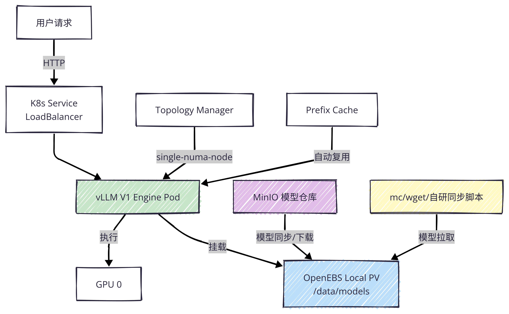

# K8s上的LLM推理服务

**示例环境说明**：

- Kubernetes集群：v1.35.4
  - Master 1个：k8s-master01.magedu.com
  - Worker 3个：k8s-node{01-03}.magedu.com，其中k8s-node01和k8s-node03上各有RTX 3090 GPU一块
- Containerd：v2.2.3
- Ingress Controller：Ingress-Nginx
- CSI Storage：OpenEBS 4.x
- LoadBalancer Service：MetalLB

## 前置准备

### 1. 安装必要的工具程序

首先，安装 ModelScope CLI 和 MinIO Client 

```bash
# 安装 ModelScope CLI（如未安装）
pip install modelscope

# 安装 MinIO Client（如未安装）
wget https://dl.min.io/client/mc/release/linux-amd64/mc
chmod +x mc
sudo mv mc /usr/local/bin/
```

而后，配置MinIO别名

```bash
mc alias set magedu http://minio.magedu.com:9000 YOUR_ACCESS_KEY YOUR_SECRET_KEY
# 验证连通性
mc ls magedu
```

### 2. 从 ModelScope 下载模型

方法 A：使用 `modelscope` CLI（推荐，支持断点续传）

```bash
# 创建模型缓存目录
mkdir -p /data/models

# 下载 Qwen3-8B（约 16GB，视网络情况 10-30 分钟）
modelscope download --model qwen/Qwen3-8B --local_dir /data/models/Qwen3-8B

# 验证下载完整性
ls -lh /data/models/Qwen3-8B/
# 预期看到：config.json, tokenizer.json, *.safetensors, generation_config.json 等
```

方法 B：使用 Git + Git LFS（适合熟悉 Git 的用户）

```bash
# 安装 Git LFS（如未安装）
sudo apt-get install git-lfs
git lfs install

# 克隆模型仓库（ModelScope 支持 Git 协议）
git clone https://www.modelscope.cn/qwen/Qwen3-8B.git /data/models/Qwen3-8B
```

> **注意**：ModelScope 的 Git 克隆可能会遇到 LFS 配额或速度限制，**优先推荐 `modelscope` CLI**。


### 3. 上传到 MinIO（保持目录结构）

首先，创建 MinIO Bucket

```bash
# 创建专用 bucket（如不存在）
mc mb models 2>/dev/null || echo "Bucket 已存在"

# 验证
mc ls models
```

接下来，使用 `mc mirror` 同步（关键命令）

`mc mirror` 是 MinIO 的**增量同步**命令，会自动保持子目录结构，且支持断点续传：

```bash
# 将本地模型目录同步到 MinIO
# 语法：mc mirror --overwrite --remove <本地路径> <别名>/<bucket>/<前缀>
mc mirror --overwrite --remove /data/models/Qwen3-8B/ models/qwen/Qwen3-8B/

# 参数说明：
# --overwrite  : 覆盖MinIO上已存在但本地更新的文件
# --remove     : 删除MinIO上存在但本地已删除的文件（保持两边一致）
# 末尾的 "/"   : 确保同步的是目录内容，而非把目录本身作为对象上传
```

最后，验证上传结果

```bash
# 查看 MinIO 上的目录结构
mc tree models/qwen/Qwen3-8B/

# 查看具体文件
mc ls models/qwen/Qwen3-8B/ --recursive | head -20

# 验证单个文件大小（例如检查safetensors是否完整）
mc stat models/qwen/Qwen3-8B/model-00001-of-00005.safetensors
```

上面第二个命令的预期输出如下。第三个命令需要根据输出的结果列表，引用其中一个进行查看。
```
[2026-04-23 04:49:40 UTC] 1.1KiB STANDARD .msc
[2026-04-23 04:49:40 UTC]    36B STANDARD .mv
[2026-04-23 04:49:40 UTC]  11KiB STANDARD LICENSE
[2026-04-23 04:49:40 UTC]  16KiB STANDARD README.md
[2026-04-23 04:49:40 UTC]   728B STANDARD config.json
[2026-04-23 04:49:40 UTC]    73B STANDARD configuration.json
[2026-04-23 04:49:40 UTC]   239B STANDARD generation_config.json
[2026-04-23 04:49:40 UTC] 1.6MiB STANDARD merges.txt
[2026-04-23 04:50:49 UTC] 3.7GiB STANDARD model-00001-of-00005.safetensors
[2026-04-23 04:50:49 UTC] 3.7GiB STANDARD model-00002-of-00005.safetensors
[2026-04-23 04:50:48 UTC] 3.7GiB STANDARD model-00003-of-00005.safetensors
[2026-04-23 04:50:38 UTC] 3.0GiB STANDARD model-00004-of-00005.safetensors
[2026-04-23 04:50:05 UTC] 1.2GiB STANDARD model-00005-of-00005.safetensors
[2026-04-23 04:49:40 UTC]  32KiB STANDARD model.safetensors.index.json
[2026-04-23 04:49:40 UTC]  11MiB STANDARD tokenizer.json
[2026-04-23 04:49:40 UTC] 9.5KiB STANDARD tokenizer_config.json
[2026-04-23 04:49:40 UTC] 2.6MiB STANDARD vocab.json
```


### 4. 大模型上传的注意事项

（1）单文件 >5GB 的情况

`safetensors` 分片文件通常单文件 4-5GB，MinIO 默认支持。但如果遇到更大的单文件（如未分片的 `.bin` 文件 >5GB），MinIO 本身无限制，但需确保：

```bash
# 检查 MinIO 服务器配置（通常默认支持大对象）
# 如使用 MinIO 分布式模式，确保每个节点磁盘空间充足
```

（2）断点续传与网络中断

`mc mirror` 自带断点续传能力。如果上传中断，重新执行相同命令即可，已上传的文件会跳过：

```bash
# 中断后重新执行，自动续传
mc mirror --overwrite --remove /data/models/Qwen3-8B/ magedu/models/qwen3-8b/
```

（3）多模型管理建议

建议按以下目录结构组织 MinIO：

```bash
magedu/models/
├── qwen3-8b/          # 当前演示模型
├── qwen3-1.8b/        # 后续多模型演示
├── qwen3-72b/         # 未来扩展（仅占位，环境跑不动）
└── README.md          # 模型清单文档（可选）
```


### 5. 常见问题排查

| 问题                                     | 原因                          | 解决                                                    |
| ---------------------------------------- | ----------------------------- | ------------------------------------------------------- |
| `mc mirror` 提示 `Bucket does not exist` | Bucket 未创建                 | 先执行 `mc mb magedu/models`                            |
| 上传后文件大小为 0                       | Git LFS 未正确拉取            | 重新用 `modelscope download` 下载，不要用裸 `git clone` |
| 同步速度慢                               | 网络带宽或 MinIO 磁盘 IO 瓶颈 | 检查节点到 MinIO 的网络延迟；MinIO 建议用 NVMe 盘       |

---

**总结**：使用 `modelscope download` 获取模型，用 `mc mirror` 同步到 MinIO，保持目录结构不变。完成后，就可确保 DaemonSet 能通过 `mc mirror` 将模型自动分发到各 GPU 节点的本地路径。


## 部署GPU Operator

NVIDIA GPU Operator是Kubernetes上的一款Operator，专用于自动化GPU集群的完整生命周期管理。它将GPU驱动、容器运行时、设备插件、监控组件等打包为 Helm Chart，通过声明式方式一键部署，使 Kubernetes 集群具备 GPU 感知和调度能力。

核心定位：**让 Kubernetes 管理员无需手动登录每个节点安装驱动，即可将 GPU 资源纳入容器编排体系**。

### 核心组件架构与作用

GPU Operator 采用分层架构，各组件职责如下：

```
┌───────────────────────────────────────————──┐
│  用户工作负载层 (User Workloads)              │
│  GPU-enabled Pods / AI/ML Training          │
├────────────────────────────────────————─────┤
│  设备发现与分配层                             │
│  • NVIDIA Device Plugin                     │
│  • GPU Feature Discovery (GFD)              │
├────────────────────────────────────────————─┤
│  容器运行时层                                 │
│  • NVIDIA Container Toolkit (nvidia-docker2)│
│  • Container Runtime (containerd/cri-o)     │
├────────────────────────────────────────————─┤
│  驱动与内核层                                │
│  • NVIDIA Driver (内核模块)                  │
│  • NVIDIA Fabric Manager (针对NVSwitch)     │
│  • Driver Manager (管理驱动生命周期)          │
├────────────────────────────────────────————─┤
│  节点操作系统层 (Host OS / Ubuntu/RHEL)       │
└────────────────────────────────────────————─┘
```

### 各组件详细说明

| 组件                             | 作用                                                         | 部署形式                                      |
| -------------------------------- | ------------------------------------------------------------ | --------------------------------------------- |
| **NVIDIA Driver**                | 编译并加载内核模块（`nvidia.ko`），提供 GPU 硬件访问接口     | DaemonSet，每节点一个 Pod，特权模式运行       |
| **NVIDIA Container Toolkit**     | 拦截容器创建请求，注入 GPU 设备（`/dev/nvidia*`）和驱动库到容器 | DaemonSet，修改 containerd/cri-o 配置         |
| **NVIDIA Device Plugin**         | 向 kubelet 注册 `nvidia.com/gpu` 资源，实现 GPU 分配与调度   | DaemonSet，遵循 Kubernetes Device Plugin 框架 |
| **GPU Feature Discovery (GFD)**  | 自动为节点添加 GPU 特性标签（如 `nvidia.com/gpu.product=RTX-3090`），支持节点亲和调度 | DaemonSet                                     |
| **NVIDIA DCGM Exporter**         | 暴露 GPU 利用率、显存、温度、功耗等 Prometheus 指标          | DaemonSet + ServiceMonitor                    |
| **Node Feature Discovery (NFD)** | 检测节点硬件特性（CPU、PCIe 等），辅助 GPU 节点识别          | 可选依赖，通常由 GPU Operator 自动部署        |
| **Driver Manager**               | 管理驱动版本升级、回滚，处理驱动与内核版本兼容性             | 内置于 Driver DaemonSet                       |
| **Sandbox Device Plugin**        | 支持 GPU 虚拟化（MIG、Time-slicing）场景下的设备分配         | 可选组件                                      |


### Kubernetes 上的安装步骤

#### 前置条件
- Kubernetes 集群 ≥ v1.22（推荐 v1.28+），我们的集群可完全满足要求
- 节点已配置 Container Runtime（containerd ≥ 1.6 或 cri-o），我们部署的containerd v2.2.3可完全满足要求
- Helm 3 已安装
- 节点未手动安装 NVIDIA 驱动（或已做好冲突处理准备）

#### 安装流程

**步骤 1：添加 Helm Repo**

```bash
helm repo add nvidia https://helm.ngc.nvidia.com/nvidia
helm repo update
```

**步骤 2：安装 GPU Operator**
```bash
# 标准安装（自动安装驱动、Container Toolkit、Device Plugin 等）
helm install gpu-operator nvidia/gpu-operator \
  --namespace gpu-operator \
  --create-namespace \
  --wait

# 若节点已预装驱动，禁用驱动安装
helm install gpu-operator nvidia/gpu-operator \
  --namespace gpu-operator \
  --create-namespace \
  --set driver.enabled=false \
  --wait
```

**步骤 3：验证安装**
```bash
# 查看 Pod 状态
kubectl get pods -n gpu-operator

# 预期输出：
# gpu-operator-xxx                    Running
# nvidia-driver-daemonset-xxx         Running
# nvidia-container-toolkit-daemonset-xxx  Running
# nvidia-device-plugin-daemonset-xxx  Running
# gpu-feature-discovery-xxx           Running
# nvidia-dcgm-exporter-xxx            Running

# 验证节点 GPU 资源
kubectl describe node <gpu-node> | grep -A 5 "Allocated resources"
# 应显示：nvidia.com/gpu: 1 (或对应数量)

# 测试 GPU  Pod
kubectl apply -f - <<EOF
apiVersion: v1
kind: Pod
metadata:
  name: cuda-vector-add
spec:
  restartPolicy: OnFailure
  containers:
  - name: cuda-vector-add
    image: nvcr.io/nvidia/k8s/cuda-sample:vectoradd-cuda11.7.1-ubuntu20.04
    resources:
      limits:
        nvidia.com/gpu: 1
EOF
kubectl logs cuda-vector-add
# 预期输出：Test PASSED
```


### 手动安装 vs GPU Operator 管理驱动的对比

| 维度                 | 手动安装节点驱动                  | GPU Operator 管理驱动                   |
| -------------------- | --------------------------------- | --------------------------------------- |
| **部署效率**         | 需逐节点 SSH 安装，环境差异大     | 一键 Helm 安装，声明式管理              |
| **版本一致性**       | 易因人为操作导致版本漂移          | 集群级统一版本，自动同步                |
| **升级维护**         | 需逐节点停机升级，风险高          | 滚动更新，自动处理依赖链                |
| **内核兼容性**       | 管理员手动解决驱动与内核匹配      | 自动检测内核版本，编译适配              |
| **回滚能力**         | 手动卸载重装，无版本控制          | 通过 Helm revision 一键回滚             |
| **Day-2 运维**       | 需自建监控、告警体系              | 内置 DCGM Exporter，Prometheus 原生集成 |
| **云原生集成**       | 需手动配置 Device Plugin、Runtime | 自动完成全链路配置                      |
| **MIG/Time-slicing** | 需手动配置复杂参数                | 通过 ConfigMap 声明式配置 GPU 虚拟化    |
| **多租户安全**       | 需自行设计隔离方案                | 支持 GPU 共享与严格资源边界             |

**核心优势总结**：GPU Operator 将 GPU 基础设施从"手工运维"转变为"GitOps 式管理"，特别适合大规模集群和频繁变更的 AI 训练/推理场景。


### 已手动安装驱动时的注意事项

这是生产环境最常见的场景，处理不当会导致**驱动冲突、Pod 启动失败**。

#### 关键原则
GPU Operator 默认会尝试在节点上安装驱动，若检测到已存在驱动，可能触发冲突。必须通过参数显式声明。

#### 部署策略

**策略 A：完全信任现有驱动（推荐）**

```bash
helm install gpu-operator nvidia/gpu-operator \
  --namespace gpu-operator \
  --create-namespace \
  --set driver.enabled=false \
  --set toolkit.enabled=true \
  --set devicePlugin.enabled=true \
  --set dcgmExporter.enabled=true
```

**策略 B：强制覆盖现有驱动（谨慎使用）**

```bash
# 先卸载节点现有驱动
sudo apt purge nvidia-driver-* -y
sudo reboot

# 再部署 GPU Operator（默认 driver.enabled=true）
helm install gpu-operator nvidia/gpu-operator ...
```

**策略 C：特定节点混合管理（异构集群）**

```bash
# 对未安装驱动的节点：启用驱动安装
# 对已安装驱动的节点：添加标签禁用驱动
kubectl label node <pre-installed-node> nvidia.com/gpu.deploy.driver=false

helm install gpu-operator nvidia/gpu-operator \
  --set driver.enabled=true \
  --set driver.nodeSelector."nvidia\.com/gpu\.deploy\.driver"=true  # 仅对未标记节点生效
```

#### 验证现有驱动兼容性

部署前必须确认手动驱动版本与 GPU Operator 默认版本兼容：
```bash
# 查看当前驱动版本
nvidia-smi | grep "Driver Version"

# 查看 GPU Operator 默认驱动版本
helm show values nvidia/gpu-operator | grep "driver.version"

# 若版本不匹配，指定 Operator 使用现有版本
helm install gpu-operator nvidia/gpu-operator \
  --set driver.enabled=false \
  --set driver.version=535.104.05  # 与现有驱动一致（仅作标记，不实际安装）
```

#### 常见故障排查

| 现象                         | 原因                         | 解决                                                      |
| ---------------------------- | ---------------------------- | --------------------------------------------------------- |
| `nvidia-smi` 在容器内报错    | Container Toolkit 未正确配置 | 检查 `nvidia-container-toolkit` DaemonSet 日志            |
| 节点无 `nvidia.com/gpu` 资源 | Device Plugin 未注册         | 检查 `nvidia-device-plugin` Pod 状态及 kubelet 日志       |
| 驱动 Pod CrashLoopBackOff    | 与现有驱动冲突               | 设置 `driver.enabled=false`，重启节点                     |
| GPU  Pod  Pending            | 资源不足或污点未容忍         | 检查节点标签 `kubectl get node -L nvidia.com/gpu.present` |


## MVP架构



本架构中的一个关键要素是vLLM Pod如何获得和加载模型权重（模型分发机制）。通常的实现方式有两种，一个是使用initContainer下载模型，另一个是使用DaemonSet在各GPU节点上预加载模型文件，并手动配置模型文件目录为OpenEBS LocalPV。

### 使用initContainer获取模型

> 注意：本示例假设mc alias设置为了models，并基于该alias创建qwen bucket，而后上传模型到了Qwen3-8B目录中，也就是“models/qwen/Qwen3-8B”，请确保你的路径亦是这般。否则，请对配置文件中的引用进行相应的修改。


相关的资源配置文件位于level-1-initcontainer目录中，它会将LLM推理服务部署到llm-serving名称空间。

```bash
cd level-1/initContainer

# 注意要按顺序创建资源
kubectl apply -f .
```

**注意事项**：

1. **replicas 与 GPU 独占资源的冲突**
  当前配置设置了 replicas: 1，且主容器申请了 nvidia.com/gpu: 1。如果后续误将 replicas 改为大于 1，而集群中该节点只有 1 张 GPU，新增的 Pod 会一直处于 Pending 状态（资源不足）。对于 GPU 独占型工作负载，通常建议配合 PodDisruptionBudget 或显式保持 replicas: 1，并考虑使用 StatefulSet 替代 Deployment 来避免多个副本争抢同一块 GPU。
2. **nodeSelector 在 Deployment 下的行为变化**
  原 Pod 直接绑定到 k8s-node01.magedu.com，Deployment 的滚动更新（RollingUpdate）策略在重建 Pod 时，新 Pod 也必须满足该 nodeSelector。如果该节点故障或维护，Deployment 的 ReplicaSet 会持续尝试在该节点上创建 Pod 并失败，导致服务不可用。建议后续演进为使用 nodeAffinity + PodAntiAffinity 或基于 GPU 标签的通用调度策略，而非硬编码主机名。
3. **PVC 的 ReadWriteOnce 与多副本的冲突**
  model-pvc-qwen3-8b 绑定的 OpenEBS LocalPV 通常是 ReadWriteOnce（RWO）访问模式。当前 replicas: 1 没有问题，但如果未来扩容副本，多个 Pod 无法同时挂载同一个 RWO PVC。若需多副本，必须改用 ReadWriteMany（RWX）的存储类（如 NFS、CephFS），或每个副本独立挂载 PVC。
4. **InitContainer 的幂等逻辑在 Deployment 场景下更为关键**
  Deployment 的滚动更新、节点驱逐或镜像拉取失败重试都会触发 Pod 重建。InitContainer 中的 .ready 文件检查逻辑能避免重复下载模型，但需确保：
  PVC 中的数据在 Pod 重建后确实持久保留（LocalPV 依赖节点本地磁盘，节点故障则数据丢失）；
  mc mirror --overwrite --remove 的 --remove 标志在模型文件变更时可能误删本地已有文件，建议根据实际更新策略评估是否保留该参数。


